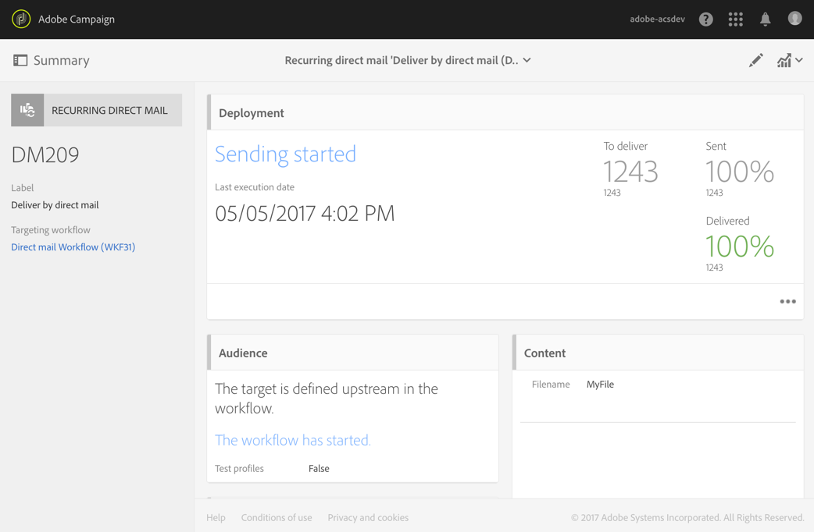

# 直接郵件傳送{#direct-mail-delivery}

## 說明 {#description}

此活 **[!UICONTROL Direct mail delivery]** 動可讓您設定並準備包含您要用於直接郵件促銷活動之描述檔資料的檔案。 這可以是一次使用的直效郵件，也可以是循環性 **直** 效郵件。

標準的直接郵件只傳送一次。

循環郵件可讓您在定義的時段內，多次傳送相同的直效郵件給不同的目標。 您可以匯總每個期間的交貨，以取得符合您需求的報表。

## 使用內容 {#context-of-use}

此活 **[!UICONTROL Direct mail delivery]** 動通常用於自動準備包含描述檔資料的檔案。 然後，可將此檔案傳送給負責郵寄的合作夥伴／供應商。

當連結至排程器時，您可以定義循環的直接電子郵件。

直接郵件收件者是透過查詢、交叉點等定位活動，在相同工作流程中定義活動上游的活動。 在準備直接郵件時，不會自動排除未指定郵寄地址的個人檔案。

根據工作流執行參數觸發消息準備。 在訊息控制面板中，您可以選擇是否要求傳送訊息的手動確認（預設為必要）。 您可以手動啟動工作流，或將排程器活動置於工作流中以自動執行。

**相關主題：**

* [使用案例： 將電子郵件與直效郵件傳送結合](../../automating/using/coupling-email-direct-mail.md)
* [關於直接郵件](../../channels/using/about-direct-mail.md)

## 配置 {#configuration}

1. 將活動拖放 **[!UICONTROL Direct mail delivery]** 到工作流程中。
1. 選擇活動，然後使用顯示的快  速操作中的按鈕將其開啟。

   >[!NOTE]
   >
   >您可以透過活動快速動作的按鈕，存取活動（而非傳送本身）的一  般屬性和進階選項。 此按鈕是頻道活動專屬的按鈕。 您可以透過直接郵件儀表板中的動作列來存取直接郵件的屬性。

1. 選擇直接郵件發送模式：

   * **[!UICONTROL Direct mail]**: 直接郵件只發一次。 您可以在此處指定是否要向活動添加出站轉變。 在本過程的步驟7中詳細介紹了不同的過渡類型。
   * **[!UICONTROL Recurring direct mail]**: 根據活動中定義的頻率，直接郵件會被發送多次 **[!UICONTROL Scheduler]** 。 選擇發送的聚合期間。 這可讓您將定義期間發生的所有傳送重新分組，並透過一封名為 **Recurring execution** ，也可從應用程式的行銷活動清單存取的直效郵件。

      例如，對於每日處理的循環生日郵件，您可以選擇匯總每月的傳送。 這可讓您每月收到傳送的報表，不過每天都會處理郵件。

      >[!NOTE]
      >
      >對於循環的直接郵件，在工作流的每次執行時都生成新檔案。 選定的聚合期間對此行為沒有影響。

1. 選擇直接郵件類型。 直接郵件類型來自「 > > 」菜單中定 **[!UICONTROL Resources]** 義的 **[!UICONTROL Templates]** 模 **[!UICONTROL Delivery templates]** 板。
1. 輸入直接郵件的常規屬性。 您也可以將它附加至現有的促銷活動。 工作流的傳送活動的標籤會以直接郵件標籤更新。
1. 定義直接郵件內容。 請參閱有關內容編輯 [的章節](../../designing/using/personalization.md)。
1. 依預設，活動 **[!UICONTROL Direct mail delivery]** 不包含任何對外轉場。 如果要將出站轉移添加到活動 **[!UICONTROL Direct mail delivery]** 中，請轉至高級活動選項的頁籤( **[!UICONTROL General]** 活動快速操作中的按鈕)，然後選中以下選項之一：

   * **[!UICONTROL Add outbound transition without the population]**: 這可讓您產生一個對外轉移，其中包含與傳入轉移完全相同的人口。 此轉換包含直接郵件活動生成的檔案以及直接郵件活動收到的原始人口。
   * **[!UICONTROL Add outbound transition with the population]**: 這可讓您產生一個出站轉移，其中包含將要向其發送直接郵件的人口。 在直接郵件準備過程中排除的目標成員（隔離、無效地址等） 會從此轉換中排除。 轉換也包含直接郵件產生的檔案。

1. 確認活動的設定並儲存工作流程。

當您重新開啟活動時，會將您直接帶至直接郵件儀表板。 只能編輯其內容。

依預設，啟動傳送工作流程只會觸發訊息準備。 在工作流啟動後，仍需要確認從工作流建立的消息的發送。 但是，在訊息控制面板中，只有在訊息是從工作流程建立時，您才能停用選 **[!UICONTROL Request confirmation before sending messages]** 項。 取消勾選此選項後，訊息會在準備完成後不另行通知而傳送。

## 注釋 {#remarks}

您可以在應用程式的行銷活動清單中存取在工作流程中建立的傳送。 您可以使用控制面板來檢視工作流程的執行狀態。 直接郵件摘要窗格中的連結可讓您直接存取連結的元素(工作流程、促銷活動、父傳送（若是重複寄送的直接郵件）。

循環傳送的執行預設為遮色片。 若要檢視，請勾選行 **[!UICONTROL Show recurring executions]** 銷活動搜尋面板中的選項。

在可從行銷活動清單存取或直接透過相關循環執行存取的父傳送中，您可以檢視已處理的郵件總數（根據設定活動時指定的匯總期間）。 **[!UICONTROL Direct mail delivery]** 若要這麼做，請選取按鈕，以開啟父傳送區塊的 **[!UICONTROL Deployment]** 詳細資訊  檢視。

