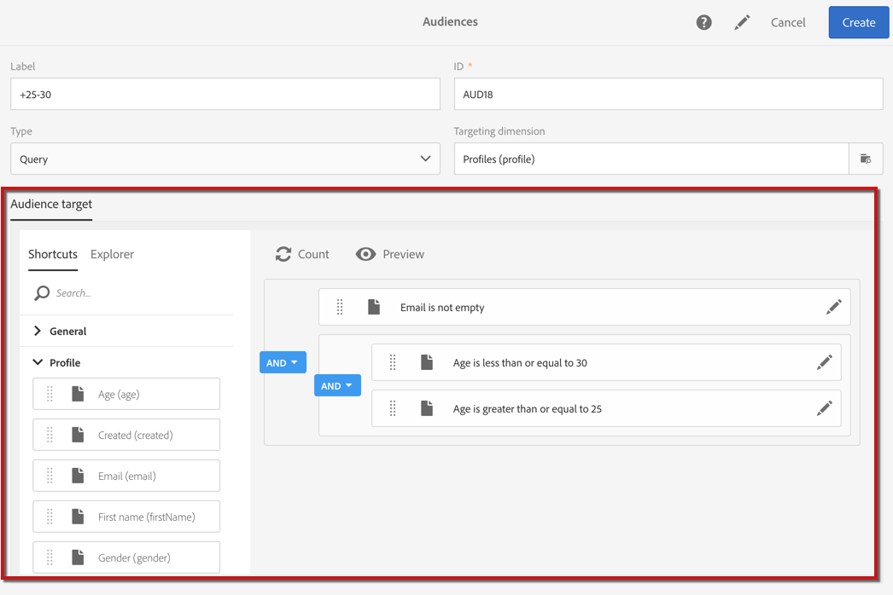
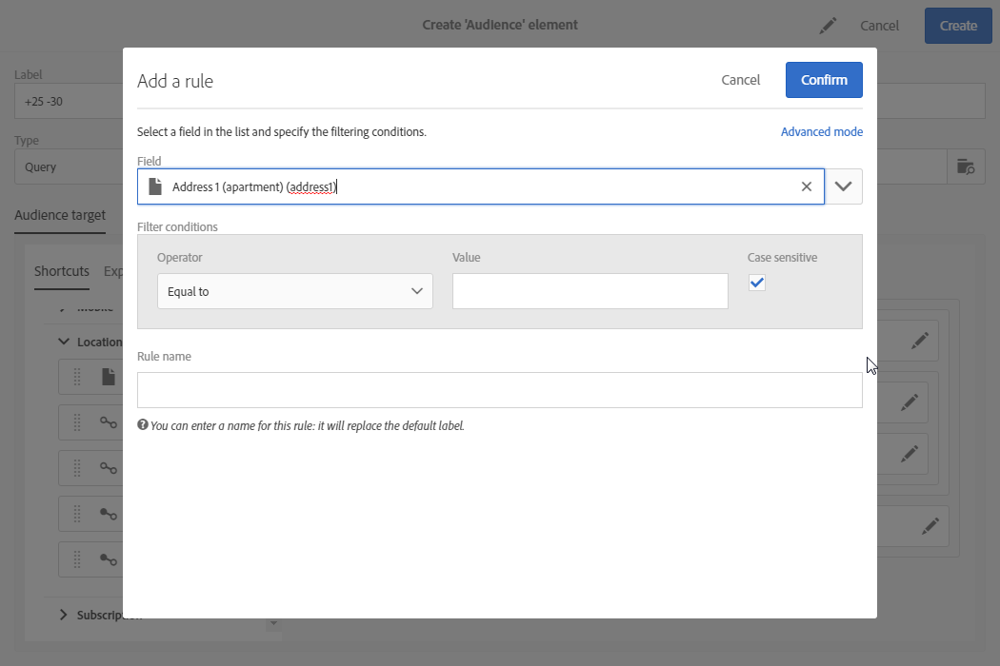
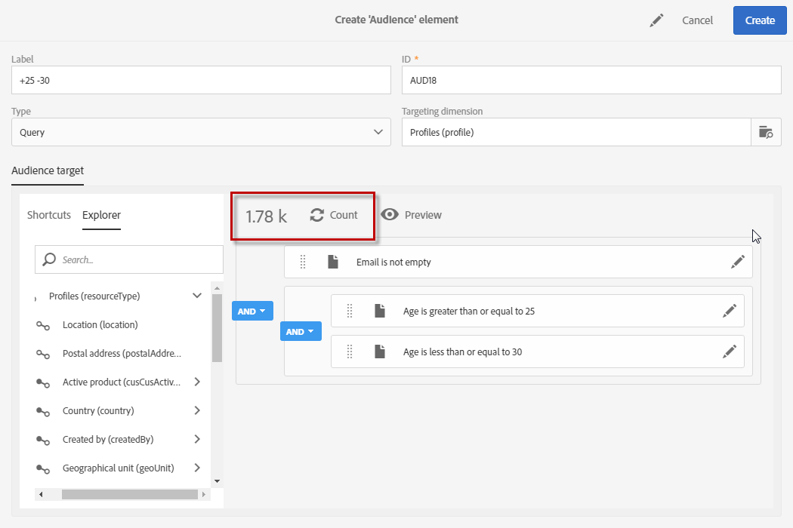

# 編輯查詢{#editing-queries}

## 關於查詢編輯器 {#about-query-editor}

查詢編輯器是精靈，可讓您篩選 Adobe Campaign 資料庫中包含的資料。

這項功能可讓您建立人口族群，運用預先定義的篩選器和規則，以更佳的方式鎖定收件者。

若干應用功能使用它以：

* 建立&#x200B;**查詢**&#x200B;類型&#x200B;**對象**
* 定義&#x200B;**電子郵件**&#x200B;目標
* 在&#x200B;**工作流程**&#x200B;活動中定義人口

## 查詢編輯器介面 {#query-editor-interface}

查詢編輯器由&#x200B;**浮動視窗**&#x200B;和&#x200B;**工作區**&#x200B;組成。

### 浮動視窗 {#palette}

浮動視窗位於編輯器的左側，分為兩個標籤，其中包含分成主題區塊的元素。這些標籤包括：

* **快速鍵**，預設可用，或由執行個體管理員建立。您可在這裡找到欄位、節點、群組、1-1 連結、1-N 連結和其他預先定義的篩選器。
* 允許您存取目標資源中所有可用欄位的&#x200B;**瀏覽器**：節點、分組元素、連結（1-1 和 1-N）。

必須將標籤中包含的元素移入工作區，才能設定並代入查詢。視選取的目標維度而定（請參閱[目標維度和資源](../../automating/using/query.md#targeting-dimensions-and-resources)），您可以：

* 逐一選取對象或設定檔
* 使用預先定義的篩選器
* 為您選取的欄位定義簡單規則
* 定義進階規則，讓您將函式套用至特定欄位

### 工作區 {#workspace}

工作區是您可在其中設定及結合規則、對象和從浮動視窗新增的預先定義的篩選器的中央區域。

將元素從浮動視窗移入工作區時，會開啟一個新視窗，您可以啟動「[建立查詢](#creating-queries)」。

## 建立查詢 {#creating-queries}

查詢編輯器可用於定義訊息中的對象或測試設定檔、工作流程中的人口以及建立查詢類型的對象。

查詢可在建立傳送時在 **[!UICONTROL Audience]** 視窗中定義，或在建立工作流程時在「**查詢**」活動中定義。

1. 將元素從浮動視窗移入工作區。用於編輯規則的窗口隨即開啟。

   * 對於字串或數值&#x200B;**欄位**，請指定比較運算子和值。

      

   * 對於日期或日期和時間&#x200B;**欄位**，您可以選取定義特定日期、兩個日期之間的範圍或與查詢執行日期相關的期間。

      

   * 對於布林&#x200B;**欄位**，選中連結到該欄位可能值的框。
   * 對於&#x200B;**分組**，選取要在其上建立規則的分組欄位，然後以與其他欄位相同的方式定義條件。

      

   * 對於與其他資料庫資源的 **1-1** 連結，請直接從目標表中選取一個值。

      

   * 對於與另一資料庫資源的 **1-N** 連結，可以在此第二個資源的欄位上定義子查詢。

      您不需要指定子條件。

      例如，您只能在設定檔追蹤記 錄中選取 **[!UICONTROL Exists]** 運算子並核准規則。規則會傳回所有存在追蹤記錄的設定檔。

      

   * 對於&#x200B;**預先定義的篩選器**，請根據提供的標準輸入或選取所需的元素。

      管理員可以建立篩選器，以方便進行複雜和重複的查詢。這些規則將以預先設定的規則形式出現在查詢編輯器中，並限制使用者需執行的步驟數。

      

1. 您可以指定規則的名稱。然後，這會顯示為工作區中的規則名稱。如果未指定規則名稱，則會顯示條件的自動說明。
1. 要組合工作區元素，請將它們互相聯鎖以建立不同的群組和/或群組級別。然後，您可以選取邏輯運算子來組合同一層級的元素：

   * **[!UICONTROL AND]**：兩個條件的交集。只考慮與每個條件匹配的元素。
   * **[!UICONTROL OR]**：兩個條件的聯合。考慮匹配兩個條件中至少一個的元素。
   * **[!UICONTROL EXCEPT]**：排除條件。將匹配第一標準的元素考慮在內，除非這些也與第二標準匹配。

1. 您現在可以使用動作列的  和  按鈕，計算並預覽查詢目標的元素數目。

   

如果要修改查詢的元素，請按一下編輯圖示。規則會依先前設定的方式開啟，然後您就可以進行任何必要的調整。

您的查詢現在已建立並定義，這可讓您建置人口族群，以更個人化您的傳遞。

**相關主題：**

* [進階函式](../../automating/using/advanced-expression-editing.md)
* [定義篩選器](../../developing/using/configuring-filter-definition.md)
* [使用案例：建立每週一次的電子郵件傳送](../../automating/using/workflow-weekly-offer.md)
* [使用案例：建立依位置分段的傳送](../../automating/using/workflow-segmentation-location.md)
* [使用案例：建立具備輔助功能的傳送](../../automating/using/workflow-created-query-with-complement.md)
* [使用案例：重新定位傳送新傳送給非開啟者的工作流程](../../automating/using/workflow-cross-channel-retargeting.md)
