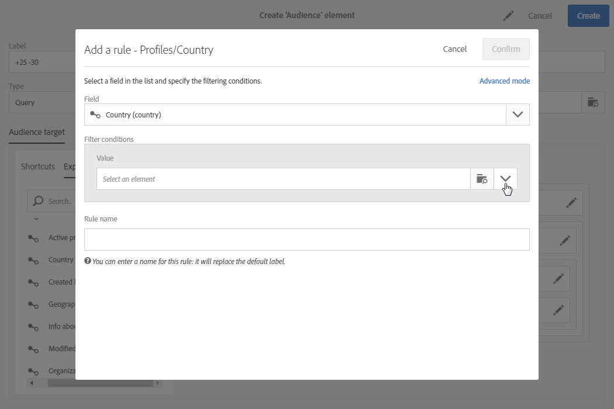

# 編輯查詢{#editing-queries}

## 關於查詢編輯器 {#about-query-editor}

查詢編輯器是精靈，可讓您篩選Adobe Campaign資料庫中包含的資料。

這項功能可讓您建立人口族群，運用預先定義的篩選條件和規則，以更佳的方式鎖定收件者。

若干應用功能使用它以：

* 建立查 **詢類型** (Create **Query Type)對象**
* 定義電 **子郵件** 目標
* 在工作流活動中定 **義人口**

## 查詢編輯器介面 {#query-editor-interface}

查詢編輯器由元件面板和工 **作區** 組 **成**。

### 浮動視窗 {#palette}

浮動視窗位於編輯器的左側，分為兩個標籤，其中包含分成主題區塊的元素。 這些標籤包括：

* 快 **速鍵**，預設可用，或由例項管理員建立。 您可在這裡找到欄位、節點、群組、1-1連結、1-N連結和其他預先定義的篩選。
* 允許 **您訪問目標資源中所有可用欄位的瀏覽器** :節點、分組元素、連結（1-1和1-N）。

必須將標籤中包含的元素移入工作區，才能設定並考慮查詢。 視選取的定位維度而定(請參 [閱定位維度和資源](../../automating/using/query.md#targeting-dimensions-and-resources))，您可以：

* 逐一選取觀眾或個人檔案
* 使用預先定義的篩選
* 為您選擇的欄位定義簡單規則
* 定義進階規則，讓您將函式套用至特定欄位

### 工作區 {#workspace}

工作區是您可在其中設定及結合規則、對象和從浮動視窗新增的預先定義篩選的中央區域。

將元素從元件面板移入工作區時，會開啟一個新窗口，您可以啟動「創 [建查詢」](#creating-queries)。

## 建立查詢 {#creating-queries}

查詢編輯器可用於定義消息中的對象或測試配置檔案、工作流中的人口以及建立查詢類型的對象。

查詢可在建立傳送時 **[!UICONTROL Audience]** 在窗口中定義，或在建立工作流時在 **Query** 活動中定義。

1. 將元素從浮動視窗移入工作區。 用於編輯規則的窗口隨即開啟。

   * 對於字串或數值 **欄位**，請指定比較運算子和值。

      

   * 對於日期或日期和時 **間欄位**，您可以選擇定義特定日期、兩個日期之間的範圍或與查詢執行日期相關的期間。

      

   * 對於布爾 **欄位**，選中連結到該欄位可能值的框。
   * 對於 **分組** ，選擇要在其上建立規則的分組欄位，然後以與其他欄位相同的方式定義條件。

      

   * 對於與其 **他資料庫資源的1-1** 連結，請直接從目標表中選擇一個值。

      

   * 對於與 **另一資料庫資源的1-N** 連結，可以在此第二個資源的欄位上定義子查詢。

      您不需要指定子條件。

      例如，您只能在描述檔追蹤記 **[!UICONTROL Exists]** 錄檔中選取運算子並核准規則。 規則會傳回所有有追蹤記錄的描述檔。

      

   * 對於預 **先定義的篩選**，請根據提供的標準輸入或選擇所需的元素。

      管理員可以建立篩選器，以方便進行複雜和重複的查詢。 這些規則將以預先設定的規則形式出現在查詢編輯器中，並限制使用者需執行的步驟數。

      

1. 您可以指定規則的名稱。 然後，這會顯示為工作區中的規則名稱。 如果未指定規則名稱，則會顯示條件的自動說明。
1. 要組合工作區元素，請將它們互相聯鎖以建立不同的組和／或組級別。 然後，您可以選取邏輯運算子來組合同一層級的元素：

   * **[!UICONTROL AND]**:兩個准則的交集。 只考慮與每個准則匹配的元素。
   * **[!UICONTROL OR]**:兩個標準的結合。 考慮匹配兩個准則中至少一個的元素。
   * **[!UICONTROL EXCEPT]**:排除條件。 將匹配第一准則的元素考慮在內，除非它們也匹配第二准則。

1. 您現在可以使用動作列的和按鈕，計算並預覽查詢所  定位  的元素數目。

   

如果要修改查詢的元素，請按一下編輯表徵圖。 規則會依先前設定的方式開啟，然後您就可以進行任何必要的調整。

您的查詢現在已建立並定義，這可讓您建立人口族群，以更個人化您的傳送。

**相關主題：**

* [進階函式](../../automating/using/advanced-expression-editing.md)
* [定義篩選器](../../developing/using/configuring-filter-definition.md)
* [使用案例：建立每週一次的電子郵件傳送](../../automating/using/workflow-weekly-offer.md)
* [使用案例：建立依位置分段的傳送](../../automating/using/workflow-segmentation-location.md)
* [使用案例：建立具備輔助功能的傳送](../../automating/using/workflow-created-query-with-complement.md)
* [使用案例：重新定位傳送新傳送給非開啟者的工作流程](../../automating/using/workflow-cross-channel-retargeting.md)
