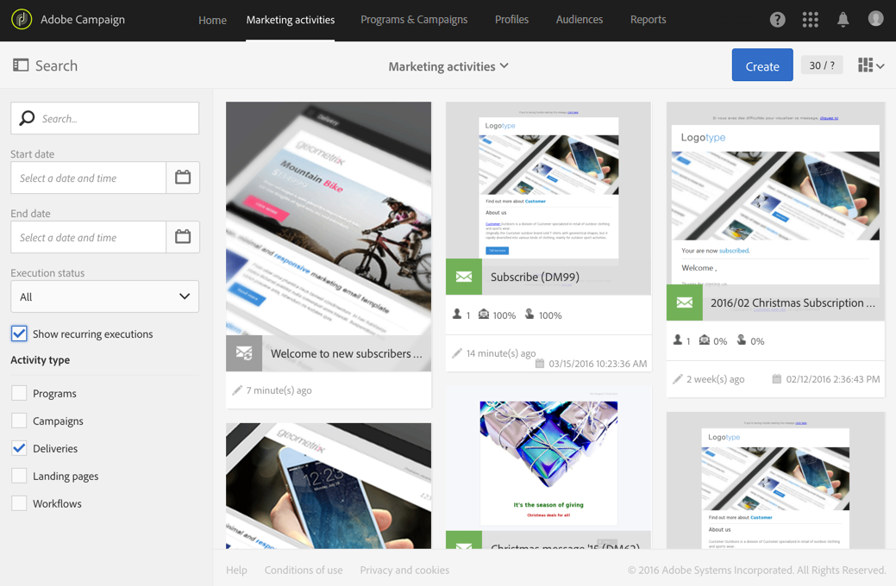

# 電子郵件傳送{#email-delivery}

## 說明 {#description}

此活 **[!UICONTROL Email delivery]** 動可讓您設定在工作流程中傳送電子郵件。 這可以是單一 **傳送電子郵件** ，只傳送一次，或是循環 **寄送** 電子郵件。

單一傳送電子郵件是標準電子郵件，只傳送一次。

循環電子郵件可讓您在定義的期間內多次傳送相同的電子郵件至不同的目標。 您可以匯總每個期間的交貨，以取得符合您需求的報表。

## 使用內容 {#context-of-use}

活動 **[!UICONTROL Email delivery]** 通常用於自動傳送電子郵件至相同工作流程中計算的目標。

當連結至排程器時，您可以定義循環的電子郵件。

電子郵件收件者是透過查詢、交叉點等定位活動，在相同工作流程中定義活動上游的位置。

根據工作流執行參數觸發消息準備。 在訊息控制面板中，您可以選擇是否要求傳送訊息的手動確認（預設為必要）。 您可以手動啟動工作流，或將排程器活動置於工作流中以自動執行。

**相關主題：**

* [使用案例： 建立每週一次的電子郵件傳送](../../automating/using/workflow-weekly-offer.md)
* [使用案例： 建立依位置分段的傳送](../../automating/using/workflow-segmentation-location.md)
* [使用案例： 建立具備輔助功能的傳送](../../automating/using/workflow-created-query-with-complement.md)
* [使用案例： 重新定位傳送新傳送給非開啟者的工作流程](../../automating/using/workflow-cross-channel-retargeting.md)
* [使用案例： 生日寄送](../../automating/using/birthday-delivery.md)

## 配置 {#configuration}

1. 將活動拖放 **[!UICONTROL Email delivery]** 至工作流程。
1. 選擇活動，然後使用顯示的快  速操作中的按鈕將其開啟。

   >[!NOTE]
   >
   >您可以透過活動快速動作的按鈕，存取活動（而非傳送本身）的一  般屬性和進階選項。 此按鈕是活動的特 **[!UICONTROL Email delivery]** 定按鈕。 您可以透過電子郵件控制面板中的動作列存取電子郵件的屬性。

1. 選擇電子郵件傳送模式：

   * **[!UICONTROL Email]**: 電子郵件只會傳送一次。 您可以在此處指定是否要向活動添加出站轉變。 在本過程的步驟7中詳細介紹了不同的過渡類型。
   * **[!UICONTROL Recurring email]**: 根據活動中定義的頻率，會多次傳送電子郵 **[!UICONTROL Scheduler]** 件。 選擇發送的聚合期間。 這可讓您在一個電子郵件中重新分組定義期間發生的所有傳送，該電子郵件也稱為 **Recurring execution** ，可從應用程式的行銷活動清單存取。

      例如，對於每日傳送的循環生日電子郵件，您可以選擇匯總每月傳送的傳送。 這可讓您每月收到有關傳送的報表，不過每天都會傳送電子郵件。
   >[!NOTE]
   >
   >循環傳送是根據匯總期間 **準備的**。 例如，如果匯總期間是「按天」，則每天只重新準備一次傳送。 如果您計畫每天呼叫此工作流程多次，請使用 [!UICONTROL No aggregation]。

1. 選擇電子郵件類型。 電子郵件類型來自「 > >」功能表中定 **[!UICONTROL Resources]** 義的 **[!UICONTROL Templates]** 電子郵件 **[!UICONTROL Delivery templates]** 範本。
1. 輸入電子郵件的一般屬性。 您也可以將它附加至現有的促銷活動。 工作流程的傳送活動標籤會以電子郵件標籤更新。
1. 定義電子郵件內容。 請參閱有關內容編輯 [的章節](../../designing/using/designing-content-in-adobe-campaign.md)。
1. 依預設，活動 **[!UICONTROL Email delivery]** 不包含任何對外轉場。 如果要將出站轉移添加到活動 **[!UICONTROL Email delivery]** 中，請轉至高級活動選項的頁籤( **[!UICONTROL General]** 活動快速操作中的按鈕)，然後選中以下選項之一：

   * **[!UICONTROL Add outbound transition without the population]**: 這可讓您產生一個對外轉移，其中包含與傳入轉移完全相同的人口。
   * **[!UICONTROL Add outbound transition with the population]**: 這可讓您產生對外轉場，其中包含傳送電子郵件的人口。 傳送準備期間排除的目標成員（隔離、無效電子郵件等） 會從此轉換中排除。

1. 確認活動的設定並儲存工作流程。

當您重新開啟活動時，會將您直接帶至電子郵件控制面板。 只能編輯其內容。

依預設，啟動傳送工作流程只會觸發訊息準備。 在工作流啟動後，仍需要確認從工作流建立的消息的發送。 但是，在訊息控制面板中，只有在訊息是從工作流程建立時，您才能停用選 **[!UICONTROL Request confirmation before sending messages]** 項。 取消勾選此選項後，訊息會在準備完成後不另行通知而傳送。

## 注釋 {#remarks}

您可以在應用程式的行銷活動清單中存取在工作流程中建立的傳送。 您可以使用控制面板來檢視工作流程的執行狀態。 電子郵件摘要窗格中的連結可讓您直接存取連結的元素（工作流程、促銷活動、父項傳送，以防重複傳送電子郵件）。

不過，循環傳送的執行依預設會被遮色。 若要檢視，請勾選行 **[!UICONTROL Show recurring executions]** 銷活動搜尋面板中的選項。

在可從行銷活動清單存取或直接透過相關循環執行存取的父傳送中，您可以檢視已處理的傳送總數（根據設定活動時指定的匯總期間）。 **[!UICONTROL Email delivery]** 若要這麼做，請選取以開啟父傳送區塊的詳 **[!UICONTROL Deployment]** 細資料檢視 。

