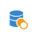

# 排除{#exclusion}

## 說明 {#description}

**[!UICONTROL Exclusion]** 活動可讓您根據特定條件，從單一群體中排除元素。

## 使用內容 {#context-of-use}

**[!UICONTROL Exclusion]** 活動主要用於對入站轉變群體進行額外篩選。

主要集會在入站轉變中定義。 將從主要集中排除其他入站轉變的成員。 排除活動的出站轉變只包含其他入站轉變中未遇到的主要集程元。

## 設定 {#configuration}

1. 將 **[!UICONTROL Exclusion]** 活動拖放至工作流程中。
1. 選取活動，然後使用所顯示快速動作中的  按鈕將其開啟。
1. 從入站轉變中選取 **[!UICONTROL Primary set]**。 這是從中排除元素的集。 其他集會先設定相符的元素，然後才會從主要集予以排除。

   >[!NOTE]
   >
   >入站轉變必須包含相同類型的群體。 例如，如果主要集包含測試輪廓，其他轉變也必須包含測試輪廓。

1. 如有需要，請管理活動的[轉變](../../automating/using/activity-properties.md)，以存取輸出群體的進階選項。
1. 確認活動的設定並儲存工作流程。

## 範例 {#example}

下列範例顯示兩個查詢活動，其設定是從 Adobe Campaign 資料庫篩選年齡介於 18 到 27 歲之間且電子郵件地址無效的輪廓。 之後，會從第一組中排除包含無效電子郵件地址的輪廓。 舉例來說，這可讓您傳送電子郵件。

