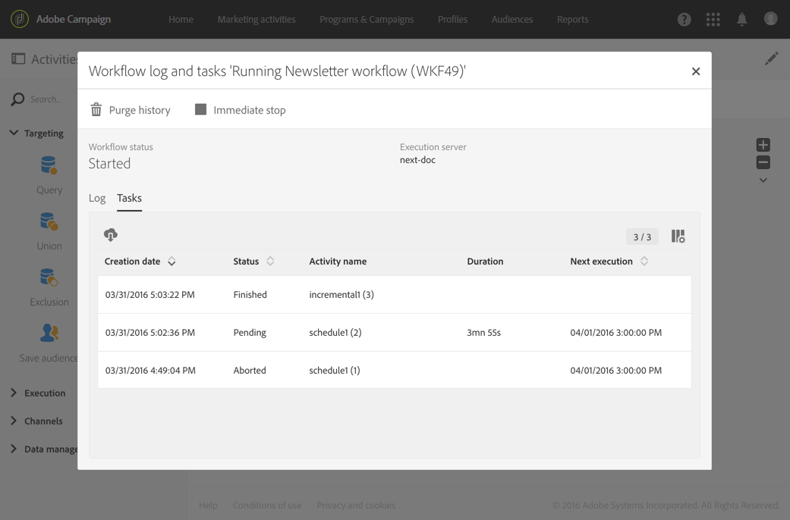

# 執行工作流程{#executing-a-workflow}

## 關於工作流執行 {#about-workflow-execution}

工作流程一律以手動方式啟動。 但是，啟動後，它可以保持非活動狀態，具體取決於在 [Scheduler活動中指定的資訊](../../automating/using/scheduler.md) 。

>[!CAUTION]
>
> Adobe建議客戶排定工作流程執行的優先順序，並執行最多20個並行工作流程執行，以一致地在執行個體中達到最佳效能。 可計畫並行執行超過20個工作流，預設情況下將按順序執行。 您可以將票證提交給客戶服務，以調整併發工作流執行的最大數量的預設設定。

執行相關動作（開始、停止、暫停等）是非 **同步進程** :命令將保存，並在伺服器可用來應用該命令後生效。

在工作流程中，每個活動的結果通常會透過轉場（以箭頭表示）傳送至下列活動。

如果轉移未連結至目標活動，則不會終止。

>[!NOTE]
>
>仍可執行包含未終止轉場的工作流程：將會產生警告訊息，工作流程在轉場時會暫停，但不會產生錯誤。 您也可以開始工作流程，而不需完成設計，而且可以隨時完成設計。

執行活動後，轉場中傳送的記錄數就會顯示在其上方。

您可以開啟轉場來檢查在執行工作流程期間或之後傳送的資料是否正確。 您可以檢視資料和資料結構。

依預設，只能存取工作流程上次轉換的詳細資訊。 要能夠訪問前述活動的結果，您需要在啟動工作流之前，先 **[!UICONTROL Keep interim results]**檢查工作流**[!UICONTROL Execution]** 屬性部分中的選項。

>[!NOTE]
>
>此選項會耗用大量記憶體，並可協助建立工作流程，並確保其正確設定和運作。 在生產例項中保留未選中狀態。

當轉場開啟時，您可以編輯轉場， **[!UICONTROL Label]**或將轉場連**[!UICONTROL Segment code]** 結至它。 若要這麼做，請編輯對應的欄位並確認您的修改。

## 從REST API控制工作流程 {#controlling-a-workflow-from-the-rest-api}

使用REST API，您可以啟 **動**、暫 **停**、繼 **續和** 停止Rest **** 工作流。

您可以在 [API檔案中找到更多REST呼叫的詳細資訊和範例。](../../api/using/controlling-a-workflow.md)

## 生命週期 {#life-cycle}

工作流的生命週期包括三個主要步驟，每個步驟都連結到狀態和顏色：

* **編輯** （灰色）

   這是工作流的初始設計階段(請參閱「建 [立工作流](../../automating/using/building-a-workflow.md#creating-a-workflow)」)。 伺服器尚未處理工作流程，因此可以修改工作流程，而不會造成任何風險。

* **進行中** （藍色）

   在初始設計階段完成後，工作流程便可由伺服器啟動並處理。

* **完成** （綠色）

   當不再進行任何工作或操作員明確停止實例時，工作流即完成。

工作流程一旦啟動後，可能還會有兩個其他狀態：

* **警告** （黃色）

   工作流無法完成或使用或按鈕  暫停  。

* **錯誤** （紅色）

   執行工作流時發生錯誤。 工作流已停止，用戶必須執行操作。 若要進一步瞭解此錯誤，請使用  按鈕存取工作流程記錄檔(請參 [閱Monitoring](#monitoring))。

行銷活動清單可讓您顯示所有工作流程及其狀態。 如需詳細資訊，請參閱管 [理行銷活動](../../start/using/marketing-activities.md#about-marketing-activities)。

## 執行命令 {#execution-commands}

動作列中的圖示可讓您啟動、追蹤和修改工作流程的執行。 請參閱 [動作列](../../automating/using/workflow-interface.md#action-bar)。

可用操作如下：

**開始**

按  鈕會開始執行工作流程，然後進入 **「進行中** （藍色）」狀態。 如果暫停了工作流，則會繼續它，否則會啟動它，然後啟動初始活動。

>[!NOTE]
>
>啟動是非同步程式：請求會儲存，並會由工作流程執行引擎盡快處理。

**暫停**

按  鈕會暫停執行。 工作流程會顯示 **警告** （黃色）狀態。 新活動在恢復之前不會激活，但正在進行的操作不會暫停。

**停止**

按  鈕會停止正在執行的工作流程，然後會進入「完 **成** （綠色）」狀態。 如果可能，將中斷正在進行的操作，並立即取消正在進行的導入或SQL查詢。 您無法從停止的工作流程所在位置繼續。

**重新啟動**

此按  鈕包括停止，然後重新啟動工作流。 在大多數情況下，這可讓您更快速地重新啟動。 當停止需要一定的時間時，自動重新啟動也很有用，因為只有在停止  有效時，按鈕才可用。

在選擇工作流中的一個或多個活動時，您可以執行其他操作，例如：

**立即執行**

此按  鈕會盡快啟動所有選取的待定活動。

**正常執行**

按鈕  會重新啟動任何暫停或停用的活動。

**已暫停執行**

按鈕  會暫停所選活動的工作流：不會執行此任務以及隨後執行的所有任務（位於同一個分支中）。

**無執行**

按鈕  會停用任何選取的活動。

>[!NOTE]
>
>快速動作可讓您存取與某個特定活動相關的不同動作，並在選取活動時顯示。

## 監控 {#monitoring}

此圖  示會開啟工作流程記錄和工作功能表。

工作流歷史記錄將保存在工作流執行選項中指定的持續時間內(請參閱 [工作流屬性](#workflow-properties))。 因此，在此期間，即使在重新啟動後，也會保存所有消息。 如果不想保存先前執行中的消息，則必須按一下按鈕來清除歷史記  錄。

該選 **[!UICONTROL Log]**項卡包含所有活動或任何選定活動的執行歷史記錄。 它按時間順序對執行的操作和執行錯誤進行索引。

此標 **[!UICONTROL Tasks]**簽詳細說明了活動的執行順序。 按一下工作以取得詳細資訊。

在這兩個清單中：

* 按一下計數器，以根據套用的篩選條件查看活動總數。 如果清單中的元素數少於30，則預設會顯示計數器。
* 按 **[!UICONTROL Configure list]**鈕可讓您選擇顯示的資訊、定義欄順序，以及排序清單。
* 您可以使用篩選器更快找到所需資訊。 使用搜尋欄位在工作流程活動名稱中尋找特定文字(例如：&quot;query&quot;)和記錄檔。

## 錯誤管理 {#error-management}

發生錯誤時，工作流程會暫停，當發生錯誤時正在執行的活動會閃爍紅色。

工作流狀態變為紅色，錯誤記錄在日誌中。

您可以設定工作流程，使其不會暫停並繼續執行，而不會出現錯誤。 要執行此操作，請通過按鈕轉至工作流  屬性，並在「 **[!UICONTROL Execution]**In of error（發生錯誤）」欄位**&#x200B;的「**Ignore**（忽略）」選項中&#x200B;**。

在這種情況下，錯誤任務將被中止。 此模式特別適用於設計為稍後重新嘗試操作（定期操作）的工作流。

>[!NOTE]
>
>您可以針對每個活動分別套用此設定。 若要這麼做，請選取活動，然後使用快速動作將其開啟 。 然後在「執行選項」頁籤中選擇錯誤 **管理模式** 。 請參閱 [活動執行選項](#activity-execution-options)。

工作 **[!UICONTROL Execution]**流屬性的部分還允許您定義在工作流執行**[!UICONTROL Consecutive errors]** 自動暫停之前授權的一些屬性。 只要未到達此數字，就會忽略錯誤元素，並正常執行其他工作流分支。 如果到達此號碼，工作流程會暫停，並自動通知工作流程主管（電子郵件和應用程式內通知）。 請參 [閱工作流程屬](#workflow-properties) 性 [和Adobe Campaign通知](../../administration/using/sending-internal-notifications.md)。

也可以在工作流的執行屬性中定義監督者。

## 工作流程屬性 {#workflow-properties}

要修改工作流的執行選項，請使用按  鈕訪問工作流屬性並選擇 **[!UICONTROL Execution]**部分。

該 **[!UICONTROL Default affinity]**欄位允許您強制在特定電腦上執行工作流或工作流活動。

在欄位 **[!UICONTROL History in days]**中，指定必須清除歷史記錄的持續時間。

您可以選擇在必要時檢 **[!UICONTROL Save SQL queries in the log]**查和**[!UICONTROL Execute in the engine (do not use in production)]** 選項。

如果您 **[!UICONTROL Keep interim results]**想要檢視轉場的詳細資訊，請勾選此選項。 警告：勾選此選項可能會大幅減緩工作流程的執行速度。

欄位 **[!UICONTROL Severity]**可讓您指定在Adobe Campaign例項中執行工作流程的優先順序層級。 重要的工作流程會先執行。

在欄 **[!UICONTROL Supervisors]**位中，您可以定義工作流程遇到錯誤時要通知的人員群組（電子郵件和應用程式內通知）。 如果未定義任何群組，則不會通知任何人。 如需Adobe Campaign通知的詳細資訊，請參閱[Adobe Campaign通知](../../administration/using/sending-internal-notifications.md)。

該 **[!UICONTROL In case of error]**欄位允許您指定在活動遇到錯誤時要執行的操作。 有兩個選項可供使用：

* **暫停流程**:工作流程會自動暫停。 工作流程狀態接著是「 **錯誤** 」，而相關色彩會變成紅色。 問題解決後，請重新啟動工作流程。
* **忽略**:不會執行活動，因此，後續的任何活動（位於同一個分支）也不會執行。 這可能對循環性任務非常有用。 如果分支有調度程式放在上游，則應在下次執行日期觸發。

   選取此選項，您也可以定義許 **[!UICONTROL Consecutive errors]**可的數目：

   * 如果指定的數 **[!UICONTROL 0]**字，或者只要未達到指定的數字，就會忽略遇到錯誤的活動。 其他工作流程分支會正常執行。
   * 如果達到指定的數字，則整個工作流將暫停並變為 **[!UICONTROL Erroneous]**。 如果已定義主管，則會自動透過電子郵件通知他們。

## 活動屬性 {#activity-properties}

### 活動的一般屬性 {#general-properties-of-an-activity}

每個活動都有一個 **[!UICONTROL Properties]**標籤。 此頁籤允許您修改活動的常規參數，特別是標籤和ID。 配置此頁籤是可選的。

### 管理活動的出站轉場 {#managing-an-activity-s-outbound-transitions}

預設情況下，某些活動沒有出站轉移。 您可以從標籤或活動 **[!UICONTROL Transitions]**的標籤中新增一個，**[!UICONTROL Properties]** 以便將其他流程套用至相同工作流程中的人口族群。

根據活動，您可以添加幾種類型的出站轉場：

* 標準轉換：由活動計算的人口
* 無人口轉型：可以添加此類型的出站轉移以繼續工作流，並且不包含任何人口以不佔用系統上任何不必要的空間。
* 拒絕：被拒絕。 例如，如果活動的傳入資料因不正確或不完整而無法處理。
* 補充：執行活動後剩餘人口數。 例如，如果區段活動設定為僅儲存傳入人口的百分比。

如果適用，請為活 **[!UICONTROL Segment code]**動的出站轉換指定一個。 此區段代碼可讓您識別目標人口的子集來自何處，並稍後可能提供訊息個人化用途。

### 活動執行選項 {#activity-execution-options}

在活動的屬性畫面中，有一個標 **[!UICONTROL Advanced options]**簽可讓您定義活動的執行模式和行為，以防發生錯誤。

若要存取這些選項，請在工作流程中選取活動，然後使用動作列  的按鈕將其開啟。

該 **[!UICONTROL Execution]**欄位允許您定義在任務啟動時要執行的操作。 這有三種選擇：

* **正常**:活動正常執行。
* **啟用但不執行**:活動會暫停，因此後續的任何後續進程也會暫停。 如果您希望在任務啟動時出現，則此選項會很有用。
* **不要啟用**:活動不會執行，因此，後續的所有活動（在同一分支中）也不會執行。

該 **[!UICONTROL In case of error]**欄位允許您指定在活動遇到錯誤時要執行的操作。 有兩個選項可供使用：

* **暫停流程**:工作流程會自動暫停。 工作流程狀態接著是「 **錯誤** 」，而相關色彩會變成紅色。 問題解決後，請重新啟動工作流程。
* **忽略**:不會執行活動，因此，後續的任何活動（位於同一個分支）也不會執行。 這可能對循環性任務非常有用。 如果分支有調度程式放在上游，則應在下次執行日期觸發。

該字 **[!UICONTROL Behavior]**段允許您定義在使用非同步任務時要遵循的過程。 有兩個選項可供使用：

* **授權多項任務**:即使第一個任務未完成，也可以同時執行多個任務。
* **當前任務具有優先順序**:一旦任務進行中，就會優先處理。 只要一個任務仍在進行中，就不會執行其他任務。

欄 **[!UICONTROL Max. execution duration]**位可讓您指定持續時間，例如&quot;30s&quot;或&quot;1h&quot;。 如果活動在指定的持續時間過後仍未完成，則會觸發警報。 這不會影響工作流程的運作方式。

該 **[!UICONTROL Affinity]**欄位允許您強制在特定電腦上執行工作流或工作流活動。 若要這麼做，您必須為相關的工作流程或活動指定一或數個相關性。

該 **[!UICONTROL Time zone]**欄位允許您選擇活動的時區。 Adobe Campaign可讓您管理同一執行個體上多個國家／地區之間的時間差異。 建立實例時，將配置所應用的設定。

>[!NOTE]
>
>預設情況下，如果未選擇時區，則活動將使用工作流屬性中定義的時區。

「注 **釋** 」欄位是可讓您新增附註的免費欄位。
