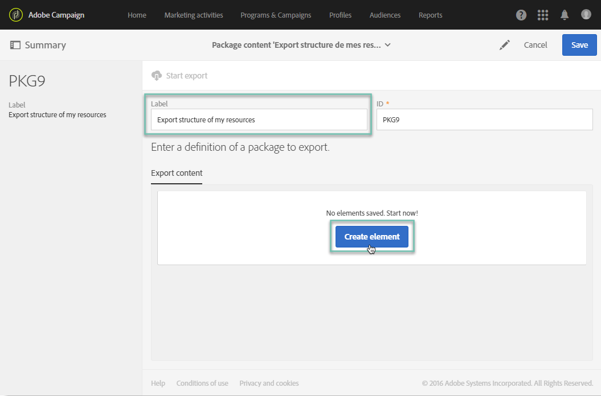

# 匯出／匯入自訂資源 {#exporting-importing-custom-resources}

本教學課程說明如何將自訂資源套件從開發環境匯出並匯入至生產環境。

此範例針對連結至Adobe Campaign的功能管理員。

先決條件為：

* **可用和發佈的一或多個自訂資源** 。

   此外，您必須為這些資源定義一個唯一鍵，因為自動主鍵未在包中導出。 因此，資源可以具有主鍵和附加唯一鍵，以保證記錄的唯一性。
* **建立和匯出套件** ，所需的權限。

其他資源：

* [管理套件](../../automating/using/managing-packages.md)
* [部署軟體包：操作原則](../../developing/using/data-model-concepts.md)
* [新增或擴充資源](../../developing/using/key-steps-to-add-a-resource.md)

## 步驟1:導出結構 {#exporting-the-structure}

在本節中，我們將執行第一個包導出，其中詳細說明自定義資源資料的物理結構。

此範例包含兩個自訂資源：產 **品** 和 **訂單**。

1. 轉到 **[!UICONTROL Administration]** / **[!UICONTROL Deployment]** / **[!UICONTROL Package exports]** 菜單。

   我們將建立新套件，以匯出使用「產 **[!UICONTROL Custom resource (cusResource)]** 品」和「訂購」這兩個自訂資源篩選的套件。

1. 在頁面 **[!UICONTROL Package exports]** 中，按一 **[!UICONTROL Create]** 下以建立新套件。
1. 完成標籤，然後按一下 **[!UICONTROL Create element]**。

   

1. 搜索並選擇 **[!UICONTROL Custom resource (cusResource)]**。

   

1. 在篩選條件中 **[!UICONTROL Custom resource]** 選取「產品」和「訂 **購** 」兩個資 **源**，以設定詳細資訊。

   請確定不要忘記更改邏輯運算子。 值必須設定為 **OR** ，以便產品資源和訂單資源的結構整合到包中。

   

1. 確認並保存包定義。

您現在可以按一下 **[!UICONTROL Start export]**。

產生的套件可在「下載」檔案夾中使用。 郵遞區號檔案的名稱是隨機產生的。 您可以重新命名它。

## 匯出資料 {#exporting-the-data}

第二次匯出將允許我們從「產品」和「訂 **單」** 自 **** 訂資源匯出資料。

根據與結構匯出相同的匯出類型，您將建立包含資料的第二個封裝。

1. 在頁面 **[!UICONTROL Package exports]** 中，按一 **[!UICONTROL Create]** 下以建立新套件。
1. 填寫標籤， **[!UICONTROL Export data of my resources]** 然後按一 **[!UICONTROL Create element]** 下標籤 **[!UICONTROL Export content]** 中。
1. 搜索並選擇「產 **品** 」資源。

   

1. 設定進階 **篩選條件** , **其中@Label IS NOT NULL**。

   

1. 檢查計數。

   

1. 對「訂單」自訂資源重複 **相同** 的操作。

   

1. 確認並保存包定義。

您現在可以按一下 **[!UICONTROL Start export]**。

產生的套件可在「下載」檔案夾中使用。 郵遞區號檔案的名稱是隨機產生的。 您可以重新命名它。

## 導入結構 {#importing-the-structure}

### 導入包 {#importing-the-structure-package}

1. 連線至 **您要匯入新建立之封裝的目標例項** 。
1. 前往/ **[!UICONTROL Administration]****[!UICONTROL Deployment]** / **[!UICONTROL Package imports]** menu，以建立新的套件，從第一次匯出匯入檔案。
1. 將結構文 **件拖放** 到為此目的提供的區域。 接受的格式為ZIP或XML。

   

1. 修改標籤，例如「匯 **入結構**」，然後按一下 **[!UICONTROL Save]**。
1. Click **[!UICONTROL Start import]**.

   

### 發佈 {#publish-structure}

1. 轉到 **[!UICONTROL Administration]** / **[!UICONTROL Development]** / **[!UICONTROL Publication]** 菜單。
1. 按一 **[!UICONTROL Prepare publication]** 下 **[!UICONTROL Publish]** ，以新自訂資源中的資料來更新例項。
1. 與安裝的軟體包對應的菜單項將插入到菜單 **[!UICONTROL Client data]** 中。

   

## 匯入資料 {#importing-the-data}

在本節中，我們將匯 **入前一步驟中** ，連結至實例上所安裝之套件的資料。

與前一步驟相同，它分為兩個部分：匯入套件和發佈。

### 導入包 {#importing-the-data-package}

1. 前往/ **[!UICONTROL Administration]****[!UICONTROL Deployment]** / **[!UICONTROL Package imports]** menu，以建立新的套件，以匯入包含資料的檔案。
1. 將資料檔案拖放至為此目的提供的區域。 接受的格式為ZIP或XML。
1. 修改標籤，例如「匯入資料」，然後按一下 **[!UICONTROL Save]**。
1. Click **[!UICONTROL Start import]**.

   

### 發佈 {#publish-data}

1. 轉到 **[!UICONTROL Administration]** / **[!UICONTROL Development]** / **[!UICONTROL Publication]** 菜單。
1. 按一 **[!UICONTROL Prepare publication]** 下 **[!UICONTROL Publish]** ，以自訂資源的資料更新例項。
