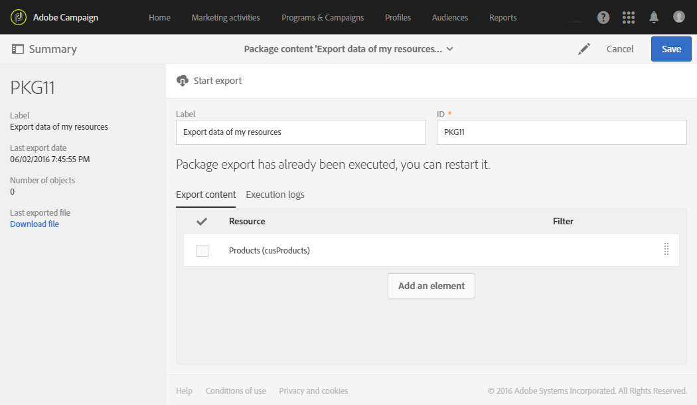

# 匯出/匯入自訂資源 {#exporting-importing-custom-resources}

本教學課程說明如何將自訂資源套件從開發環境匯出並匯入至生產環境。

此範例針對連結至 Adobe Campaign 的功能管理員。

先決條件為：

* **一或多個的自訂資源**&#x200B;可供使用且已發佈。

   此外，您必須為這些資源定義一個唯一索引鍵，因為自動主要密鑰未在套件中匯出。因此，資源可以具有主要密鑰與附加唯一索引鍵，以保證此記錄的唯一性。
* 建立與匯出套件的&#x200B;**必要權利** 。

其他資源：

* [管理套件](../../automating/using/managing-packages.md)
* [部署套件：操作原則](../../developing/using/data-model-concepts.md)
* [新增或擴充資源](../../developing/using/key-steps-to-add-a-resource.md)

## 匯出結構 {#exporting-the-structure}

在本節中，我們將執行第一個套件匯出，其中詳細解說自訂資源資料的實體結構。

此範例包含兩個自訂資源：**產品**&#x200B;與&#x200B;**訂購**。

1. 前往 **[!UICONTROL Administration]** / **[!UICONTROL Deployment]** / **[!UICONTROL Package exports]** 功能表。

   我們將建立新的套件，以匯出使用兩個自訂資源（&quot;Products&quot; 及 &quot;Orders&quot;）篩選的　**[!UICONTROL Custom resource (cusResource)]**。

1. 在 **[!UICONTROL Package exports]** 頁面中，按一下 **[!UICONTROL Create]** 以建立新套件。
1. 完成標籤，然後按一下 **[!UICONTROL Create element]**。

   

1. 搜尋並選取 **[!UICONTROL Custom resource (cusResource)]**。

   

1. 在篩選條件中 **[!UICONTROL Custom resource]** 選取　**Products** 及 **Orders**　這兩個資源，以設定詳細資訊。

   請別忘記要變更邏輯運算子。該該值必須設定為　**OR**，以便產品資源與訂購資源的結構整合到此套件中。

   

1. 確認並儲存套件定義。

您現在可以按一下 **[!UICONTROL Start export]**。

產生的套件可在「下載」資料夾中使用。壓縮檔案的名稱是隨機產生的。您可以重新命名。

## 匯出資料 {#exporting-the-data}

第二次匯出將允許我們從　**Products** 及 **Orders**　的自訂資源匯出資料。

根據與結構匯出相同的匯出類型，您將建立包含資料的第二個套件。

1. 在 **[!UICONTROL Package exports]** 頁面中，按一下 **[!UICONTROL Create]** 以建立新套件。
1. 使用　**[!UICONTROL Export data of my resources]**　填寫標籤，然後按一下 **[!UICONTROL Export content]** 索引標籤中的　**[!UICONTROL Create element]**。
1. 搜尋並選取　**Products**　資源。

   

1. 設定進階&#x200B;**篩選條件**&#x200B;其中的 **@Label IS NOT NULL**。

   

1. 檢查計數。

   

1. 對　**Orders**　自訂資源重複相同的操作。

   

1. 確認並儲存套件定義。

您現在可以按一下 **[!UICONTROL Start export]**。

產生的套件可在「下載」資料夾中使用。壓縮檔案的名稱是隨機產生的。您可以重新命名。

## 匯入結構 {#importing-the-structure}

### 匯入套件 {#importing-the-structure-package}

1. 連線至您要匯入新建立之套件的&#x200B;**目標執行個體** 。
1. 前往 **[!UICONTROL Administration]** / **[!UICONTROL Deployment]** / **[!UICONTROL Package imports]** 功能表，並從第一次匯出之匯入檔案中建立新的套件。
1. 將&#x200B;**結構檔案**&#x200B;拖放至為此目的提供的區域。接受的格式為 ZIP 或 XML。

   

1. 修改標籤，例如　**Import structure**，然後按一下 **[!UICONTROL Save]**。
1. 按一下 **[!UICONTROL Start import]**。

   

### 發佈 {#publish-structure}

1. 前往 **[!UICONTROL Administration]** / **[!UICONTROL Development]** / **[!UICONTROL Publication]** 功能表。
1. 按一下 **[!UICONTROL Prepare publication]**，然後再按 **[!UICONTROL Publish]**，使用新自訂資源中的資料來更新執行個體。
1. 與安裝的套件對應之功能表項目將插入到 **[!UICONTROL Client data]** 功能表。

   

## 匯入資料 {#importing-the-data}

在本節中，我們將&#x200B;**匯入上一個步驟中連結至執行個體所安裝之套件的資料**。

與上一個步驟相同，它分為兩個部分：匯入套件並發佈。

### 匯入套件 {#importing-the-data-package}

1. 前往/ **[!UICONTROL Administration]** **[!UICONTROL Deployment]** / **[!UICONTROL Package imports]** 功能表，建立新的套件以匯入包含資料的檔案。
1. 將資料檔案拖放至為此目的提供的區域。接受的格式為 ZIP 或 XML。
1. 修改標籤，例如　&quot;Import data&quot;，然後按一下 **[!UICONTROL Save]**。
1. 按一下 **[!UICONTROL Start import]**。

   

### 發佈 {#publish-data}

1. 前往 **[!UICONTROL Administration]** / **[!UICONTROL Development]** / **[!UICONTROL Publication]** 功能表。
1. 按一下 **[!UICONTROL Prepare publication]**，然後再按 **[!UICONTROL Publish]** 使用自訂資源的資料更新執行個體。
