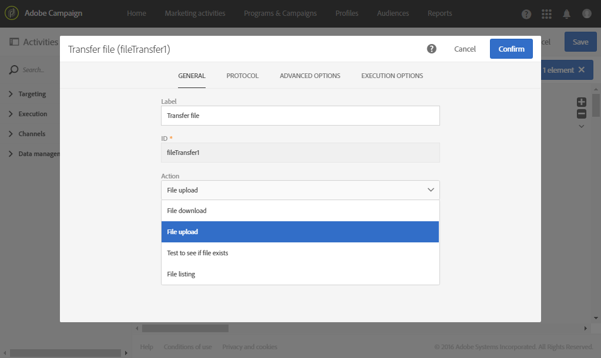

# 在外部檔案中匯出設定檔 {#exporting-profiles-external-file}

以下範例說明如何在活動 **[!UICONTROL Extract file]** 之後設定 **[!UICONTROL Query]** 活動。

此工作流程的目的是以外部檔案格式匯出設定檔清單，以便在 Adobe Campaign 外部使用資料。

1. 將[Extract file](../../automating/using/extract-file.md)活動拖放到工作流中，並將其放在[Query](../../automating/using/query.md)活動之後。

   在此範例中，會對年齡介於 18 至 30 歲的所有設定檔執行查詢。

1. 開啟&#x200B;**[!UICONTROL Extract file]**&#x200B;活動以進行編輯。
1. 為輸出檔案命名。
1. 新增輸出欄。

   在此範例中，會新增設定檔的電子郵件、年齡、出生日期、名字和姓氏作為輸出欄。

   

1. 按一下 **[!UICONTROL File structure]** 索引標籤以定義：

   * CSV 輸出格式

      

   * 日期格式

      

1. 確認您的活動。
1. 在&#x200B;**[!UICONTROL Extract file]**&#x200B;活動之後拖放[傳輸檔案](../../automating/using/transfer-file.md)活動，以恢復外部帳戶上的提取檔案。
1. 開啟活動並選取 **[!UICONTROL File upload]** 動作。

   

1. 選取外部帳戶，然後輸入伺服器上資料夾的路徑。

   

1. 確認您的活動並儲存您的工作流程。
1. 啟動工作流程。

   當工作流程已正確執行時，擷取的檔案便可在外部帳戶上使用。
