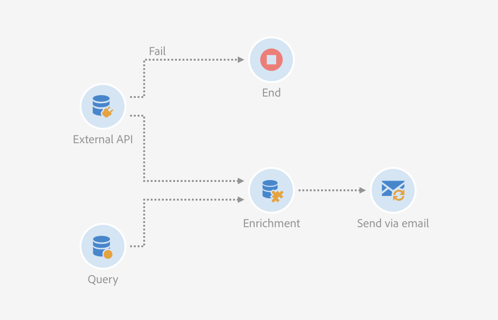
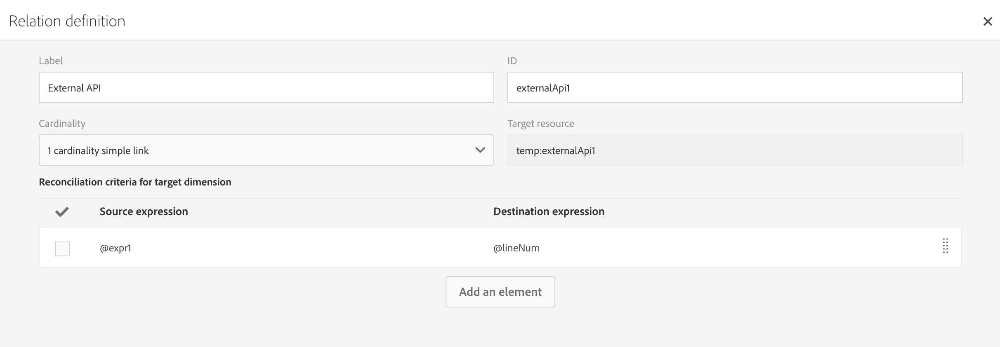

# 外部 API {#external-api}

## 說明 {#description}

此活 **[!UICONTROL External API]** 動會透過 **HTTP API呼叫，從外部系統** 將資料匯入 **工作流程中** 。

外部系統端點可以是公用API端點、客戶管理系統或無伺服器應用程式例項(例如 [Adobe I/O Runtime](https://www.adobe.io/apis/experienceplatform/runtime.html))，以及一些類別。

>[!NOTE]
>
>基於安全性原因，Campaign Standard不支援使用JSSP。 如果您需要執行程式碼，可以透過外部API活動呼叫Adobe I/O Runtime例項。

本活動的主要特點是：

* 能夠將JSON格式的資料傳遞至第三方REST API端點
* 能夠接收回JSON回應、將它對應至輸出表格，並傳遞至下游的其他工作流程活動。
* 具有出站特定過渡的故障管理

### 從測試版過渡到正式上市 {#from-beta-to-ga}

在Campaign Standard 20.3版本中，外部API功能將測試版移至一般可用性(GA)。

>[!CAUTION]
>
>因此，如果您使用測試版外部API活動，則需要在所有工作流程中以GA外部API活動來取代這些活動。  使用External API測試版的工作流程將從20.3版開始停止運作。

取代外部API活動時，將新的外部API活動新增至工作流程、手動複製設定詳細資訊，然後刪除舊活動。

>[!NOTE]
>
>您將無法複製標題值，因為這些值在活動中被遮色。

接著，重新設定工作流程中指向及／或使用測試版外部API活動資料的其他活動，以指向及／或使用新外部API活動的資料。 活動範例： 電子郵件傳送（個人化欄位）、擴充活動等。

### 限制和護欄 {#guardrails}

以下護欄適用於此活動：

* 5MB http回應資料大小限制
* 請求逾時為1分鐘
* 不允許HTTP重新導向
* 拒絕非HTTPS Url
* 「接受： application/json」請求標題和「Content-Type: application/json&quot;回應標題是允許的

>[!CAUTION]
>
>請注意，此活動的用途是擷取促銷活動範圍的資料（最新的選件集、最新的分數等），而非擷取每個描述檔的特定資訊，因為這會導致大量資料傳輸。 如果使用案例需要此項，建議使用「傳輸檔 [案](../../automating/using/transfer-file.md) 」活動。

JSON的特定防護欄已設定：

* **JSON最大深度**: 將可處理的自訂巢狀JSON的深度上限限制為10個層級。
* **JSON金鑰最大長度**: 將內部密鑰的最大長度限制為255。 此鍵與列ID相關聯。
* **允許JSON最大重複金鑰**:  將用作欄ID的重複JSON屬性名稱的總數上限限制為150。

活動不支援JSON結構，如下：

* 將陣列對象與其他非陣列元素組合
* JSON陣列物件是巢狀內嵌在一或多個中間陣列物件中。

## 配置 {#configuration}

將活動拖放 **[!UICONTROL External API]** 到工作流程中，並開啟活動以啟動設定。

### 入站映射

入站對應是由先前入站活動生成的臨時表，將在UI中顯示為JSON併發送。
根據此臨時表，用戶可以對入站資料進行修改。

「入 **站資源** 」下拉菜單允許您選擇將建立臨時表的查詢活動。

「添 **加計數參數** 」複選框將為來自臨時表的每行添加計數值。 請注意，此複選框僅在入站活動生成臨時表時才可用。

「入 **站列** 」(Inbound Columns)部分允許用戶從入站轉換表中添加任何欄位。 選取的欄將是資料物件中的索引鍵。 JSON中的資料物件將是陣列清單，包含傳入轉場表各列所選欄的資料。

自 **訂參數** 文字方塊可讓您新增有效的JSON及外部API所需的其他資料。 此額外資料將新增至產生的JSON中的params物件。

### 出站映射

此標籤可讓您定義API呼叫傳 **回的範例** JSON結構。

JSON剖析器的設計可容納標準JSON結構模式類型，但有些例外。 標準模式的範例是：`{“data”:[{“key”:“value”}, {“key”:“value”},...]}`

範例JSON定義必須具有下 **列特性**:

* **陣列元素** 必須包含第一級屬性（不支援較深的層級）。
   **屬性名** ，最終將成為輸出臨時表的輸出模式的列名。
* **要擷取的JSON** 元素必須在JSON回應內的10或更低巢狀層級。
* **欄名稱** ，定義是以&quot;data&quot;陣列的第一個元素為基礎。
列定義（添加／刪除）和屬性的類型值可以在「列定義」( **Column definition** )頁籤中編輯。

**平面化核取方塊** 行為：

「平面化」核取方塊(預設值： 未勾選)，以指出是否將JSON平面化為索引鍵／值對應。

* 當核取 **方塊停用** （未勾選）時，會剖析範例JSON以尋找陣列物件。 使用者將需要提供API回應範例JSON格式的修剪版本，如此Adobe Campaign就能確切判斷使用者想要使用哪個陣列。 在工作流程製作時，將會判斷並記錄巢狀陣列物件的路徑，以便在執行時使用它來存取從API呼叫接收的JSON回應內文中存取該陣列物件。

* 啟用 **核取方塊** （勾選）後，範例JSON將會平面化，而提供之範例JSON中指定的所有屬性將用來建立輸出臨時表格的欄，並顯示在「欄定義」標籤上。 請注意，如果範例JSON中有任何陣列物件，則這些陣列物件的所有元素也會平面化。

如果已 **驗證解析**，則會出現一條消息，邀請您在「列定義」頁籤中自定義資料映射。 在其他情況下，會顯示錯誤訊息。

### 執行

此標籤可讓您定義 **將傳送資料至ACS的HTTPS端點** 。 如有需要，您可在下列欄位中輸入驗證資訊。

### 屬性

此標籤可讓您控 **制外部API活動的一般屬性** ，例如UI中顯示的標籤。 無法自訂內部ID。

### 欄定義

>[!NOTE]
>
>在「出站映射」頁籤 **中完成並驗證響應資料格式** 時，將顯示此頁籤。

「 **欄定義** 」標籤可讓您精確指定每欄的資料結構，以匯入不含任何錯誤的資料，並使其符合Adobe Campaign資料庫中已存在的類型，以供日後作業使用。

例如，您可以變更欄的標籤，並選取其類型（字串、整數、日期等） 甚至指定錯誤處理。

如需詳細資訊，請參閱「載 [入檔案](../../automating/using/load-file.md) 」區段。

### 轉換

此標籤可讓您啟用 **出站轉場** 及其標籤。 在逾時或負載超過資料大 **小限制** 時，此特定轉 **換很實用**。

### 執行選項

此標籤可用於大部分的工作流活動。 如需詳細資訊，請參閱「活 [動屬性](../../automating/using/activity-properties.md) 」一節。

## 疑難排解

此新工作流活動中添加了兩種類型的日誌消息： 資訊與錯誤。 它們可協助您疑難排解潛在問題。

### 資訊

這些日誌消息用於在工作流活動執行期間記錄有關有用檢查點的資訊。 具體來說，下列記錄訊息可用來記錄第一次嘗試存取API的重試嘗試（以及首次嘗試失敗的原因）。

<table> 
 <thead> 
  <tr> 
   <th> 消息格式  </th> 
   <th> Example  </th> 
  </tr> 
 </thead> 
 <tbody> 
  <tr> 
   <td> 叫用API URL '%s'。</td> 
   <td> 
叫用API URL 'https://example.com/api/v1/web-coupon?count=2'。
</td> 
  </tr> 
  <tr> 
   <td> 重試API URL '%s'，先前嘗試失敗('%s')。</td> 
   <td> 
重試API URL 'https://example.com/api/v1/web-coupon?count=2'，先前嘗試失敗('HTTP - 401')。
</td>
  </tr> 
  <tr> 
   <td> 正在傳輸'%s'(%s / %s)的內容。</td> 
   <td> 
從'https://example.com/api/v1/web-coupon?count=2'(1234 / 1234)傳輸內容。
</td> 
  </tr>
 </tbody> 
</table>

### 錯誤

這些日誌消息用於記錄有關可能最終導致工作流活動失敗的意外錯誤條件的資訊。

<table> 
 <thead> 
  <tr> 
   <th> 代碼——消息格式  </th> 
   <th> Example  </th> 
  </tr> 
 </thead> 
 <tbody> 
  <tr> 
   <td> WKF-560250 —— 超出API要求內文限制(限制： '%d')。</td> 
   <td> 
已超出API要求內文限制(限制： '5242880')。
</td> 
  </tr> 
  <tr> 
   <td> WKF-560239 —— 超出API回應限制(限制： '%d')。</td> 
   <td> 
已超出API回應限制(限制： 5242880')。
</td> 
  </tr> 
  <tr> 
   <td> WKF-560245 —— 無法剖析API URL(錯誤： '%d')。</td> 
   <td> 
無法剖析API URL(錯誤： '-2010')。

   
 注意： 當API URL失敗驗證規則時，會記錄此錯誤。
</td>
  </tr> 
  <tr>
   <td> WKF-560244 - API URL主機不能是'localhost'或IP位址常值(URL主機： '%s')。</td> 
   <td> 
API URL主機不得是'localhost'或IP位址常值(URL主機： 'localhost')。

    
API URL主機不得是'localhost'或IP位址常值(URL主機： 192.168.0.5')。

    
API URL主機不得是'localhost'或IP位址常值(URL主機： '[2001]')。
</td>
  </tr> 
  <tr> 
   <td> WKF-560238 - API URL必須是安全URL(https)(請求的URL: '%s')。</td> 
   <td> 
API URL必須是安全URL(https)(請求的URL: 'https://example.com/api/v1/web-coupon?count=2')。
</td> 
  </tr> 
  <tr> 
   <td> WKF-560249 —— 無法建立請求內文JSON。 添加「%s」時出錯。</td> 
   <td> 
無法建立請求正文JSON。 添加'params'時出錯。

    
無法建立請求正文JSON。 新增「資料」時發生錯誤。
</td>
  </tr> 
  <tr> 
   <td> WKF-560246 - HTTP標頭鍵錯誤(標頭鍵： '%s')。</td> 
   <td> 
HTTP標頭鍵錯誤(標頭鍵： '%s')。

   
 注意： 當自定義標頭密鑰根據 <a href="https://tools.ietf.org/html/rfc7230#section-3.2.html">RFC驗證失敗時，將記錄此錯誤</a>
</td> 
  </tr>
 <tr> 
   <td> WKF-560248 —— 不允許HTTP標頭鍵(標頭鍵： '%s')。</td> 
   <td> 
不允許HTTP標題鍵(標題鍵： '接受')。
</td> 
  </tr> 
  <tr> 
   <td> WKF-560247 - AHTTP標頭值錯誤(標頭值： '%s')。</td> 
   <td> 
HTTP標頭值錯誤(標頭值： '%s')。 

    
注意： 當自定義標頭值根據 <a href="https://tools.ietf.org/html/rfc7230#section-3.2.html">RFC驗證失敗時，將記錄此錯誤</a>
</td> 
  </tr> 
  <tr> 
   <td> WKF-560240 - JSON裝載有不良屬性'%s'。</td> 
   <td> 
JSON裝載包含不正確的屬性'plash'。
</td>
  </tr> 
  <tr>
   <td> WKF-560241 —— 格式錯誤的JSON或不可接受的格式。</td> 
   <td> 
格式錯誤的JSON或不可接受的格式。

   
注意： 此訊息僅適用於從外部API剖析回應內文，並在嘗試驗證回應內文是否符合本練習規定的JSON格式時記錄。
</td>
  </tr>
  <tr> 
   <td> WKF-560246 —— 活動失敗(原因： '%s')。</td> 
   <td> 
當活動因HTTP 401錯誤回應而失敗時——活動失敗(原因： 'HTTP - 401')

        
當活動因內部呼叫失敗而失敗時——活動失敗(原因： 'iRc - -Nn')。

        
當活動因無效的內容類型標題而失敗時。 -活動失敗(原因： 'Content-Type - application/html')。
</td> 
  </tr>
 </tbody> 
</table>

<!--
## Example: Managing coupons with External API Activity

This example illustrates how to **add coupon value** retrieving by a REST call to profiles and then sending an email containing these coupon values.

The workflow is presented as follows:

1. Drag and drop an **External API** activity
    1. Parse the JSON sample responsa as {"data":[{"code":"value"}]}.
    1. Add the **Rest endpoint URL** and define authentication setting if needed
    
    1. In the **column definition** tab, add a new column called **code** that will store the code value.
        
    1. Enabled an **outbound transition** to manage request failures.
1. Drag and drop a **Query** activity
    1. Configure the **Target** tab to query all the **@adobe.com** email. For different Query samples, refer to the [Query](../../automating/using/query.md) section.
    1. In the **additional data** tab, add a new column based on **rowId()** function. This additional column allows you to reconciliate coupon code with the profile ID..
        

        >[!NOTE]
        >
        >This reconciliation approach means that the profile query number is equal to the number of coupon values returned by the REST call.
1. Once this two activities are configured, drag and drop an **Enrichment** activity to associate coupon values with profiles.
    1. Select the previous Query activity in the **primarySet** field.
        
    1. Create a new relation in the **Advanced relations** tab, and add the following reconciliation criteria:
    1. **@expr1** coming grom the Query activity in the source expression field.
    1. **@lineNum** as an expression that returns the line number for each coupon value in the destination field.
        
        More information on the enrichment activity are available [here](../../automating/using/enrichment.md)

    1. The transition **Data Structure** will contain:
        
1. Finally drag and drop a **Send via Email** activity.
    You can modify your email template by adding the **code** personnalized field.

-->
