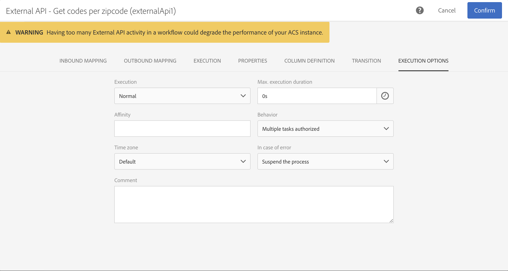

# External API {#external-api}

## Description {#description}

**[!UICONTROL External API]** 活動會透過REST API呼叫從 **外部系統** 將資料帶入 **工作流程** 。

The REST endpoints can be a Customer management system, an [Adobe I/O Runtime](https://www.adobe.io/apis/experienceplatform/runtime.html) or an Experience Cloud REST endpoints (Data Platform, Target, Analytics, Campaign, etc).

此活動的主要特點包括：

* MB http回應資料大小限制
* 透過對外特定轉場的失敗管理
* 請求逾時為60秒
* 不允許HTTP重新導向
* 非HTTPS URL被拒絕
* 「接受：application/json「request header and「Content-Type」：application/json「回應標題」

## Configuration {#configuration}

Drag and drop an **[!UICONTROL External API]** activity into your workflow and open the activity to start the configuration.

### 傳入對應

傳入對應是由先前傳入活動產生的暫時表格，會在UI中顯示並以JSON形式傳送。
使用者可根據此暫存表格修改傳入資料。

**「內嵌資源** 」下拉式清單可讓您選取將建立暫存表格的查詢活動。

**「新增計數參數** 」核取方塊將會計算來自暫存表格的每一列的計數值。請注意，只有當傳入的活動產生臨時表格時，才可使用此核取方塊。

**「內嵌欄」** 區段可讓使用者從傳入的轉換表格新增任何欄位。選取的欄將是資料物件中的索引鍵。JSON中的資料物件將是包含傳入轉換表格每一列之選定欄資料的陣列清單。

**自訂參數** 文字方塊可讓您使用外部API所需的額外資料新增有效的JSON。此額外資料會新增至產生的JSON中的params物件。

### 對外對應

This tab lets you define the sample **JSON structure** returned by the API Call.

The JSON structure pattern is: **{“data”:[{“key”:“value”}, {“key”:“value”},...]}**

The sample JSON definition must have the **following characteristics**:

* **資料** 是JSON中的強制屬性名稱，「資料」的內容是JSON陣列。
* **陣列元素** 必須包含第一級屬性(不支援更深層次)。
   **屬性名稱** 最後會變成輸出暫存表格輸出結構的欄名稱。
* **欄名稱** 定義是以「資料」陣列的第一個元素為基礎。
Columns definition (add/remove) and the type value of the property can be edited in the **Column definition** tab.

If the **parsing is validated** a message appears and invite you to customize the data mapping in the "Column definition" tab. 在其他情況下，會顯示錯誤訊息。

### 執行執行

This tab lets you define the **HTTPS Endpoint** that will send data to ACS. If needed, you can enter authentication information in the fields below.

### 屬性

This tab lets you control **general properties** on the external API activity like the displayed label in the UI. 內部ID無法自訂。

### 欄定義

    &gt;[！注意]
    &gt;
    &gt;&gt;此標籤會在**回應資料格式**已完成並在「對外對應」標籤中驗證時顯示。

**「欄定義** 」標籤可讓您精確指定每個欄的資料結構，以便匯入不包含任何錯誤的資料，並使它符合Adobe Campaign資料庫中已存在的類型，以便日後操作。

例如，您可以變更欄的標籤，選取其類型(字串、整數、日期等)。甚至指定錯誤處理。

For more information, refer to the [Load File](../../automating/using/load-file.md) section.

### 轉場效果

This tab lets you activate the **outbound transition** and its label. This specific transition is useful in case of **timeout** or if the payload exceed the **data size limit**.

### 執行選項

大部分工作流程活動都有此標籤。For more information, consult the [Activity properties](../../automating/using/executing-a-workflow.md#activity-properties) section.

<!--
## Example: Managing coupons with External API Activity

This example illustrates how to **add coupon value** retrieving by a REST call to profiles and then sending an email containing these coupon values.

The workflow is presented as follows:

1. Drag and drop an **External API** activity
    1. Parse the JSON sample responsa as {"data":[{"code":"value"}]}.
    1. Add the **Rest endpoint URL** and define authentication setting if needed
    
    1. In the **column definition** tab, add a new column called **code** that will store the code value.
        
    1. Enabled an **outbound transition** to manage request failures.
1. Drag and drop a **Query** activity
    1. Configure the **Target** tab to query all the **@adobe.com** email. For different Query samples, refer to the [Query](../../automating/using/query.md) section.
    1. In the **additional data** tab, add a new column based on **rowId()** function. This additional column allows you to reconciliate coupon code with the profile ID..
        

        >[!NOTE]
        >
        >This reconciliation approach means that the profile query number is equal to the number of coupon values returned by the REST call.
1. Once this two activities are configured, drag and drop an **Enrichment** activity to associate coupon values with profiles.
    1. Select the previous Query activity in the **primarySet** field.
        
    1. Create a new relation in the **Advanced relations** tab, and add the following reconciliation criteria:
    1. **@expr1** coming grom the Query activity in the source expression field.
    1. **@lineNum** as an expression that returns the line number for each coupon value in the destination field.
        
        More information on the enrichment activity are available [here](../../automating/using/enrichment.md)

    1. The transition **Data Structure** will contain:
        
1. Finally drag and drop a **Send via Email** activity.
    You can modify your email template by adding the **code** personnalized field.

-->
