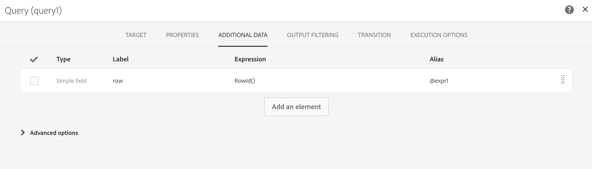

# 外部 API {#external-api}

## 說明 {#description}

**[!UICONTROL External API]** 活動會透過 **HTTP API** 呼叫，從&#x200B;**外部系統**&#x200B;將資料帶入工作流程中。

外部系統端點可以是公用 API 端點、客戶管理系統或無伺服器應用程式執行個體（例如 [Adobe I/O Runtime](https://www.adobe.io/apis/experienceplatform/runtime.html)），以及一些類別。

>[!NOTE]
>
>基於安全性原因，Campaign Standard 不支援使用 JSSP。如果您需要執行程式碼，可以透過外部 API 活動呼叫 Adobe I/O Runtime 執行個體。

本活動的主要特點是：

* 能夠將 JSON 格式的資料傳遞至第三方 REST API 端點
* 能夠重新接收 JSON 回應、將它對應至輸出表格，並傳遞至下游的其他工作流程活動。
* 具有出站特定轉變的故障管理

### 回溯相容性注意事項 {#from-beta-to-ga}

藉由 Campaign Standard 20.4 版本的發佈，http 回應資料大小限制和回應逾時護欄已降低，以符合最佳實務（請參閱「限制和護欄」一節）。這些護欄修改不會對現有的外部 API 活動產生影響；因此，建議您在所有工作流程中，以新版本取代現有的外部 API 活動。

如果您要從 Campaign Standard 20.2（或更舊版本）升級，請注意，Campaign Standard 20.3 版中的外部 API 功能將從測試版移至 General Availability。

因此，如果您使用測試版外部 API 活動，則需要在所有工作流程中以 GA 外部 API 活動來取代這些活動。  從 Campaign Standard 20.3 版開始，使用外部 API 測試版的工作流程將無法運作。

取代外部 API 活動時，將新的外部 API 活動新增至工作流程、手動複製設定詳細資訊，然後刪除舊活動。

>[!NOTE]
>
>您將無法複製活動指定標題值，因為這些值在活動中被遮罩。

接著，重新設定工作流程中指向及/或使用測試版外部 API 活動資料的其他活動，以指向及/或使用新外部 API 活動的資料。活動範例：電子郵件傳送（個人化欄位）、擴充活動等。

### 限制和護欄 {#guardrails}

以下護欄適用於此活動：

* 5MB http 回應資料大小限制（注意：這與之前版本中 50MB 的限制有所不同）
* 請求逾時為 1 分鐘（注意：這與之前版本中 10 分鐘逾時有所不同）
* 不允許 HTTP 重新導向
* 拒絕非 HTTPS Url
* 允許使用 &quot;Accept: application/json&quot; 要求標頭及 &quot;Content-Type: application/json&quot; 回應標頭

具體的護欄已經到位：

* **JSON 深度上限**：將可處理的自訂巢狀 JSON 的深度上限限制為 10 個層級。
* **JSON 金鑰長度上限**：將內部密鑰的最大長度限制為 255。此鍵與欄 ID 相關聯。
* **允許的 JSON 重複金鑰上限**：將作為欄 ID 的重複 JSON 屬性名稱的總數上限為 150。

>[!CAUTION]
>
>外部 API 活動的用途是擷取促銷活動範圍的資料（最新的選件集、最新的分數等），而非擷取每個設定檔的特定資訊，因為這會導致大量資料傳輸。如果使用案例需要此項目，建議使用[傳輸檔案](../../automating/using/transfer-file.md)活動。

## 設定 {#configuration}

將 **[!UICONTROL External API]** 活動拖放到工作流程中，並開啟活動以啟動設定。

### 入站對應

入站對應是由先前入站活動產生的臨時表格，將在 UI 中顯示為 JSON 並發送。
根據此臨時表格，使用者可以對入站資料進行修改。

**入站資源**&#x200B;下拉式功能表可讓您選取將建立臨時表格的查詢活動。

**新增計數參數**&#x200B;核取方塊將為來自臨時表格的每行新增計數值。請注意，此核取方塊僅在入站活動產生臨時表格時才可用。

**入站欄**&#x200B;區段可讓使用者從入站轉變表格中新增任何欄位。選取的欄將是資料物件中的金鑰。JSON 中的資料物件將是陣列清單，包含入站轉變表格各列所選欄的資料。

**自訂參數**&#x200B;文字方塊可讓您新增有效的 JSON 及外部 API 所需的其他資料。此額外資料將新增至產生的 JSON 中的 params 物件。

### 出站對應

此索引標籤可讓您定義 API 呼叫傳回的範例 **JSON 結構**。

JSON 剖析器的設計可容納標準 JSON 結構模式類型，但有些例外。標準模式的範例是：`{“data”:[{“key”:“value”}, {“key”:“value”},...]}`

範例 JSON 定義必須具有&#x200B;**下列特性**：

* **陣列元素**必須包含第一級屬性（不支援較深的層級）。
   **屬性名稱**，最終將成為輸出臨時表格之輸出架構的欄名稱。
* 要擷取的 **JSON 元素**&#x200B;必須在 JSON 回應內的 10 級或更低巢狀層級。
* **欄名稱**，定義是以 &quot;data&quot; 陣列的第一個元素為基礎。
列定義（新增/刪除）和屬性的類型值可以在 **Column definition** 索引標籤中編輯。

**平面化核取方塊**&#x200B;行為：

平面化核取方塊（預設值：未勾選），以指出是否將 JSON 平面化為索引鍵/值對應。

* **停用核取方塊**（未勾選）時，會剖析範例 JSON 以尋找陣列物件。使用者將需要提供 API 回應範例 JSON 格式的裁剪版本，如此 Adobe Campaign 就能確切判斷使用者想要使用哪個陣列。在工作流程製作時，將會判斷並記錄巢狀陣列物件的路徑，以便在執行時使用它來存取從 API 呼叫接收的 JSON 回應內文中存取該陣列物件。

* **啟用核取方塊**（已核取）後，範例 JSON 將會平面化，而提供之範例 JSON 中指定的所有屬性將用於建立輸出臨時表格的欄，並顯示在 Column Definitions 索引標籤上。請注意，如果範例 JSON 中有任何陣列物件，則這些陣列物件的所有元素也會平面化。

如果已&#x200B;**驗證解析**，則會出現一條訊息，邀請您在「列定義」索引標籤中自訂資料對應。在其他情況下，會顯示錯誤訊息。

### 執行

此索引標籤可讓您定義連接端點。該&#x200B;**[!UICONTROL URL]**&#x200B;欄位允許您定義將向 ACS 發送資料的 **HTTPS 端點**。

如果端點需要，則可以使用兩種驗證方法：

* 基本驗證：在 **[!UICONTROL Request Header(s)]** 欄位中輸入您的使用者名稱/密碼資訊。

* OAuth 驗證：按一下 **[!UICONTROL Use connection parameters defined in an external account]**，您可以選取定義 OAuth 驗證的外部帳戶。如需詳細資訊，請參閱[外部帳戶](../../administration/using/external-accounts.md)。

### 屬性

此索引標籤可讓您控制外部 API 活動的&#x200B;**一般屬性**，例如， UI 中顯示的標籤。無法自訂內部 ID。

### 欄定義

>[!NOTE]
>
>在 Outbound Mapping 索引標籤中完成並驗證&#x200B;**回應資料格式**&#x200B;時，將顯示此索引標籤。

**Column definition** 索引標籤可讓您精確指定每欄的資料結構，以匯入不含任何錯誤的資料，並使其符 Adobe Campaign 資料庫中已存在的類型，以供日後作業使用。

例如，您可以變更欄的標籤，並選取其類型（字串、整數、日期等）或甚至指定錯誤處理。

如需詳細資訊，請參閱[載入檔案](../../automating/using/load-file.md)區段。

### 轉變

此索引標籤可讓您啟用&#x200B;**出站轉變**&#x200B;及其標籤。在&#x200B;**逾時**&#x200B;或負載超過&#x200B;**資料大小限制**&#x200B;時，此特定轉變很實用。

### 執行選項

此索引標籤可用於大部分的工作流程活動。如需詳細資訊，請參閱[活動屬性](../../automating/using/activity-properties.md)區段。

## 疑難排解

此新工作流程活動中新增了兩種類型的日誌訊息：資訊與錯誤。它們可協助您疑難排解潛在問題。

### 資訊

這些日誌訊息用於在工作流程活動執行期間記錄有關有用檢查點的資訊。
<table> 
 <thead> 
  <tr> 
   <th> 訊息格式  </th> 
   <th> 範例   </th> 
  </tr> 
 </thead> 
 <tbody> 
  <tr> 
   <td> 叫用 API URL '%s'。</td> 
   <td> 
叫用 API URL 'https://example.com/api/v1/web-coupon?count=2'。
</td> 
  </tr> 
  <tr> 
   <td> 由於 %d 毫秒中的 %s 與嘗試 %d，正在重試 API URL '%s'。</td> 
   <td> 
由於 HTTP - 401（2364 毫秒）與嘗試 2，而重試 API URL 'https://example.com/api/v1/web-coupon?count=0'。
</td>
  </tr> 
  <tr> 
   <td> 正在傳輸 '%s'(%s / %s) 的內容。</td> 
   <td> 
從 'https://example.com/api/v1/web-coupon?count=2'(1234 / 1234) 傳輸內容。
</td> 
  </tr>
  <tr> 
   <td> 使用提供者 ID '%s' 的快取存取權杖。</td> 
   <td> 
使用提供者 ID 'EXT25' 的快取存取權杖。注意： EXT25 是外部帳戶的 ID（或名稱）。 
</td> 
  </tr>
  <tr> 
   <td> 已從伺服器為提供者 ID '%s' 擷取存取權杖。</td> 
   <td> 
已從伺服器為提供者 ID 'EXT25' 擷取存取權杖。注意：EXT25 是外部帳戶的 ID（或名稱）。
</td> 
  </tr>
  <tr> 
   <td> 正在重新整理 OAuth 存取權杖，因為發生錯誤 (HTTP:'%d')。</td> 
   <td> 
正在重新整理 OAuth 存取權杖，因為發生錯誤 (HTTP:)。
</td> 
  </tr>
  <tr> 
   <td> 重新整理 OAuth 存取權杖時發生錯誤（錯誤：'%d'）。 </td> 
   <td> 
重新整理 OAuth 存取權杖時發生錯誤（錯誤：'404'）。
</td> 
  </tr>
  <tr> 
   <td> 嘗試 %d 時，無法使用指定的外部帳戶擷取 OAuth 存取權杖，在 %d 毫秒內重試。</td> 
   <td> 
嘗試 1 時，無法使用指定的外部帳戶擷取 OAuth 存取權杖，於 1387 毫秒內重試。
</td> 
  </tr>
 </tbody> 
</table>

### 錯誤

這些日誌訊息用於記錄有關可能最終導致工作流程活動失敗的意外錯誤條件的資訊。

<table> 
 <thead> 
  <tr> 
   <th> 代碼 – 訊息格式  </th> 
   <th> 範例   </th> 
  </tr> 
 </thead> 
 <tbody> 
  <tr> 
   <td> WKF-560250 – 超出 API 要求內文限制（限制：'%d'）。</td> 
   <td> 
已超出 API 要求內文限制（限制：'5242880'）。
</td> 
  </tr> 
  <tr> 
   <td> WKF-560239 – 超出 API 回應限制（限制：'%d'）。</td> 
   <td> 
已超出 API 回應限制（限制：5242880'）。
</td> 
  </tr> 
  <tr> 
   <td> WKF-560245 – 無法剖析 API URL（錯誤：'%d'）。</td> 
   <td> 
無法剖析 API URL（錯誤：'-2010'）。

   
 注意：當 API URL 失敗驗證規則時，會記錄此錯誤。
</td>
  </tr> 
  <tr>
   <td> WKF-560244 - API URL 主機不能是 'localhost' 或 IP 位址常值（URL 主機：'%s'）。</td> 
   <td> 
API URL主機不得是 'localhost' 或 IP 位址常值（URL 主機： 'localhost'）。

    
API URL主機不得是 'localhost' 或 IP 位址常值（URL 主機：192.168.0.5'）。

    
API URL主機不得是 'localhost' 或 IP 位址常值（URL 主機：'[2001]'）。
</td>
  </tr> 
  <tr> 
   <td> WKF-560238 - API URL 必須是安全 URL (https)（請求的 URL：'%s'）。</td> 
   <td> 
API URL 必須是安全 URL(https)（請求的 URL：'https://example.com/api/v1/web-coupon?count=2'）。
</td> 
  </tr> 
  <tr> 
   <td> WKF-560249 – 無法建立請求內文 JSON。新增 '%s' 時出錯。</td> 
   <td> 
無法建立請求正文 JSON。新增 'params' 時出錯。

    
無法建立請求正文 JSON。新增 'data' 時發生錯誤。
</td>
  </tr> 
  <tr> 
   <td> WKF-560246 - HTTP 標頭鍵錯誤（標頭鍵：'%s'）。</td> 
   <td> 
HTTP 標頭鍵錯誤（標頭鍵：'%s'）。

   
 注意：當自訂標頭密鑰根據 <a href="https://tools.ietf.org/html/rfc7230#section-3.2.html">RFC</a> 驗證失敗時，將記錄此錯誤
</td> 
  </tr>
 <tr> 
   <td> WKF-560248 – 不允許 HTTP 標頭鍵（標頭鍵：'%s'）。</td> 
   <td> 
不允許 HTTP 標題鍵（標題鍵：'接受'）。
</td> 
  </tr> 
  <tr> 
   <td> WKF-560247 - HTTP 標頭值錯誤（標頭值：'%s'）。</td> 
   <td> 
HTTP 標頭值錯誤（標頭值：'%s'）。 

    
注意：當自訂標頭值根據 <a href="https://tools.ietf.org/html/rfc7230#section-3.2.html">RFC</a> 驗證失敗時，將記錄此錯誤
</td> 
  </tr> 
  <tr> 
   <td> WKF-560240 - JSON 裝載有不良屬性 '%s'。</td> 
   <td> 
JSON 裝載包含不正確的屬性 'plash'。
</td>
  </tr> 
  <tr>
   <td> WKF-560241 – 格式錯誤的 JSON 或不可接受的格式。</td> 
   <td> 
格式錯誤的 JSON 或不可接受的格式。

   
注意：此訊息僅適用於從外部 API 剖析回應內文，並在嘗試驗證回應內文是否符合本練習規定的 JSON 格式時記錄。
</td>
  </tr>
  <tr> 
   <td> WKF-560246 – 活動失敗（原因：'%s'）。</td> 
   <td> 
當活動因 HTTP 401 錯誤回應而失敗時 – 活動失敗（原因：'HTTP - 401'）

        
當活動因內部呼叫失敗而失敗時 – 活動失敗（原因：'iRc - -Nn'）。

        
當活動因無效的內容類型標題而失敗時。- 活動失敗（原因：'Content-Type - application/html'）。
</td> 
  </tr>
  <tr> 
   <td> WKF-560278 -「初始化 OAuth 協助程式時發生錯誤（錯誤：'%d'）」。</td> 
   <td> 
此錯誤表示活動無法初始化內部 OAuth2.0 協助程式設施，因為使用外部帳戶中設定的屬性初始化協助程式時發生錯誤。
</td>
  </tr>
  <tr> 
   <td> WKF-560279 -「不允許 HTTP 標頭鍵（標頭鍵：'%s'）。」</td> 
   <td> 
此警告（非錯誤）訊息指出 OAuth 2.0 外部帳戶已設定為新增憑證作為 HTTP 標頭，但因為標頭金鑰是保留的標頭金鑰，所以不允許使用此金鑰。
</td>
  </tr>
  <tr> 
   <td> WKF-560280 - 找不到 '%s' ID 的外部帳戶。</td> 
   <td> 
找不到 'EXT25' ID 的外部帳戶。注意：此錯誤指出活動已設定為使用無法再找到的外部帳戶。當帳戶已從 DB 刪除時最有可能發生此情況，因此在正常作業環境中不可能發生。
</td>
  </tr>
  <tr> 
   <td> WKF-560281 - 已停用 '%s' ID 的外部帳戶。</td> 
   <td> 
'EXT25' ID 的外部帳戶已停用。注意：此錯誤指出活動已設定為使用外部帳戶，但該帳戶已停用（或標示為非使用中）。
</td>
  </tr>
  <tr> 
   <td> WKF-560282 - 不支援協議。</td> 
   <td> 
此錯誤指出與活動相關聯的外部帳戶不是 OAuth2.0 外部帳戶。因此，除非活動設定發生某些損壞或手動更改，否則不太可能發生此錯誤。
</td>
  </tr>
  <tr> 
   <td> WKF-560283 - 擷取 OAuth 存取權杖失敗。</td> 
   <td> 
此錯誤的最常見原因是外部帳戶的設定錯誤（例如，在使用外部帳戶時，未先測試連線是否成功）。外部帳戶上的 URL/認證可能已變更。
</td>
  </tr>
  <tr> 
   <td> CRL-290199 - 無法觸達頁面：%s。</td> 
   <td> 
為 OAuth 設定外部帳戶 UI 螢幕畫面時，會顯示此錯誤訊息。這表示外部授權伺服器的 URL 不正確/已變更/來自伺服器的回應為「找不到頁面」。
</td>
  </tr>
  <tr> 
   <td> CRL-290200 - 不完整/不正確的認證。</td> 
   <td> 
為 OAuth 設定外部帳戶 UI 螢幕畫面時，會顯示此錯誤訊息。這表示認證不正確或遺失連接至驗證伺服器的其他必要認證。

</td>
  </tr>
 </tbody> 
</table>

<!--
## Example: Managing coupons with External API Activity

This example illustrates how to **add coupon value** retrieving by a REST call to profiles and then sending an email containing these coupon values.

The workflow is presented as follows:

1. Drag and drop an **External API** activity
    1. Parse the JSON sample responsa as {"data":[{"code":"value"}]}.
    1. Add the **Rest endpoint URL** and define authentication setting if needed
    
    1. In the **column definition** tab, add a new column called **code** that will store the code value.
        
    1. Enabled an **outbound transition** to manage request failures.
1. Drag and drop a **Query** activity
    1. Configure the **Target** tab to query all the **@adobe.com** email. For different Query samples, refer to the [Query](../../automating/using/query.md) section.
    1. In the **additional data** tab, add a new column based on **rowId()** function. This additional column allows you to reconciliate coupon code with the profile ID..
        

        >[!NOTE]
        >
        >This reconciliation approach means that the profile query number is equal to the number of coupon values returned by the REST call.
1. Once this two activities are configured, drag and drop an **Enrichment** activity to associate coupon values with profiles.
    1. Select the previous Query activity in the **primarySet** field.
        
    1. Create a new relation in the **Advanced relations** tab, and add the following reconciliation criteria:
    1. **@expr1** coming grom the Query activity in the source expression field.
    1. **@lineNum** as an expression that returns the line number for each coupon value in the destination field.
        
        More information on the enrichment activity are available [here](../../automating/using/enrichment.md)

    1. The transition **Data Structure** will contain:
        
1. Finally drag and drop a **Send via Email** activity.
    You can modify your email template by adding the **code** personnalized field.

-->
