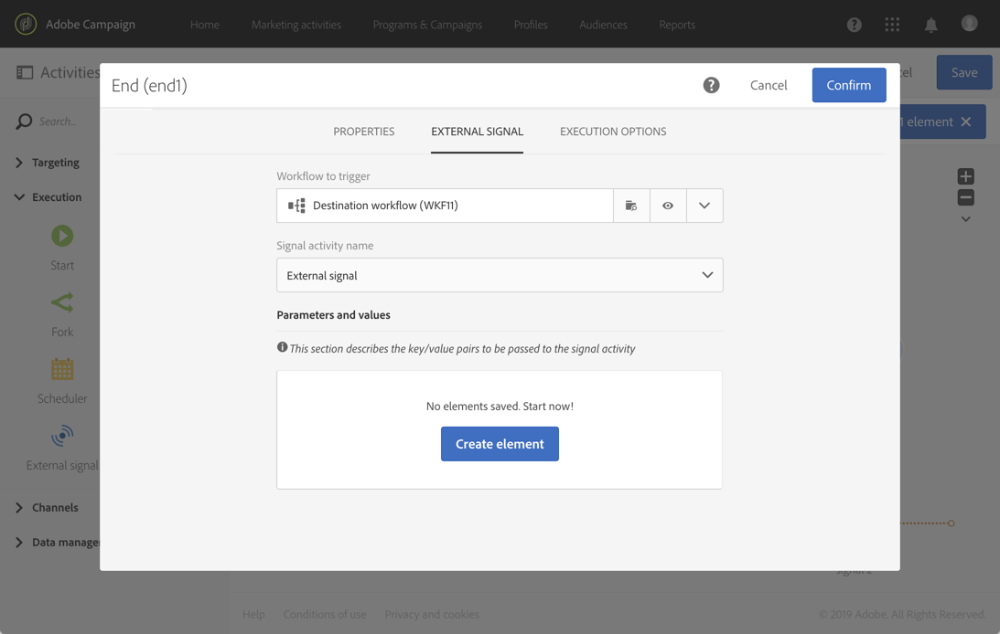

# 外部信號{#external-signal}

## 說明 {#description}

當某 **[!UICONTROL External signal]** 些條件在另一個工作流或REST API呼叫中成功滿足時，活動會觸發工作流。

## 使用內容 {#context-of-use}

此活 **[!UICONTROL External signal]** 動可用來組織和協調不同的流程，這些流程是同一客戶歷程中不同工作流程的一部分。 它允許從另一個工作流程開始，以支援更複雜的客戶歷程，同時更能監控和回應問題。

此 **[!UICONTROL External signal]** 活動設計為作為工作流的第一個活動。 可從其他工作流程 **[!UICONTROL End]** 的活動或REST API呼叫(如需詳細資訊，請參閱 [API檔案](../../api/using/triggering-a-signal-activity.md))觸發。

觸發時，可定義外部參數，並可在工作流程事件變數中使用。 使用外部參數調用工作流的過程在本節中進 [行了詳細說明](../../automating/using/calling-a-workflow-with-external-parameters.md)。

>[!NOTE]
>
>無法比每10分鐘更頻繁地觸發活動。

請注意，活動 **[!UICONTROL External signal]** 可從數個不同的事件觸發。 在這種情況下，當 **[!UICONTROL External signal]** 執行其中一個來源工作流程或API呼叫時，就會立即觸發。 它不需要完成所有來源工作流程。

**相關主題**

* [使用案例： 外部信號活動和資料導入](../../automating/using/external-signal-data-import.md)。
* [使用案例： 呼叫工作流程，以使用外部參數從檔案建立觀眾](../../automating/using/calling-a-workflow-with-external-parameters.md#use-case)

## 配置 {#configuration}

配置外部信號時，首先必須在目標工作流 **[!UICONTROL External signal]** 中配置活動。 完成此配置後，此工 **[!UICONTROL External signal]** 作流的活動將可用於配置源工作流 **[!UICONTROL End]** 的活動。

1. 將活動拖放至 **[!UICONTROL External signal]** 您的目標工作流程。
1. 選擇活動，然後使用顯示的快  速操作中的按鈕將其開啟。
1. 編輯活動的標籤。 配置觸發的源工作流時需要此標籤 **[!UICONTROL External signal]**。

   如果要使用參數調用工作流，請使用該 **[!UICONTROL Parameters]** 區域來聲明它們。 如需詳細資訊，請參閱[本章節](../../automating/using/calling-a-workflow-with-external-parameters.md#declaring-the-parameters-in-the-external-signal-activity)。

   

1. 確認活動的設定、新增您需要的任何其他活動並儲存工作流程。

   >[!NOTE]
   >
   >如果要從另一個工作流觸發目標工作流，請繼續下列步驟。 如果您想要從REST API呼叫觸發目標工作流程，請參閱 [API檔案](../../api/using/triggering-a-signal-activity.md) ，以取得詳細資訊。

1. 開啟來源工作流程並選取 **[!UICONTROL End]** 活動。 如果沒有可 **[!UICONTROL End]** 用活動，請在工作流分支的最後一個活動後添加一個活動。

   有些活動預設沒有任何出站轉移。 從這些 **[!UICONTROL Properties]** 活動的頁籤中，可以添加出站轉變。

   例如，在活動 **[!UICONTROL Update data]** 中，移至標籤並 **[!UICONTROL Transitions]** 勾選選 **[!UICONTROL Add an outbound transition without the population]** 項。 此選項允許添加不含任何資料且不佔用系統中任何不必要的空間的過渡。 它只是用來連接觸發目標工作 **[!UICONTROL End]** 流程的額外活動。

   

1. 在活動 **[!UICONTROL External signal]** 的標籤中，選 **[!UICONTROL End]** 擇目標工作流以及要在該工作流 **[!UICONTROL External signal]** 中觸發的活動。

   當您設定活動以觸 **[!UICONTROL End]** 發另一個工作流程時，其圖示會以其他訊號符號更新。

   如果要使用參數調用工作流，請使用該 **[!UICONTROL Parameters and values]** 區域。 如需詳細資訊，請參閱[本章節](../../automating/using/calling-a-workflow-with-external-parameters.md#defining-the-parameters-when-calling-the-workflow)。

   

1. 保存源工作流。

執行來 **[!UICONTROL End]** 源工作流或REST API調用的活動後，目標工作流將自動從活動觸發 **[!UICONTROL External signal]** 。

>[!NOTE]
>
>目標工作流必須先手動啟動，才能觸發。 啟動後，將激 **[!UICONTROL External activity]** 活該代碼並等待源工作流中的信號。
