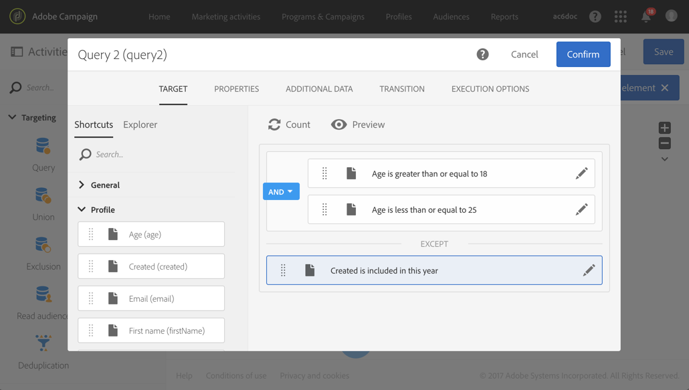
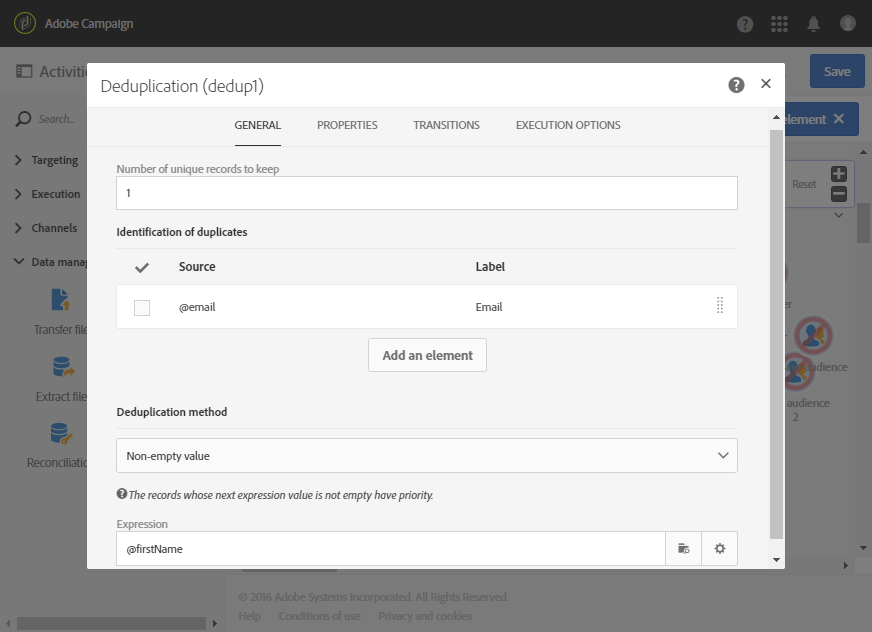

# 在傳遞之前識別重複項目 {#identifying-duplicates-before-a-delivery}

以下範例說明重複資料刪除可讓您在傳送電子郵件之前排除目標的重複項目。 這表示您可以避免將通訊多次傳送至相同的輪廓。

工作流程由以下部分組成：

* 允許您定義電子郵件目標的[查詢](../../automating/using/query.md)。 在此，工作流將目標鎖定在客戶端資料庫中已存留超過一年的 18 到 25 歲的所有配置檔案。

  

* [重複資料刪除](../../automating/using/deduplication.md)活動，可讓您識別來自前一個查詢的重複專案。 在此範例中，僅會針對每個重複項目儲存一個記錄。 重複項目是使用電子郵件地址識別。 這表示每個要存在於定位中的電子郵件地址只能傳送一次電子郵件傳送。

  選取的重複資料刪除方法是 **[!UICONTROL Non-empty value]**。 這可讓您確保在記錄中，若有重複項目，會對已提供&#x200B;**名字**&#x200B;的項目指定優先順序。 如果在電子郵件內容的個人化欄位中使用名字，這會使其更加連貫。

  此外，還新增了額外的轉變功能，以保留複本並列出複本。

  

* 在重複資料刪除的主要出站轉變之後放置的[電子郵件傳遞](../../automating/using/email-delivery.md)。
* 重複資料刪除的額外轉變之後所放置的[儲存對象](../../automating/using/save-audience.md)活動，可將重複資料儲存到&#x200B;**重複資料**&#x200B;對象中。 此客群可重複使用，以直接將其成員排除在每封電子郵件的傳送之外。
