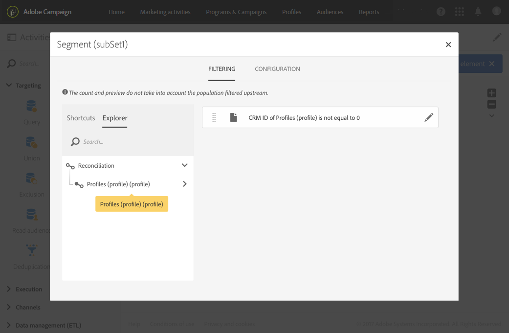

# 匯入資料{#importing-data}

## 收集資料 {#collecting-data}

您可以從檔案收集資料以處理資料及／或將資料匯入Adobe Campaign資料庫。

* 此活 **[!UICONTROL Load file]** 動可讓您匯入單一結構化格式的資料，以便在Adobe Campaign中使用此資料。 資料會暫時匯入，而另一個活動必須將它完全整合在Adobe Campaign資料庫中。
* 此活 **[!UICONTROL Transfer file]** 動可讓您接收或傳送檔案、測試Adobe Campaign中是否有檔案或列出檔案。

   您可以在前使用此活動，以 **[!UICONTROL Load file]** 防需要從外部源中檢索檔案。

## 匯入最佳實務 {#import-best-practices}

謹慎並遵循下面詳述的幾個簡單規則，將有助於確保資料庫內的資料一致性，並避免在資料庫更新或資料匯出期間發生常見錯誤。

### 使用匯入範本 {#using-import-templates}

大部分的匯入工作流程應包含下列活動： **[!UICONTROL Load file]**, **[!UICONTROL Reconciliation]****[!UICONTROL Segmentation]**, **[!UICONTROL Deduplication]**, **[!UICONTROL Update data]**。

使用匯入範本可讓您非常方便地準備類似的匯入，並確保資料庫中的資料一致性。

在許多專案中，匯入建置時不 **[!UICONTROL Deduplication]** 會執行任何活動，因為專案中使用的檔案不會重複。 有時會從匯入不同的檔案中顯示重複項目。 因此，消除重複就很困難。 因此，重複資料消除步驟是所有導入工作流中的良好預防措施。

切勿假設傳入的資料是一致且正確的，或IT部門或Adobe Campaign主管負責處理。 在專案期間，請牢記資料清理。 在匯入資料時，可消除重複資料、進行協調並維持一致性。

「示例：」( [Example:)中提供了為導入資料而設計的通用工作流模板的示例。「導入工作流模板](#example--import-workflow-template) 」部分。

>[!NOTE]
>
>您也可以使用 [匯入範本](../../automating/using/importing-data-with-import-templates.md)。 它們是由管理員定義的工作流模板，一旦激活，則僅提供指定包含要導入的資料的檔案的可能性。

### 使用平面檔案格式 {#using-flat-file-formats}

匯入時最有效的格式是平面檔案。 平面檔案可以在資料庫級別以批量模式導入。

例如：

* 分隔符號：制表符或分號
* 首行含標題
* 無字串分隔字元
* 日期格式：YYYY/MM/DD HH:mm:SS

要導入的檔案示例：

```
lastname;firstname;birthdate;email;crmID
Smith;Hayden;23/05/1989;hayden.smith@example.com;124365
Mars;Daniel;17/11/1987;dannymars@example.com;123545
Smith;Clara;08/02/1989;hayden.smith@example.com;124567
Durance;Allison;15/12/1978;allison.durance@example.com;120987
```

### 使用壓縮 {#using-compression}

盡可能使用壓縮檔案進行匯入和匯出。 預設支援GZIP。 您可以分別在匯入檔案或擷取資料時新增前置處理，在和工作流程活動 **[!UICONTROL Load file]** 中加 **[!UICONTROL Extract file]** 入後置處理。

### 在增量模式中導入 {#importing-in-delta-mode}

常規導入必須在delta模式下完成。 這表示每次只會傳送已修改或新資料至Adobe Campaign，而非整個表格。

完整匯入應僅用於初始載入。

### 維護一致性 {#maintaining-consistency}

若要維持Adobe Campaign資料庫中的資料一致性，請遵循下列原則：

* 如果匯入的資料與Adobe Campaign中的參考表格相符，則應與工作流程中的該表格協調。 不應拒絕不符合的記錄。
* 確保匯入的資料一律「 **標準化」** （電子郵件、電話號碼、直效郵件位址），而且此標準化是可靠的，多年來不會變更。 如果不是這樣，有些復本可能會出現在資料庫中，而Adobe Campaign不提供進行「模糊」比對的工具，因此很難管理和移除它們。
* 事務性資料應具有協調密鑰，並與現有資料協調以避免建立重複資料。
* **依順序匯入相關檔案**。 如果匯入由多個彼此依存的檔案組成，工作流程應確保檔案的匯入順序正確。 檔案失敗時，不會導入其他檔案。
* **匯入資料**&#x200B;時，可以消除重複資料、進行協調並維持一致性。

## 範例：匯入工作流程範本 {#example--import-workflow-template}

如果您需要定期匯入具有相同結構的檔案，請使用匯入範本是最佳做法。

此範例說明如何預先設定可重複用於匯入來自Adobe Campaign資料庫中CRM的設定檔的工作流程。

1. 從中建立新的工作流模板 **[!UICONTROL Resources > Templates > Workflow templates]**。
1. 新增下列活動：

   * **[!UICONTROL Load file]**:定義包含要導入資料的檔案的預期結構。

      >[!NOTE]
      >
      >您只能從單一檔案匯入資料。 如果工作流程有多 **[!UICONTROL Load file]** 個活動，則每次都會使用相同的檔案。

   * **[!UICONTROL Reconciliation]**:協調導入的資料與資料庫資料。
   * **[!UICONTROL Segmentation]**:根據記錄是否可以調節，建立篩選器以不同方式處理記錄。
   * **[!UICONTROL Deduplication]**:在將傳入檔案插入資料庫之前，先從該檔案中消除重複資料。
   * **[!UICONTROL Update data]**:使用導入的配置檔案更新資料庫。
   

1. 設定活 **[!UICONTROL Load file]** 動：

   * 上傳範例檔案以定義預期的結構。 範例檔案應僅包含幾行，但是導入時需要的所有列。 檢查並編輯檔案格式，以確保每列的類型設定正確：文字、日期、整數等。 例如：

      ```
      lastname;firstname;birthdate;email;crmID
      Smith;Hayden;23/05/1989;hayden.smith@mailtest.com;123456
      ```

   * 在區 **[!UICONTROL File to load]** 段中，選 **[!UICONTROL Upload a new file from the local machine]** 取並保留空白欄位。 每次從此模板建立新工作流時，您都可以在此處指定所需的檔案，只要該檔案與定義的結構相對應。

      您可以使用任何選項，但必須相應修改模板。 例如，如果您選 **[!UICONTROL Use the file specified in the inbound transition]**&#x200B;取，則可在 **[!UICONTROL Transfer file]** 擷取要從FTP/SFTP伺服器匯入的檔案之前新增活動。

      如果您希望使用者能夠下載包含匯入期間發生錯誤的檔案，請勾選 **[!UICONTROL Keep the rejects in a file]** 選項並指定 **[!UICONTROL File name]**。

      

1. 設定活 **[!UICONTROL Reconciliation]** 動。 此活動的目的是識別傳入的資料。

   * 在標籤 **[!UICONTROL Relations]** 中，選 **[!UICONTROL Create element]** 取並定義匯入資料與收件者定位維度之間的連結(請參閱 [定位維度和資源](../../automating/using/query.md#targeting-dimensions-and-resources))。 在此範例中， **CRM ID** custom欄位可用來建立連結條件。 只要您需要欄位或欄位組合，就能識別唯一記錄。
   * 在頁籤 **[!UICONTROL Identification]** 中，將選項保留為未 **[!UICONTROL Identify the document from the working data]** 選中狀態。
   

1. 設定活 **[!UICONTROL Segmentation]** 動，以擷取一個轉場中已協調的收件者，以及在第二個轉場中無法協調但擁有足夠資料的收件者。

   然後，可以使用與已調節的收件人之間的轉換來更新資料庫。 然後，如果檔案中有一組最小資訊，則與未知收件人的轉換可用於在資料庫中建立新收件人條目。

   無法協調且沒有足夠資料的收件者會在補充的對外轉場中選取，並可匯出成個別檔案或略過。

   * 在活 **[!UICONTROL General]** 動的標籤中，將設為 **[!UICONTROL Resource type]** 並 **[!UICONTROL Temporary resource]** 選擇作 **[!UICONTROL Reconciliation]** 為目標集。
   * 在選 **[!UICONTROL Advanced options]** 項卡中，選 **[!UICONTROL Generate complement]** 中該選項可查看是否無法在資料庫中插入任何記錄。 如果需要，您可以對補充資料套用進一步的處理：檔案匯出、清單更新等。
   * 在標籤的第一個區 **[!UICONTROL Segments]** 段中，在傳入人口中新增篩選條件，以僅選擇描述檔的CRM ID不等於0的記錄。 這樣，在該子集中選擇與資料庫配置檔案協調的檔案資料。

      

   * 添加第二個段，該段選擇具有足夠資料要插入到資料庫中的未協調記錄。 例如：電子郵件地址、名字和姓氏。 未協調的記錄的配置檔案的CRM ID值等於0。

      

   * 未在前兩個子集中選擇的所有記錄都在中選擇 **[!UICONTROL Complement]**。

1. 設定位 **[!UICONTROL Update data]** 於先前設定之活動首次出站轉 **[!UICONTROL Segmentation]** 移後的活動。

   * 選 **[!UICONTROL Update]** 擇為 **[!UICONTROL Operation type]** ，因為入站轉換只包含資料庫中已存在的收件人。
   * 在標 **[!UICONTROL Identification]** 簽中，選 **[!UICONTROL Using reconciliation criteria]** 擇並定義- Profiles in this **[!UICONTROL Dimension to update]** -和活動中建立的連結之間的鍵 **[!UICONTROL Reconciliation]** 。 在此範例中，會 **使用CRM ID** custom欄位。

      

   * 在頁籤 **[!UICONTROL Fields to update]** 中，指定「配置檔案」維中的欄位，以使用檔案中相應列的值進行更新。 如果檔案列的名稱與收件人維欄位的名稱相同或幾乎相同，則可以使用魔術棒按鈕自動匹配不同的欄位。

      

      >[!NOTE]
      >
      >如果您打算將直效郵件傳送給這些個人檔案，請務必包含郵遞區號，因為這項資訊對於直效郵件提供者而言十分重要。 同時，請確定已勾 **[!UICONTROL Address specified]** 選設定檔資訊中的方塊。 若要從工作流程更新此選項，只需將元素新增至要更新的欄位，然後將 **1****[!UICONTROL Source]** 指定為，並選取 **postalAddress/@addrDefined** field as **[!UICONTROL Destination]**。 有關直效郵件和使用選項的詳細 **[!UICONTROL Address specified]** 資訊，請參 [閱此文檔](../../channels/using/about-direct-mail.md#recommendations)。

1. 設定轉換 **[!UICONTROL Deduplication]** 後包含未協調描述檔的活動：

   * 在該選 **[!UICONTROL Properties]** 項卡中，將設定 **[!UICONTROL Resource type]** 為從工作流活動生成的 **[!UICONTROL Reconciliation]** 臨時資源。

      

   * 在此範例中，電子郵件欄位可用來尋找獨特的描述檔。 您可以使用任何您確定已填入的欄位，以及唯一組合的一部分。
   * 選擇 **[!UICONTROL Deduplication method]**。 在這種情況下，應用程式會自動決定在出現重複記錄時保存哪些記錄。
   

1. 設定先前 **[!UICONTROL Update data]** 設定之活動之 **[!UICONTROL Deduplication]** 後的活動。

   * 選 **[!UICONTROL Insert only]** 擇為 **[!UICONTROL Operation type]** ，因為入站轉換只包含資料庫中不存在的配置檔案。
   * 在標 **[!UICONTROL Identification]** 簽中，選 **[!UICONTROL Using reconciliation criteria]** 擇並定義- Profiles in this **[!UICONTROL Dimension to update]** -和活動中建立的連結之間的鍵 **[!UICONTROL Reconciliation]** 。 在此範例中，會 **使用CRM ID** custom欄位。

      

   * 在頁籤 **[!UICONTROL Fields to update]** 中，指定「配置檔案」維中的欄位，以使用檔案中相應列的值進行更新。 如果檔案列的名稱與收件人維欄位的名稱相同或幾乎相同，則可以使用魔術棒按鈕自動匹配不同的欄位。

      

      >[!NOTE]
      >
      >如果您打算將直效郵件傳送給這些個人檔案，請務必包含郵遞區號，因為這項資訊對於直效郵件提供者而言十分重要。 同時，請確定已勾 **[!UICONTROL Address specified]** 選設定檔資訊中的方塊。 若要從工作流程更新此選項，只需將元素新增至要更新的欄位，然後將 **1****[!UICONTROL Source]** 指定為，並選取 **[postalAddress/@addrDefined]** field as **[!UICONTROL Destination]**。 有關直效郵件和使用選項的詳細 **[!UICONTROL Address specified]** 資訊，請參 [閱此文檔](../../channels/using/about-direct-mail.md#recommendations)。

1. 在活動的第三次轉 **[!UICONTROL Segmentation]** 換後，如果要跟蹤未插入數 **[!UICONTROL Extract file]****[!UICONTROL Transfer file]** 據庫的資料，請添加活動和活動。 設定這些活動，以匯出您需要的欄，並在FTP或SFTP伺服器上傳輸檔案，您可在其中擷取該欄。
1. 新增活 **[!UICONTROL End]** 動並儲存工作流程範本。

範本現在可以使用，而且適用於每個新的工作流程。 然後，需要全部指定包含要在活動中導入的資料的文 **[!UICONTROL Load file]** 件。


