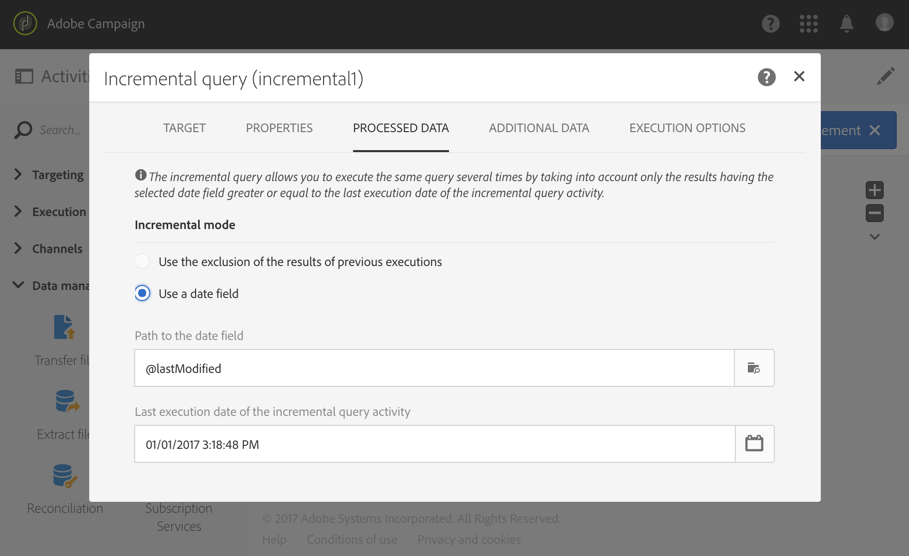

# 增量查詢{#incremental-query}

## 說明 {#description}

**[!UICONTROL Incremental query]** 活動可讓您從 Adobe Campaign 資料庫中篩選及擷取元素總量。每次執行此活動時，都會排除先前執行的結果。這可讓您只鎖定新元素。

您可以透過專用索引標籤來定義目標母體的　**[!UICONTROL Additional data]**。此資料會儲存在其他欄中，且僅能用於進行中的工作流程。

活動使用查詢編輯器工具。[專屬區段](../../automating/using/editing-queries.md#about-query-editor)中會詳細說明此工具。

## 使用內容 {#context-of-use}

必須將 **[!UICONTROL Incremental query]** 連結到 **[!UICONTROL Scheduler]**，才能定義工作流程的執行頻率，從而定義查詢。

**[!UICONTROL Processed data]** 索引標籤特定於此活動，可讓您根據需要查看活動先前執行的任何結果。

**[!UICONTROL Incremental query]** 活動可用於各種類型的使用：

* 將個人分段以定義訊息、對象等的目標。

* 匯出資料。

   您可以使用 **[!UICONTROL Incremental query]** 活動定期匯出檔案中的新記錄檔。例如，如果您想在外部報表或 BI 工具中使用記錄檔資料，則此功能會很有用。[匯出記錄檔](../../automating/using/exporting-logs.md)區段提供完整的範例。

**相關主題**

* [使用案例： 對服務訂戶的增量查詢](../../automating/using/incremental-query-on-subscribers.md)

## 設定 {#configuration}

1. 將 **[!UICONTROL Incremental query]** 活動拖放至工作流程中。
1. 選取活動，然後使用所顯示快速操作中的  按鈕將其開啟。
1. 如果要對設定檔案資源以外的資源運行查詢，請轉至活動的 **[!UICONTROL Properties]** 索引標籤，然後選取 **[!UICONTROL Resource]** 和　**[!UICONTROL Targeting dimension]**。

   **[!UICONTROL Resource]** 可讓您調整浮動視窗中顯示的篩選條件，而與所選資源相關的 **[!UICONTROL Targeting dimension]**，則與您要取得的母體類型（識別的設定檔、傳送、連結至所選資源的資料等）相對應。

1. 在 **[!UICONTROL Target]** 索引標籤，定義並結合規則以執行查詢。
1. 在 **[!UICONTROL Processed data]** 索引標籤中，選取要用於工作流下一個執行的增量模式：

   * **[!UICONTROL Use the exclusion of the results of previous executions]**：會排除每個新執行的先前執行結果。
   * **[!UICONTROL Use a date field]**：下次執行只考慮所選日期欄位大於或等於 **[!UICONTROL Incremental query]** 活動最後執行日期的結果。您可以選取與在 **[!UICONTROL Properties]** 索引標籤中選取的資源相關的任何日期欄位。此模式在查詢大型資源（如記錄檔資料）時具有更理想的效能。

      在第一次執行工作流程後，您可以在此索引標籤中看到下次執行時使用的最後一個執行日期。每次執行工作流程時，都會自動更新它。您仍然可以手動輸入新值來覆寫此值，以符合您的需求。
   >[!NOTE]
   >
   >**[!UICONTROL Use a date field]** 模式會根據選取的日期欄位，提供更大的彈性。例如，如果選定欄位與修改日期相對應，則日期欄位模式將可讓您檢索最近更新的資料，而另一個模式將僅排除在先前執行中已定位的記錄，即使這些記錄自上次執行工作流後已被修改。

   

1. 您可以透過專用索引標籤來定義目標母體的　**[!UICONTROL Additional data]**。此資料會儲存在其他欄中，且僅能用於進行中的工作流程。尤其是，您可以從連結至查詢目標維度的 Adobe Campaign 資料庫表格新增資料。請參閱[擴充資料](../../automating/using/query.md#enriching-data)區段。
1. 確認活動的設定並儲存工作流程。

## 擴充資料 {#enriching-data}

和查詢一樣，您也可以擴充來自 **[!UICONTROL Incremental query]** 的資料。請參閱[擴充資料](../../automating/using/query.md#enriching-data)區段。
