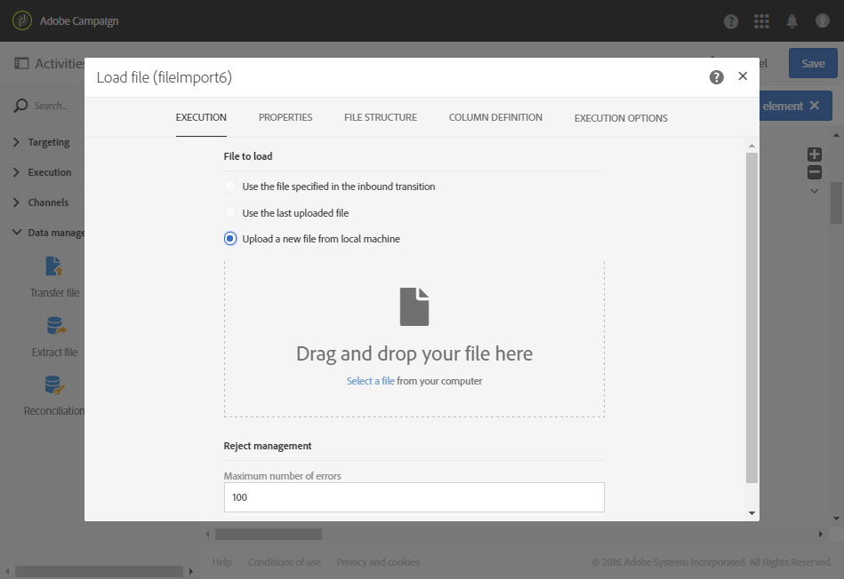

# 載入檔案 {#load-file}

## 說明 {#description}

>[!CAUTION]
>
>使用此功能時，請記住SFTP儲存空間、資料庫儲存空間和作用中的設定檔限制，請視您的Adobe Campaign合約而定。

**[!UICONTROL Load file]** 活動可讓您匯入單一結構化格式的資料，以便在 Adobe Campaign 中使用此資料。會暫時匯入資料，而另一個活動必須將它完全整合在 Adobe Campaign 資料庫中。

## 使用內容 {#context-of-use}

設定活動時，會定義資料擷取的方式。例如，要載入的檔案可以是聯絡人清單。

您可以：

* 使用檔案結構將其應用於其他檔案的資料（使用 **[!UICONTROL Transfer file]** 活動復原）或
* 使用檔案的結構和資料，將其匯入 Adobe Campaign。

>[!IMPORTANT]
>
>只考慮 &quot;flat&quot; 結構檔案，例如。txt、.csv 等檔案。

**相關主題：**

* [使用案例：使用外部資料更新資料庫](../../automating/using/update-database-file.md)
* [使用案例：根據自動檔案下載更新資料](../../automating/using/update-data-automatic-download.md)
* [使用案例：傳送包含豐富欄位的電子郵件](../../automating/using/sending-email-enriched-fields.md)
* [使用案例：協調檔案對象與資料庫](../../automating/using/reconcile-file-audience-with-database.md)

## 設定 {#configuration}

活動設定涉及兩個步驟。首先，您需要透過上傳範例檔案來定義預期的檔案結構。完成此操作後，您可以指定要匯入其資料的檔案起源。

>[!NOTE]
>
>範例檔案的資料用於設定活動，但不匯入。建議使用包含少量資料的範例檔案。

1. 將 **[!UICONTROL Load file]** 活動拖放至工作流程中。
1. 選取活動，然後使用所顯示快速操作中的  按鈕將其開啟。
1. 上傳範例檔案，讓您在匯入最終檔案時定義預期結構。

   

   上傳資料檔案後，活動中會出現兩個新索引標籤：**[!UICONTROL File structure]** 及 **[!UICONTROL Column definition]**。

1. 移至索引標籤 **[!UICONTROL File structure]** 以檢視從範例檔案自動偵測的結構。

   如果錯誤地偵測到檔案結構，您有幾個選項可以更正任何可能的錯誤：

   * 透過選取 **[!UICONTROL Detect structure from a new file]** 選項，可以選取使用另一個檔案的結構。
   * 您可以修改預設偵測參數，使其與檔案相適應。**[!UICONTROL File type]** 欄位可讓您指定您要匯入的檔案是否由長度固定的欄組成。在這種情況下，您還必須指定 **[!UICONTROL Column definition]** 索引標籤中各欄的字元數目上限。

      正確從檔案中復原資料所需的所有偵測選項，都會在 **[!UICONTROL File format]** 中重新分組。您可以修改它們，然後考慮到這些新設定，重新偵測活動中載入的最後一個檔案的結構。要執行此操作，請使用 **[!UICONTROL Apply configuration]** 按鈕。例如，您可以指定不同的欄分隔符號。

      >[!NOTE]
      >
      >此操作會考慮到活動中載入的最後一個檔案。如果偵測到的檔案很大，資料預覽只會顯示前 30 行。

      

      在 **[!UICONTROL File format]** 區段中，**[!UICONTROL Check columns from file against column definitions]** 選項可讓您驗證要上傳的檔案的列是否與列定義對應。

      如果欄數和/或名稱不符合欄定義，則執行工作流程時會顯示錯誤訊息。如果未啟動該選項，記錄檔案將顯示警告。

      

1. 移至 **[!UICONTROL Column definition]** 索引標籤，以檢查每欄的資料格式，並視需要調整參數。

   **[!UICONTROL Column definition]** 索引標籤可讓您精確指定每欄的資料結構，以匯入不含任何錯誤的資料（例如，使用 null 管理），並讓它符合 Adobe Campaign 資料庫中已存在的類型，以供日後作業使用。

   例如，您可以變更欄的標籤，並選取其類型（字串、整數、日期等）或甚至指定錯誤處理。

   如需詳細資訊，請參閱[欄格式](#column-format)區段。

   

1. 在 **[!UICONTROL Execution]** 索引標籤中，指定是否要處理檔案以載入資料：

   * 來自工作流程的入站轉變。
   * 是您在上一步驟中上傳的項目。
   * 是要從本機機器上傳的新檔案。如果上傳工作流程中已定義第一個檔案，就會顯示 **[!UICONTROL Upload a new file from local machine]** 選項。這可讓您上傳其他檔案，以便在目前檔案不符合您的需求時加以處理。

      

1. 如果要從中載入資料的檔案壓縮到 GZIP 檔案 (.gz) 中，請在 **[!UICONTROL Add a pre-processing step]** 欄位中選取 **[!UICONTROL Decompression]** 選項。這可讓您在載入資料之前先解壓縮檔案。只有當檔案來自活動的入站轉變時，才可使用此選項。

   該 **[!UICONTROL Add a pre-processing step]** 欄位還允許您在將檔案導入資料庫之前對其進行解密。 有關如何使用加密檔案的詳細資訊，請參 [閱本節](../../automating/using/managing-encrypted-data.md)

1. **[!UICONTROL Keep the rejects in a file]** 選項可讓您下載包含匯入期間發生錯誤的檔案，並套用至後期處理階段。啟動此選項時，外站轉變會重新命名為「拒絕」。

   >[!NOTE]
   >
   >**[!UICONTROL Add date and time to the file name]** 選項可讓您將時間標記記新增包含拒絕之檔案的名稱。

   

1. 確認活動的設定並儲存工作流程。

如果活動在執行工作流程後發生任何錯誤，請參閱記錄檔以取得檔案中錯誤值的詳細資訊。如需工作流程記錄檔的詳細資訊，請參閱[本區段](../../automating/using/monitoring-workflow-execution.md)。

## 欄格式 {#column-format}

載入範例檔案時，會自動偵測欄格式，並使用每個資料類型的預設參數。您可以修改這些預設參數，以指定要套用至資料的特定程式，尤其是當有錯誤或空值時。

要執行此操作，請從要定義其格式的列的快速操作中選取 **[!UICONTROL Edit properties]**。將會開啟欄格式詳細資訊視窗。

然後，您可以修改每欄的格式。

欄格式化可讓您定義每列的值處理：

* **[!UICONTROL Ignore column]**：不會在資料載入期間處理此欄。
* **[!UICONTROL Data type]**：指定每欄所需的資料類型。
* **[!UICONTROL Format and separators]**，**屬性**：指定文字的屬性、時間、日期和數值格式，以及欄內容所指定的分隔符號。

   * **[!UICONTROL Maximum number of characters]**：指定字串類型列的字元數上限。

      載入由長度固定的欄組成的檔案時，必須填入此欄位。

   * **[!UICONTROL Letter case management]**：定義是否需要對 **Text** 資料應用字元大寫。
   * **[!UICONTROL White space management]**：指定 **Text** 資料的字串中是否需要忽略某些空格。
   * **[!UICONTROL Time format]**、**[!UICONTROL Date format]**：指定 **Date**、**Time** r及 **Date and time** 資料的格式。
   * **[!UICONTROL Format]**：可讓您定義 **Integer** 及 **Floating number** 的數值格式。
   * **[!UICONTROL Separator]**：定義欄內容指定的分隔符號（述職的千分位分隔符號或:小數分隔符號，日期及時間的分隔符號），適用於 **Date**、**Time**、**Date and time**、**Integer**　及 **Floating number** 資料。

* **[!UICONTROL Remapping of values]**：此欄位僅在欄詳細資料設定中可用。它可讓您在匯入特定值時加以轉換。例如，您可將　&quot;three&quot;　轉換為　&quot;3&quot;。
* **[!UICONTROL Error processing]**：會定義發生錯誤時的行為。

   * **[!UICONTROL Ignore the value]**：會忽略值。會在工作流程執行記錄檔中產生警告。
   * **[!UICONTROL Reject the line]**：不會處理整行。
   * **[!UICONTROL Use a default value]**：以在　**[!UICONTROL Default value]**　欄位中定義的預設值取代造成錯誤的值。
   * **[!UICONTROL Use a default value in case the value is not remapped]**：以在　**[!UICONTROL Default value]**　欄位中定義的預設值取代導致錯誤的值，除非已針對錯誤值定義對應（請參閱上述　**[!UICONTROL Remapping of values]**　選項）。
   * **[!UICONTROL Reject the line when there is no remapping value]**：除非為錯誤值定義對應（請參閱上述 **[!UICONTROL Remapping of values]** 選項），否則不會處理整行。

   >[!NOTE]
   >
   >**[!UICONTROL Error processing]** 與關於匯入檔案之值的錯誤有關。例如，發生錯誤資料類型（字母中的 &quot;four&quot; 適用於 &quot;Integer&quot; 欄）、包含超過授權上限之字元數的字串、包含錯誤分隔符號的日期等。但是，此選項與空值管理產生的錯誤無關。

* **[!UICONTROL Default value]**：根據選取的錯誤處理指定預設值。
* **[!UICONTROL Empty value management]**：指定在資料載入期間如何管理空值。

   * **[!UICONTROL Generate an error for numerical fields]**：僅為數字欄位產生錯誤，否則插入 NULL 值。
   * **[!UICONTROL Insert NULL in the corresponding field]**：授權空值。因此插入值 NULL。
   * **[!UICONTROL Generate an error]**：如果值為空，則產生錯誤。
