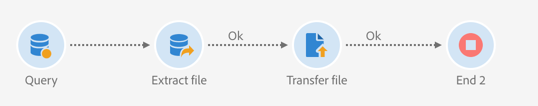

# 管理已加密的資料 {#managing-encrypted-data}

## 關於預處理階段{#about-preprocessing-stages}

在某些情況下，您要匯入促銷活動伺服器的資料可能需要加密，例如，如果包含PII資料。

為了能夠加密傳出資料或解密傳入資料，您需要使用[控制面板](https://docs.adobe.com/content/help/zh-Hant/control-panel/using/instances-settings/gpg-keys-management.html)管理GPG密鑰。

>[!NOTE]
>
>控制面板適用於AWS托管的所有客戶（現場托管其行銷實例的客戶除外）。

如果您不符合使用「控制面板」的資格，您必須聯絡Adobe客戶服務，以便他們提供您的執行個體所需的加密／解密指令。 若要這麼做，請提交指示：

* 將顯示在促銷活動介面中的&#x200B;**label**，以使用命令。 例如「加密檔案」。
* 要在實例上安裝的&#x200B;**命令**。

處理請求後，**[!UICONTROL Load file]**&#x200B;和&#x200B;**[!UICONTROL Extract file]**&#x200B;活動的&#x200B;**[!UICONTROL Pre-processing stage]**&#x200B;欄位中將提供加密／解密命令。 您可以使用這些檔案解密或加密要導入或導出的檔案。

**相關主題：**

* [載入檔案](../../automating/using/load-file.md)
* [擷取檔案](../../automating/using/extract-file.md)

## 使用案例：導入使用控制面板{#use-case-gpg-decrypt}生成的密鑰加密的資料

在此使用案例中，我們將建立工作流程，以便使用「控制面板」中產生的金鑰，匯入在外部系統中加密的資料。

 [在影片中探索此功能](#video)

執行此使用案例的步驟如下：

1. 使用「控制面板」產生金鑰對（公開／私用）。 [控制面板文檔](https://docs.adobe.com/content/help/en/control-panel/using/instances-settings/gpg-keys-management.html#decrypting-data)中提供了詳細步驟。

   * 公開金鑰將會與外部系統共用，外部系統會使用它來加密要傳送至Campaign的資料。
   * Campaign將使用私密金鑰解密傳入的加密資料。

   

1. 在外部系統中，使用從「控制面板」下載的公開金鑰來加密要匯入至「促銷活動標準」的資料。

1. 在Campaign Standard中，建立工作流程以匯入加密的資料，並使用透過控制面板安裝的私密金鑰加以解密。 為此，我們將建立以下工作流程：

   

   * **[!UICONTROL Transfer file]** 活動：將檔案從外部來源傳輸至促銷活動。在此範例中，我們想從SFTP伺服器傳輸檔案。
   * **[!UICONTROL Load file]** 活動：將檔案中的資料載入到資料庫中，然後使用「控制面板」中生成的專用密鑰對其進行解密。

1. 開啟&#x200B;**[!UICONTROL Transfer file]**&#x200B;活動，然後根據您的需求進行設定。 有關如何配置活動的全局概念可在[本節](../../automating/using/load-file.md)中獲得。

   在&#x200B;**[!UICONTROL Protocol]**&#x200B;標籤中，指定您要傳輸的sftp伺服器和加密。gpg檔案的詳細資訊。

   

1. 開啟&#x200B;**[!UICONTROL Load file]**&#x200B;活動，然後根據您的需求進行設定。 有關如何配置活動的全局概念可在[本節](../../automating/using/load-file.md)中獲得。

   將預處理階段添加到活動中，以便解密傳入資料。 若要這麼做，請從清單中選取&#x200B;**[!UICONTROL Decryption GPG]**&#x200B;選項。

   >[!NOTE]
   >
   >請注意，您不需要指定解密資料時使用的私密金鑰。 私密金鑰會儲存在「控制面板」中，「控制面板」會自動偵測用來解密檔案的金鑰。

   

1. 按一下&#x200B;**[!UICONTROL OK]**&#x200B;確認活動配置。

1. 您現在可以執行工作流程。

## 使用案例：使用控制面板{#use-case-gpg-encrypt}上安裝的密鑰加密和導出資料

在此使用案例中，我們將建立工作流程，以便使用「控制面板」上安裝的金鑰來加密和匯出資料。

 [在影片中探索此功能](#video)

執行此使用案例的步驟如下：

1. 使用GPG公用程式產生GPG金鑰對（公用／私用），然後將公用金鑰安裝至「控制面板」。 [控制面板文檔](https://docs.adobe.com/content/help/en/control-panel/using/instances-settings/gpg-keys-management.html#encrypting-data)中提供了詳細步驟。

   

1. 在Campaign Standard中，建立工作流程以匯出資料，並使用透過控制面板安裝的私密金鑰加密資料。 為此，我們將建立以下工作流程：

   

   * **[!UICONTROL Query]** 活動：在此示例中，我們要執行查詢來定位要導出的資料庫中的資料。
   * **[!UICONTROL Extract file]** 活動：加密資料並將其提取到檔案中。
   * **[!UICONTROL Transfer file]** 活動：將包含加密資料的檔案傳輸至SFTP伺服器。

1. 配置&#x200B;**[!UICONTROL Query]**&#x200B;活動以定位資料庫中所需的資料。 如需詳細資訊，請參閱[本章節](../../automating/using/query.md)。

1. 開啟&#x200B;**[!UICONTROL Extract file]**&#x200B;活動，然後根據您的需求（輸出檔案、欄、格式等）進行設定。 有關如何配置活動的全局概念可在[本節](../../automating/using/extract-file.md)中獲得。

   將預處理階段新增至活動，以加密要擷取的資料。 若要這麼做，請選取加密GPG金鑰，以用來加密資料。

   

   >[!NOTE]
   >
   >括弧中的值是使用GPG加密工具生成密鑰對時定義的&#x200B;**注釋**。 請確定您選擇了正確的相符金鑰，否則收件者將無法解密檔案。

1. 開啟&#x200B;**[!UICONTROL Transfer file]**&#x200B;活動，然後指定您要傳送檔案的SFTP伺服器。 有關如何配置活動的全局概念，請參閱[本節](../../automating/using/transfer-file.md)。

   

1. 您現在可以執行工作流程。 執行後，查詢的資料目標將匯出至SFTP伺服器，並匯出至加密的。gpg檔案。

## 教學課程影片 {#video}

本視訊說明如何使用GPG金鑰解密資料。

>[!VIDEO](https://video.tv.adobe.com/v/35753?quality=12)

本視訊說明如何使用GPG金鑰來加密資料。

>[!VIDEO](https://video.tv.adobe.com/v/36380?quality=12)

其他Campaign Standard操作說明影片可在[這裡](https://experienceleague.adobe.com/docs/campaign-standard-learn/tutorials/overview.html?lang=zh-Hant)取得。
