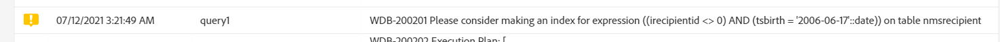

# 管理執行選項 {#managing-execution-options}

要修改工作流的執行選項，請使用  按鈕，選擇 **[!UICONTROL Execution]** 的子菜單。

可能的選項包括：

* **[!UICONTROL Default affinity]**:此欄位允許您強制在特定電腦上執行工作流或工作流活動。

* **[!UICONTROL History in days]**:指定必須清除歷史記錄的天數。 歷史記錄包含與工作流相關的元素：日誌、任務、事件（連結到工作流操作的技術對象）以及由 **[!UICONTROL Transfer file]** 的子菜單。 立即可用工作流程範本的預設值為 30 天。

   歷史記錄的清除工作是由資料庫清除技術工作流程執行，預設每天執行 （請參見） [技術工作流清單](../../administration/using/technical-workflows.md)。)

   >[!IMPORTANT]
   >
   >如果 **[!UICONTROL History in days]** 欄位留空，其值將被視為「1」，表示歷史記錄將在1天後清除。

* **[!UICONTROL Save SQL queries in the log]**:允許您將工作流中的SQL查詢保存到日誌中。

* **[!UICONTROL Diagnostic mode (Log execution plan of long running queries and give recommendations)]**:如果要記錄整個執行計畫，請選中此選項。 預設情況下禁用它。

   有關此選項的詳細資訊，請參閱 [節](#diagnostic-mode)。

* **[!UICONTROL Keep interim results]**:如果要查看過渡的詳細資訊，請選中此選項。

   >[!CAUTION]
   >
   >此選項佔用了大量磁碟空間，設計旨在幫助您建構工作流程並確保正確的設定和行為。在生產執行個體中保留未核取的狀態。

* **[!UICONTROL Execute in the engine (do not use in production)]**:允許您在本地執行工作流，以便進行開發環境測試。

* **[!UICONTROL Severity]**:允許您指定在Adobe Campaign實例中執行工作流的優先順序。 此欄位僅供Adobe團隊用於監視。

的 **[!UICONTROL Error management]** 部分提供了其他選項，允許您管理工作流在出錯時的行為。 這些選項在 [錯誤管理](../../automating/using/monitoring-workflow-execution.md#error-management) 的子菜單。

## 診斷模式 {#diagnostic-mode}

>[!CAUTION]
>
>此選項可以顯著影響您的工作流效能，因此應少使用。

啟用後， **[!UICONTROL Diagnostic mode (Log execution plan of long running queries and give recommendations)]** 的上界 **[!UICONTROL Execution]** 如果查詢需要超過一分鐘，則工作流屬性的部分將記錄整個執行計畫。

啟用此選項並啟動工作流後，如果查詢需要超過一分鐘時間，則將記錄執行計畫。 然後，可使用「解釋分析」(EXPLAIN ANALYZE)檢索執行計畫。

有關此項的詳細資訊，請參閱 [PostgreSQL文檔](https://www.postgresql.org/docs/9.4/using-explain.html)。

如果此查詢中有序列掃描， **[!UICONTROL Diagnostic mode]** 還將提供建議，以在篩選器表達式的幫助下建立索引。

>[!NOTE]
>
> 這些建議僅供參考，應根據您的使用案例仔細使用。

執行工作流時必須滿足以下兩個條件才能觸發建議：

* 序列掃描佔用查詢40%以上的時間。

* 序列掃描後生成的行少於表中總行的1 %。

通過選擇 **[!UICONTROL Administration]** > **[!UICONTROL Application settings]** > **[!UICONTROL Options]**:

* **[!UICONTROL Time of query execution (in milliseconds)(DiagnosticModeQueryTime)]**:從 **[!UICONTROL Value]** 欄位中，可以設定執行查詢的新時間。 如果查詢執行超過此值，則將記錄執行計畫。

   

* **[!UICONTROL Percentage of seq scan time (DiagnosticModeSeqScanPercentage)]**:從 **[!UICONTROL Value]** 欄位中，您可以更改序列掃描為生成建議所必須佔用的查詢時間百分比。

   
