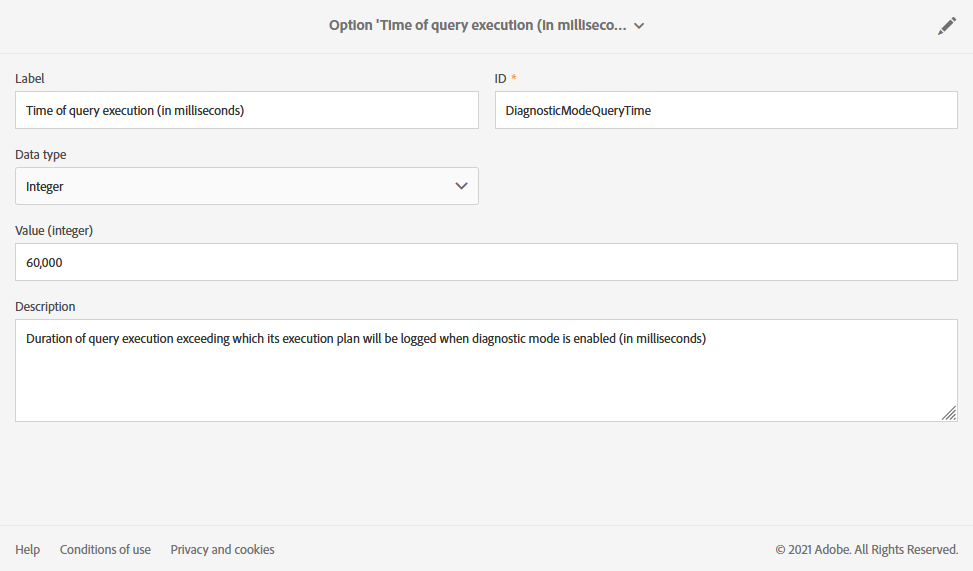

# 管理執行選項 {#managing-execution-options}

要修改工作流的執行選項，請使用按鈕訪問工作流屬性並選擇&#x200B;**[!UICONTROL Execution]**&#x200B;部分。

可能的選項包括：

* **[!UICONTROL Default affinity]**:此欄位可讓您強制在特定電腦上執行工作流程或工作流程活動。

* **[!UICONTROL History in days]**:指定必須清除歷史記錄的天數。歷史記錄包含與工作流相關的元素：日誌、任務、事件（連結到工作流操作的技術對象）以及&#x200B;**[!UICONTROL Transfer file]**&#x200B;活動下載的檔案。 現成工作流程範本的預設值為30天。

   清除歷史記錄由資料庫清理技術工作流執行，預設每天執行（請參閱[技術工作流清單](../../administration/using/technical-workflows.md)）。

   >[!IMPORTANT]
   >
   >如果&#x200B;**[!UICONTROL History in days]**&#x200B;欄位留空，其值將被視為「1」，這表示歷史記錄將在1天後清除。

* **[!UICONTROL Save SQL queries in the log]**:可讓您將SQL查詢從工作流程儲存至記錄檔。

* **[!UICONTROL Diagnostic mode (Log execution plan of long running queries and give recommendations)]**:如果要記錄整個執行計畫，請核取此選項。預設為停用。

   有關此選項的詳細資訊，請參閱此[節](#diagnostic-mode)。

* **[!UICONTROL Keep interim results]**:如果您想要檢視轉變的詳細資訊，請核取此選項。

   >[!CAUTION]
   >
   >此選項佔用了大量磁碟空間，設計旨在幫助您建構工作流程並確保正確的設定和行為。在生產執行個體中保留未核取的狀態。

* **[!UICONTROL Execute in the engine (do not use in production)]**:可讓您在本機執行工作流程，以用於開發環境測試用途。

* **[!UICONTROL Severity]**:可讓您指定在Adobe Campaign例項中執行工作流程的優先順序等級。此欄位僅供Adobe團隊監控之用。

**[!UICONTROL Error management]**&#x200B;區段提供其他選項，可讓您管理工作流程在發生錯誤時的行為。 在[錯誤管理](../../automating/using/monitoring-workflow-execution.md#error-management)部分中詳細說明了這些選項。

## 診斷模式 {#diagnostic-mode}

>[!CAUTION]
>
>此選項可能會大幅影響工作流程效能，因此應謹慎使用。

啟用後，如果查詢需要超過一分鐘，則工作流屬性的&#x200B;**[!UICONTROL Execution]**&#x200B;區段中的&#x200B;**[!UICONTROL Diagnostic mode (Log execution plan of long running queries and give recommendations)]**&#x200B;選項會記錄整個執行計畫。

啟用此選項並啟動工作流程後，如果您的查詢需要超過一分鐘，則會記錄執行計畫。 然後，您可以使用「解釋分析」來檢索執行計畫。

有關詳細資訊，請參閱[PostgreSQL文檔](https://www.postgresql.org/docs/9.4/using-explain.html)。

如果此查詢中有序列掃描，**[!UICONTROL Diagnostic mode]**&#x200B;也將提供建議，以利用篩選運算式建立索引。

>[!NOTE]
>
> 這些建議僅供參考，且應根據您的使用案例謹慎使用。

執行工作流程期間必須符合下列兩個條件，才能觸發建議：

* 序列掃描佔用查詢40%以上的時間。

* 序列掃描後產生的列不到表格中總列數的1 %。

您可以從進階功能表選取&#x200B;**[!UICONTROL Administration]** > **[!UICONTROL Application settings]** > **[!UICONTROL Options]**&#x200B;來管理選項：

* **[!UICONTROL Time of query execution (in milliseconds)(DiagnosticModeQueryTime)]**:從欄位 **[!UICONTROL Value]** 中，您可以為查詢執行設定新的時間。如果查詢執行超過此值，則將記錄執行計畫。

   

* **[!UICONTROL Percentage of seq scan time (DiagnosticModeSeqScanPercentage)]**:從欄 **[!UICONTROL Value]** 位，您可以變更序列掃描必須花費的查詢時間百分比，以便產生建議。

   
