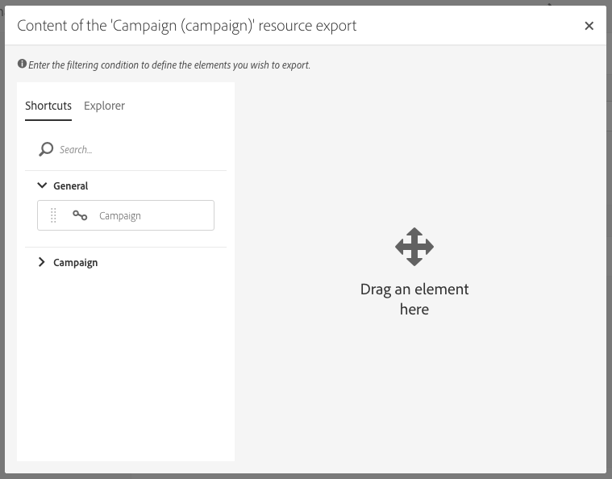
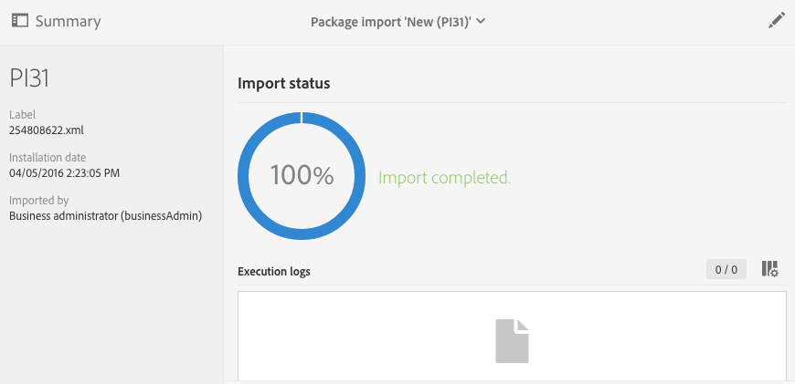

# 管理套件{#managing-packages}

管理員可以定義套件，以透過結構化　XML　檔案在不同　Adobe Campaign　執行個體之間交換資源。這些項目可能是設定參數或資料。

這對於在伺服器之間傳輸資料，或是複製執行個體的設定而言，可能非常實用。

套件位於　**[!UICONTROL Administration]** > **[!UICONTROL Deployment]** > **[!UICONTROL Package exports]** 或 **[!UICONTROL Package imports]**　功能表下方。這兩個功能表的運作類似。

依預設，每個清單的元素會根據其修改或安裝日期（從最近到最近）顯示。

若要顯示和修改元素的內容，請按一下其標籤。請參閱[匯出套件](#exporting-a-package)和[匯入套件](#importing-a-package)區段。

## 套件匯出 {#package-exports}

### 標準套件 {#standard-packages}

**[!UICONTROL Platform]** 和 **[!UICONTROL Administration]** 是兩個內建套件，每個軟體套件都包含要匯出的預定義資源清單。它們能以唯讀模式開啟，並且僅適於匯出。

>[!CAUTION]
>
>如果匯出的資源具有預設　ID，則不授權匯出套件。因此，必須使用與　Adobe Campaign Standard　標準範本不同的名稱，以變更可匯出資源的　ID。例如，要匯出測試設定檔，不能使用包含值 &quot;SDM&quot; 或 &quot;sdm&quot; 的 ID。嘗試匯出包含預設 ID 的套件時，您會看到錯誤，例如：「&#39;Brands (branding)&#39; 實體類型使用預設 ID (&#39;BRD1&#39;)，在匯入套件時可能會造成衝突。變更此名稱並重複執行作業。」

[匯出套件](#exporting-a-package)區段會說明套件會出步驟。

* **[!UICONTROL Platform]** 套件會對技術設定期間新增的所有資源進行重新分組：自訂資源、自訂資源集、觸發器，以及包含 **[!UICONTROL System]** 類型的應用程式選項。
* **[!UICONTROL Administration]** 套件會對業務設定期間新增的所有對象進行重新分組，如：行銷活動範本、內容範本、傳遞範本、登錄頁面範本、方案範本和工作流程範本。

   它也包含下列物件：內容區塊、目標對應、外部帳戶、組織單位、包含 **[!UICONTROL User]** 類型的應用程式選項、角色、類型、類型規則和使用者。

>[!NOTE]
>
>這兩個套件的內容無法修改。相反地，這些套件一律會包含最新的可用資料。您可以[建立自己的套件](#creating-a-package)，以匯出特定元素。

### 建立套件 {#creating-a-package}

如果需要匯出特定的資料集，則需要建立套件。

若要建立套件，您需要管理權限。

1. 從 > **[!UICONTROL Administration]** > **[!UICONTROL Deployment]**　> **[!UICONTROL Package exports]**，按一下套件內容清單中的 **[!UICONTROL Create]** 按鈕。

   元素會立即建立。若要取消建立，請返回清單並核取相對應的方塊以刪除它。

1. 在套件內容畫面中，指定名稱和　ID。
1. 如果您想要新增說明並限制特定使用者的存取權限，請按一下　**[!UICONTROL Edit properties]**　按鈕。

   

1. 使用 **[!UICONTROL Export content]** 索引標籤中的 **[!UICONTROL Create element]** 按鈕來選取要匯出的資源。

   

1. 資源按字母順序顯示，並可按名稱篩選。其技術名稱會以方括弧顯示。從清單中選取元素並進行確認。

   

1. 資源名稱顯示在 **[!UICONTROL Export content]** 索引標籤中。若要修改資源，請核取選相對應的方塊並使用 **[!UICONTROL Show detail of the element selected]** 按鈕。

   

1. 使用查詢編輯器可以篩選要匯出的元素。有關詳細資訊，請參閱[編輯查詢](../../automating/using/editing-queries.md#creating-queries)區段。

   

   >[!NOTE]
   >
   >您最多可以匯出　5000　個物件。

1. 指定所有要匯出的資源後，請儲存選取的資源。

您的套件現在已建立，而且準備就緒可供匯出。

### 匯出套件 {#exporting-a-package}

匯出套件可讓您儲存資源的特定狀態，以便能夠在同一執行個體上重新匯入另一個執行個體或更新版本的資源。

>[!CAUTION]
>
>如果匯出的資源具有現成可用的　ID，則不授權匯出套件。因此，必須使用與　Adobe Campaign Standard　標準範本不同的名稱，以變更可匯出資源的　ID。例如，要匯出測試設定檔，不能使用包含值 &quot;SDM&quot; 或 &quot;sdm&quot; 的 ID。

1. 從 **[!UICONTROL Administration]** > **[!UICONTROL Deployment]** > **[!UICONTROL Package exports]**&#x200B;中，選取要存取其詳細資訊的套件。
1. 檢查套件是否包含您所需的資料。
1. 按一下 **[!UICONTROL Start export]** 按鈕。

匯出的檔案會儲存在使用中瀏覽器的下載資料夾中。它會自動命名為　&quot;package_xxx.xml&quot;，其中　&quot;xxx&quot;　會與套件　ID　相對應。

操作完成後，會出現幾個區段：

* **[!UICONTROL Export status]**：本區段顯示操作是否正確執行。

   

* 您可以透過　**[!UICONTROL Log]**　索引標籤，查詢匯出的不同步驟。這包含所有前期匯出的狀態。

   

>[!NOTE]
>
>從已匯出的套件內容清單中選取元素時，仍然可以使用 **[!UICONTROL Log]** 及 **[!UICONTROL Last export]** 索引標籤。

## 套件匯入 {#package-imports}

### 系統更新 {#system-updates}

任何項目上方的套件匯入清單包含連結至　Adobe　執行之更新的自動匯入。

**[!UICONTROL Execution logs]** 索引標籤會儲存所有匯入步驟。側面板顯示一般資訊。

>[!NOTE]
>
>這些元素可在唯讀模式下存取。

### 匯入套件 {#importing-a-package}

管理員可以手動匯入源自先前從　Adobe Campaign　執行個體執行的匯出套件。如需詳細資訊，請參閱[套件匯出](#package-exports)區段。

手動軟體套件匯入由兩個步驟組成：首先，您必須上傳檔案，然後您就可以匯入其內容。

1. 從 **[!UICONTROL Administration]** > **[!UICONTROL Deployment]** > **[!UICONTROL Package imports]**，按一下套件匯入清單中的 **[!UICONTROL Create]** 按鈕。

   元素會立即建立。若要取消建立，請返回清單並核取相對應的方塊以刪除它。

1. 指定新匯入的名稱和 ID。
1. 拖放或按一下 **[!UICONTROL Select from folder]** 連結，以選取您要上傳的檔案。

   匯入的檔案必須是 XML 或 ZIP（包含 XML 檔案）格式。

   

   >[!NOTE]
   >
   >若要取代已上傳的檔案，請先透過檔案名稱右側的 X 圖示刪除檔案，然後重複此作業。

1. 上傳檔案後，使用 **[!UICONTROL Start import]** 按鈕將其內容匯入資料庫。

   

操作完成後，會出現幾個區段：

* **[!UICONTROL Import status]**：本區段顯示操作是否正確執行。
* 您可以透過 **[!UICONTROL Execution logs]** 索引標籤來查詢匯入的不同步驟。這對於檢視錯誤特別重要。

   

在匯入套件後，就無法從相同的元素重新匯入它。您只能修改其標籤和 ID。

若要重新匯入相同的套件，您必須返回套件匯入清單、建立元素，然後再次上傳選取的檔案。
