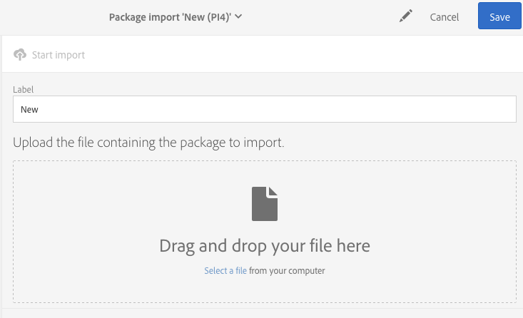

# Managing packages{#managing-packages}

管理員可以透過結構化XML檔案，定義套件以便在不同的Adobe Campaign例項之間交換資源。這些可以是設定參數或資料。

這對於從一個伺服器傳輸資料到另一個伺服器或複製執行個體的設定非常有用。

Packages are available under the **[!UICONTROL Administration]** &gt; **[!UICONTROL Deployment]** &gt; **[!UICONTROL Package exports]** or **[!UICONTROL Package imports]** menus. 這兩個功能表類似。

每份清單的元素依預設會顯示，依其修改或安裝日期而定，從最近到最新。

若要顯示並修改元素的內容，請按一下其標籤。Refer to the [Exporting a package](../../automating/using/managing-packages.md#exporting-a-package) and [Importing a package](../../automating/using/managing-packages.md#importing-a-package) sections.

## Package exports {#package-exports}

### Standard packages {#standard-packages}

**[!UICONTROL Platform]** 而且 **[!UICONTROL Administration]** 是兩個內建套件，每個套件都包含預先定義的資源清單供匯出。它們可以以唯讀模式開啓，而且僅適用於匯出。

>[!CAUTION]
>
>如果匯出的資源具有預設ID，則不會授權匯出封裝。因此，必須使用名稱不同於Adobe Campaign Standard作為標準提供的範本來變更導出資源的ID。例如，若要匯出測試設定檔，不能使用包含「SDM」或「sm」值的ID。嘗試匯出包含預設ID的封裝時，您可以看到下列錯誤：「品牌(品牌)的實體類型使用預設ID('BRD1')，在匯入套件時可能會產生衝突。變更此名稱並重復操作」。

The package export steps are described in the [Exporting a package](../../automating/using/managing-packages.md#exporting-a-package) section.

* **[!UICONTROL Platform]** 此套件會重新整理技術配置期間新增的所有資源：自訂資源、自訂資源集、觸發器以及應用 **[!UICONTROL System]** 程式選項。
* **[!UICONTROL Administration]** 此套件會重新整理業務設定期間新增的所有物件，例如：促銷活動範本、內容範本、傳送範本、著陸頁面範本、程式範本和工作流程範本。

   It also includes the following objects: content blocks, target mappings, external accounts, organizational units, application options with the **[!UICONTROL User]** type, roles, typologies, typology rules and users.

>[!NOTE]
>
>這兩個套件的內容無法修改。相反地，這些套件永遠包含最新可用的資料。You can [create your own packages](../../automating/using/managing-packages.md#creating-a-package) to export specific elements.

### Creating a package {#creating-a-package}

如果您需要匯出特定資料集，則需要建立套件。

若要建立套件，您需要管理權限。

1. From **[!UICONTROL Administration]** &gt; **[!UICONTROL Deployment]** &gt; **[!UICONTROL Package exports]**, click the **[!UICONTROL Create]** button in the list of package contents.

   元素就會立即建立。若要取消建立，請返回清單並核取對應方塊以刪除它。

1. 在套件內容畫面中，指定名稱和ID。
1. Click the **[!UICONTROL Edit properties]** button if you would like to add a description and restrict access to certain users.

   

1. Use the **[!UICONTROL Create element]** button in the **[!UICONTROL Export content]** tab to select the resources you wish to export.

   

1. 資源以字母順序顯示，可依名稱篩選。其技術名稱會以括號顯示。從清單中選取元素並確認。

   

1. The resource name is displayed in the **[!UICONTROL Export content]** tab. To modify a resource, check the corresponding box and use the **[!UICONTROL Show detail of the element selected]** button.

   

1. 使用查詢編輯器可讓您篩選要匯出的元素。For more on this, refer to the [Editing queries](../../automating/using/editing-queries.md#creating-queries) section.

   

   >[!NOTE]
   >
   >每個資源最多可匯出5000個物件。

1. 指定要匯出的所有資源後，請儲存您的選擇。

您的套件現在已建立並可匯出。

### Exporting a package {#exporting-a-package}

匯出套件可讓您儲存資源的特定狀態，以便在另一個例項或更新的例項上重新匯入。

>[!CAUTION]
>
>如果匯出的資源具有立即可用的ID，則不會授權匯出封裝。因此，必須使用名稱不同於Adobe Campaign Standard作為標準提供的範本來變更導出資源的ID。例如，若要匯出測試設定檔，不能使用包含「SDM」或「sm」值的ID。

1. From **[!UICONTROL Administration]** &gt; **[!UICONTROL Deployment]** &gt; **[!UICONTROL Package exports]**, select a package to access its detail.
1. 檢查套件包含您需要的資料。
1. Click the **[!UICONTROL Start export]** button.

匯出的檔案會儲存在瀏覽器的下載資料夾中。自動命名為「package_xxx.xml」，因此「xxx」對應至套件ID。

當作業完成時，會顯示幾個區段：

* **[!UICONTROL Export status]**：本節顯示作業是否已正確執行。

   

* You can consult the different steps of the export via the **[!UICONTROL Log]** tab. 這包含所有先前匯出的狀態。

   

>[!NOTE]
>
>When selecting an element from the package content list that has already been exported, the **[!UICONTROL Log]** and **[!UICONTROL Last export]** tabs are still available.

## Package imports {#package-imports}

### System updates {#system-updates}

上述套件匯入清單包含連結至Adobe執行更新的自動匯入。

**[!UICONTROL Execution logs]** 此標籤會儲存所有匯入步驟。側面板會顯示一般資訊。

>[!NOTE]
>
>這些元素可透過唯讀模式存取。

### Importing a package {#importing-a-package}

管理員可以手動匯入從Adobe Campaign例項先前執行的匯出匯出的套件。For more on this, refer to the [Package exports](../../automating/using/managing-packages.md#package-exports) section.

手動套件匯入包含兩個步驟：首先，您必須上傳檔案，然後才能匯入其內容。

1. From **[!UICONTROL Administration]** &gt; **[!UICONTROL Deployment]** &gt; **[!UICONTROL Package imports]**, click the **[!UICONTROL Create]** button in the package import list.

   元素就會立即建立。若要取消建立，請返回清單並核取對應方塊以刪除它。

1. 指定新匯入的名稱和ID。
1. Select the file you wish to upload by dragging and dropping it, or by clicking the **[!UICONTROL Select from folder]** link.

   匯入的檔案必須為XML或ZIP(包含XML檔案)格式。

   

   >[!NOTE]
   >
   >若要取代上傳的文件，請先透過檔案名稱右側的X圖示刪除檔案，然後重復操作。

1. Once the file is uploaded, import its content into the database by using the **[!UICONTROL Start import]** button.

   

當作業完成時，會顯示幾個區段：

* **[!UICONTROL Import status]**：本節顯示作業是否已正確執行。
* You can consult the different steps of the import via the **[!UICONTROL Execution logs]** tab. 這對於檢視錯誤特別重要。

   

匯入套件後，您無法從相同的元素重新匯入它。您只能修改其標籤和ID。

若要重新匯入相同的套件，您必須返回套裝匯入清單、建立元素，然後再次上傳選取的檔案。
