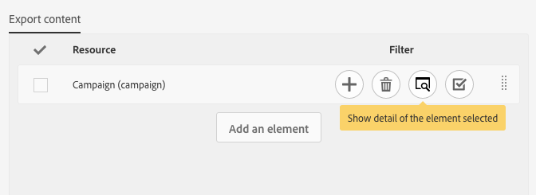

# 管理包{#managing-packages}

管理員可以定義套件，以透過結構化XML檔案在不同Adobe Campaign實例之間交換資源。 這些參數可以是配置參數或資料。

這對於將資料從一台伺服器傳輸到另一台伺服器或複製實例的配置可能非常有用。

套件位於&gt; **[!UICONTROL Administration]** &gt;或功 **[!UICONTROL Deployment]** 能表 **[!UICONTROL Package exports]** 下方 **[!UICONTROL Package imports]** 。 這兩個功能表的運作類似。

依預設，每個清單的元素會根據其修改或安裝日期（從最近到最近）顯示。

若要顯示和修改元素的內容，請按一下其標籤。 請參閱「導 [出包](#exporting-a-package) 」和「 [導入包」部分](#importing-a-package) 。

## 包導出 {#package-exports}

### 標準套件 {#standard-packages}

**[!UICONTROL Platform]** 和 **[!UICONTROL Administration]** 是兩個內置軟體包，每個軟體包包含要導出的預定義資源清單。 它們可以以只讀模式開啟，並且僅適於導出。

>[!CAUTION]
>
>如果導出的資源具有預設ID，則不授權導出包。 因此，必須使用與Adobe Campaign Standard標準範本不同的名稱來變更可匯出資源的ID。 例如，要導出測試配置檔案，不能使用包含值"SDM"或"sdm"的ID。 嘗試匯出包含預設ID的封裝時，您會看到錯誤，例如：「「品牌（品牌）」實體類型使用預設ID(「BRD1」)，在匯入套件時可能會造成衝突。 更改此名稱並重複操作。」

包導出步驟在導出包部分 [中介紹](#exporting-a-package) 。

* 軟體包 **[!UICONTROL Platform]** 重新分組在技術配置過程中添加的所有資源：自訂資源、自訂資源集、觸發器和應用程式選 **[!UICONTROL System]** 項。
* 該包 **[!UICONTROL Administration]** 重組業務配置期間添加的所有對象，如：促銷活動範本、內容範本、傳遞範本、著陸頁面範本、方案範本和工作流程範本。

   它也包含下列物件：內容區塊、目標對應、外部帳戶、組織單位、應用程式選 **[!UICONTROL User]** 項與類型、角色、類型、類型規則和使用者。

>[!NOTE]
>
>這兩個包的內容無法修改。 相反地，這些套件總是包含最新的可用資料。 您可以 [建立自己的套件](#creating-a-package) ，以匯出特定元素。

### 建立包 {#creating-a-package}

如果需要導出特定的資料集，需要建立包。

若要建立套件，您需要管理權限。

1. 從&gt; **[!UICONTROL Administration]** &gt; **[!UICONTROL Deployment]** ，按一下包內容 **[!UICONTROL Package exports]****[!UICONTROL Create]** 清單中的按鈕。

   元素會立即建立。 若要取消建立，請返回清單並勾選對應方塊以刪除它。

1. 在套件內容畫面中，指定名稱和ID。
1. 如果您 **[!UICONTROL Edit properties]** 想要新增說明並限制特定使用者的存取權，請按一下按鈕。

   

1. 使用標 **[!UICONTROL Create element]** 簽中的按 **[!UICONTROL Export content]** 鈕來選擇要導出的資源。

   

1. 資源按字母順序顯示，並可按名稱篩選。 其技術名稱以方括弧顯示。 從清單中選擇元素並進行確認。

   

1. 資源名稱顯示在頁籤 **[!UICONTROL Export content]** 中。 要修改資源，請選中相應框並使用該 **[!UICONTROL Show detail of the element selected]** 按鈕。

   

1. 使用查詢編輯器可以篩選要導出的元素。 有關詳細資訊，請參閱「編 [輯查詢](../../automating/using/editing-queries.md#creating-queries) 」部分。

   

   >[!NOTE]
   >
   >每個資源最多可以導出5000個對象。

1. 指定所有要導出的資源後，請保存所選資源。

您的套件現在已建立，並可供匯出。

### 導出包 {#exporting-a-package}

導出包允許您保存資源的特定狀態，以便能夠在同一實例上重新導入另一個實例或更新版本的資源。

>[!CAUTION]
>
>如果導出的資源具有現成的ID，則不授權導出包。 因此，必須使用與Adobe Campaign Standard標準範本不同的名稱來變更可匯出資源的ID。 例如，要導出測試配置檔案，不能使用包含值"SDM"或"sdm"的ID。

1. 從 **[!UICONTROL Administration]** &gt; **[!UICONTROL Deployment]** &gt; **[!UICONTROL Package exports]**&#x200B;中，選擇要訪問其詳細資訊的包。
1. 檢查套件是否包含您所需的資料。
1. Click the **[!UICONTROL Start export]** button.

匯出的檔案會儲存在使用中瀏覽器的下載檔案夾中。 它會自動命名為"package_xxx.xml"，其中"xxx"對應於套件ID。

操作完成後，會出現幾個部分：

* **[!UICONTROL Export status]**:此部分顯示操作是否正確執行。

   

* 您可以透過索引標籤，查詢匯出的不同 **[!UICONTROL Log]** 步驟。 這包含所有前期出口的狀態。

   

>[!NOTE]
>
>從已導出的包內容清單中選擇元素時，仍然 **[!UICONTROL Log]** 可 **[!UICONTROL Last export]** 以使用和頁籤。

## 包導入 {#package-imports}

### 系統更新 {#system-updates}

任何項目上方的套件匯入清單包含連結至Adobe執行之更新的自動匯入。

該選 **[!UICONTROL Execution logs]** 項卡儲存所有導入步驟。 側面板顯示一般資訊。

>[!NOTE]
>
>這些元素可在唯讀模式下訪問。

### 導入包 {#importing-a-package}

管理員可以手動匯入源自先前從Adobe Campaign例項執行之匯出的套件。 有關詳細資訊，請參閱「包導 [出」部分](#package-exports) 。

手動軟體包導入由兩個步驟組成：首先，您必須上傳檔案，然後您就可以匯入其內容。

1. 從 **[!UICONTROL Administration]** &gt; **[!UICONTROL Deployment]** &gt; **[!UICONTROL Package imports]****[!UICONTROL Create]** ，按一下套件匯入清單中的按鈕。

   元素會立即建立。 若要取消建立，請返回清單並勾選對應方塊以刪除它。

1. 指定新匯入的名稱和ID。
1. 拖放或按一下連結，以選取您要上傳的檔 **[!UICONTROL Select from folder]** 案。

   匯入的檔案必須是XML或ZIP（包含XML檔案）格式。

   

   >[!NOTE]
   >
   >若要取代已上傳的檔案，請先透過檔案名稱右側的X圖示刪除檔案，然後重複此作業。

1. 上傳檔案後，使用按鈕將其內容匯入資料 **[!UICONTROL Start import]** 庫。

   

操作完成後，會出現幾個部分：

* **[!UICONTROL Import status]**:此部分顯示操作是否正確執行。
* 您可以透過標籤來查詢匯入的不同 **[!UICONTROL Execution logs]** 步驟。 這對於查看錯誤特別重要。

   

在匯入套件後，就無法從相同的元素重新匯入它。 您只能修改其標籤和ID。

若要重新匯入相同的套件，您必須返回至套件匯入清單、建立元素，然後再次上傳選取的檔案。
