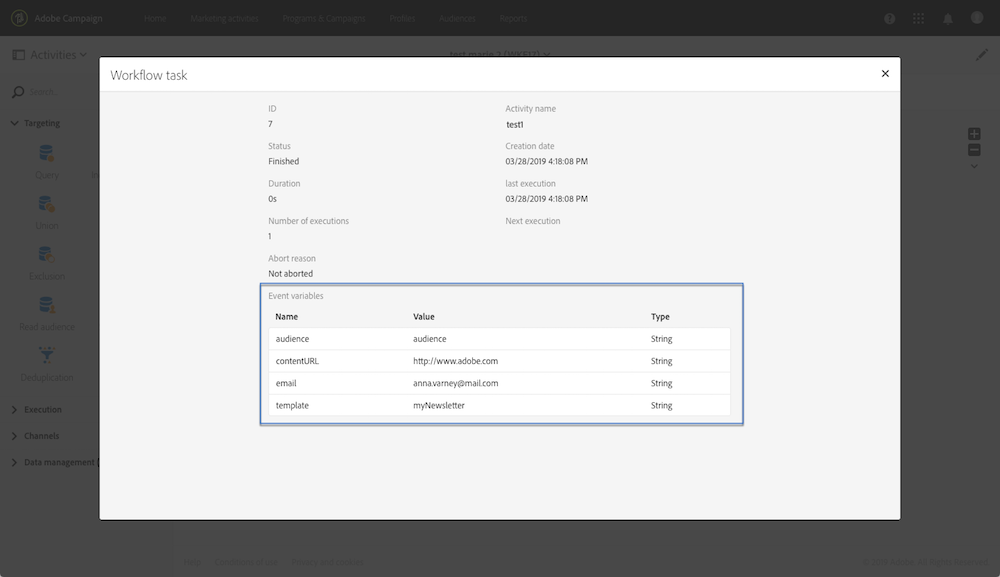

# 監控事件變數 {#monitoring-the-events-variables}

您可以監視工作流程中可用的事件變數，包括宣告的外部引數。 要執行此操作，請遵循下列步驟：

1. 選取遵循的活動 **[!UICONTROL External signal]** 活動，然後按一下 **[!UICONTROL Log and tasks]** 按鈕。
1. 在 **[!UICONTROL Tasks]** 標籤，按一下  按鈕。

   

1. 任務的執行內容隨即顯示（ID、狀態、持續時間等），包括所有現在可用於工作流程的事件變數。

   
