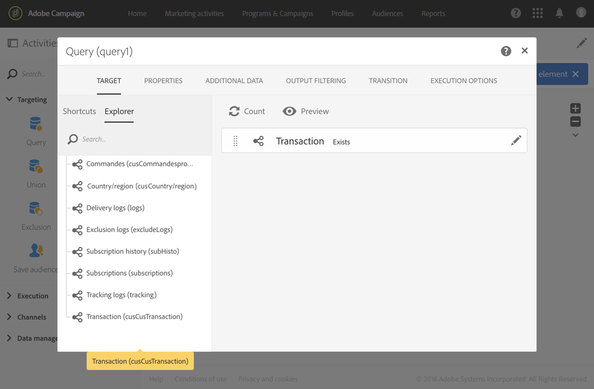

# 使用其他資料個人化電子郵件 {#example--personalizing-an-email-with-additional-data}

下列範例說明如何新增不同類型的其他資料至查詢，以及其作為電子郵件中個人化欄位的用途。如需如何豐富活動所定位資料的詳細 **[!UICONTROL Query]** 資訊，請參閱 [本節](../../automating/using/query.md#enriching-data)。

在此範例中，會使用[自訂資源](../../developing/using/data-model-concepts.md)：

* 擴充&#x200B;**設定檔**&#x200B;資源，以便新增欄位，以儲存每個設定檔的忠誠度點數。
* 已建立&#x200B;**交易**&#x200B;資源，並識別資料庫中設定檔案執行的所有採購。系統會針對每筆交易儲存購買的日期、價格和產品。
* 已建立&#x200B;**產品**&#x200B;資源，並參考可供購買的產品。

目標是將電子郵件傳送到至少已儲存一個交易的設定檔。透過這封電子郵件，客戶將會收到上次交易的提醒，以及其所有交易的概述：購買的產品數、總花費、提醒已累計的忠誠度點數總數。

工作流程如下：

1. Add a [Query](../../automating/using/query.md) activity, which allows you to target the profiles that have carried out at least one transaction.

   

1. 從查詢的 **[!UICONTROL Additional data]** 索引標籤中，定義要顯示在最終電子郵件中的不同資料：

   * 對應於忠誠點的&#x200B;**設定檔**&#x200B;維度的簡單欄位。請參閱[新增簡單欄位](../../automating/using/query.md#adding-a-simple-field)區段。
   * 根據交易收集進行兩個彙總：購買的產品數量和花費的總金額。您可以使用 **Count** 及 **Sum** 彙總，從彙總設定視窗的 **[!UICONTROL Data]** 索引標籤新增他們。請參閱[新增彙總](../../automating/using/query.md#adding-an-aggregate)區段。
   * 傳回已生效之上次交易之花費金額、日期和產品的集合。

      要執行此操作，您必須從集合設定視窗的 **[!UICONTROL Data]** 索引標籤，新增您要顯示的不同欄位。

      若要僅傳回最近的交易，您必須為 **[!UICONTROL Number of lines to return]** 輸入 &quot;1&quot;，並從 **[!UICONTROL Sort]** 索引標籤的集合，對 **Date** 欄位套用降序排序。

      請參閱[新增集合](../../automating/using/query.md#adding-a-collection)及[排序其他資料](../../automating/using/query.md#sorting-additional-data)區段。
   

1. 如果要檢查活動的出站轉變是否正確傳輸資料，請首次啟動工作流程（沒有 **[!UICONTROL Email delivery]** 活動）並開啟查詢的出站轉變。

   

1. 新增電子 [郵件傳送](../../automating/using/email-delivery.md) 活動。 在電子郵件內容中，插入與查詢中計算的資料對應的個人化欄位。您可以透過個人化欄位瀏覽器的 **[!UICONTROL Additional data (targetData)]** 連結找到它。

   

您的工作流程現在已可以執行。查詢中定位的設定檔將會收到包含其交易所計算資料的個人化電子郵件。
