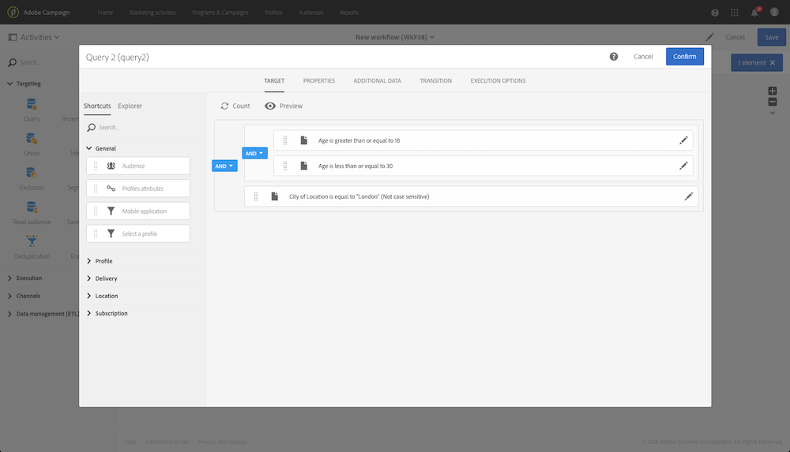
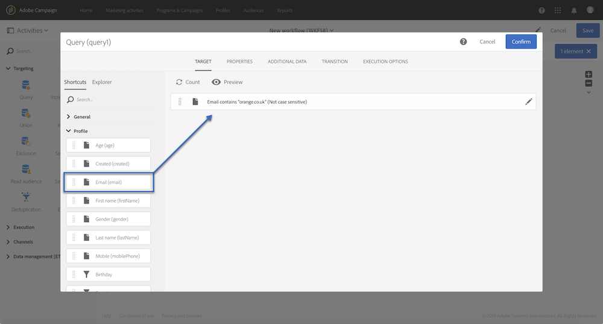
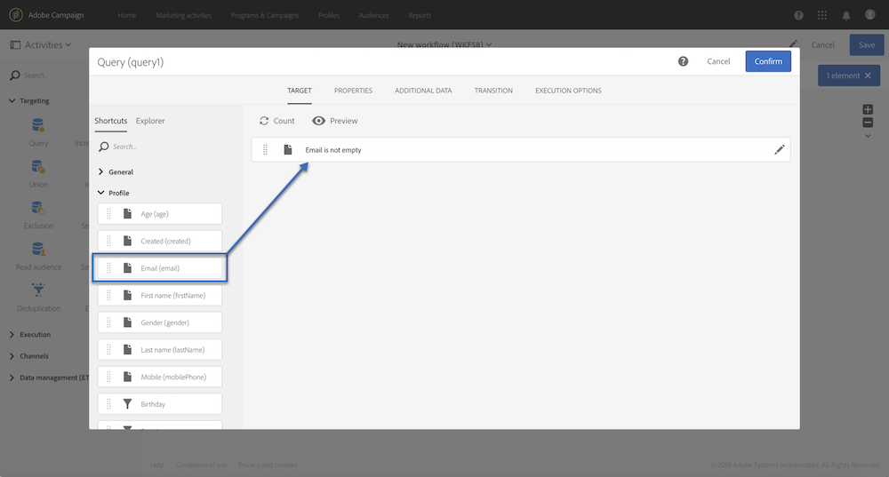
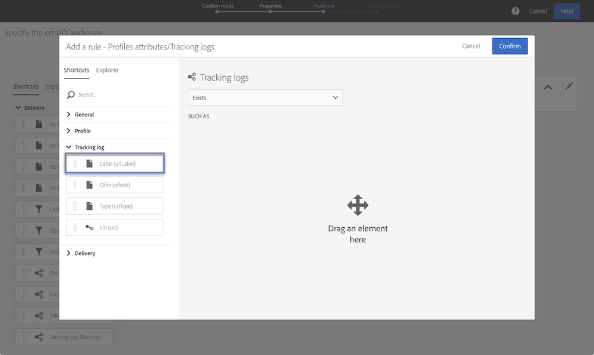

# 查詢範例 {#query-samples}

本節介紹使用&#x200B;**[!UICONTROL Query]**&#x200B;活動時的使用案例。 如需如何使用&#x200B;**[!UICONTROL Query]**&#x200B;活動的詳細資訊，請參閱[本節](../../automating/using/query.md)。

## 對簡單設定檔屬性進行定位 {#targeting-on-simple-profile-attributes}

下列範例顯示一個查詢活動，其設定是針對居住在倫敦年齡介於 18 至 30 的歲男性。

## 對電子郵件屬性進行定位 {#targeting-on-email-attributes}

下列範例顯示一個查詢活動，其設定是以電子郵件地址網域 &quot;orange.co.uk&quot; 來選擇目標輪廓。

下列範例顯示一個查詢活動，其設定是以所提供的電子郵件地址來選擇目標輪廓。

## 定位生日為今天的設定檔 {#targeting-profiles-whose-birthday-is-today}

下列範例顯示一個查詢活動，其設定是以生日為今天來選擇目標輪廓。

1. 拖曳查詢中的 **[!UICONTROL Birthday]** 篩選器。

   

1. 將 **[!UICONTROL Filter type]** 設定為 **[!UICONTROL Relative]** 並選取 **[!UICONTROL Today]**。

   

## 定位已開啟特定傳送的設定檔 {#targeting-profiles-who-opened-a-specific-delivery}

下列範例顯示一個查詢活動，其設定為篩選開啟傳送且標籤為 &quot;Summer Time&quot; 的輪廓。

1. 拖曳查詢中的 **[!UICONTROL Opened]** 篩選器。

   

1. 選取傳送，然後按一下 **[!UICONTROL Confirm]**。

   

## 針對傳送因為特定原因而失敗的設定檔進行定位 {#targeting-profiles-for-whom-deliveries-failed-for-a-specific-reason}

下列範例顯示一個查詢活動，其設定是篩選因其信箱已滿而傳送失敗的輪廓。 此查詢僅適用於具有管理權限且屬於 **[!UICONTROL All (all)]** 組織單位（請參閱[本區段](../../administration/using/organizational-units.md)）的使用者。

1. 選取 **[!UICONTROL Delivery logs]** 資源，以便直接在傳送記錄表中進行篩選（請參閱[使用與目標維度不同的資源](../../automating/using/using-resources-different-from-targeting-dimensions.md)）。

   

1. 拖曳查詢中的 **[!UICONTROL Nature of failure]** 篩選器。

   

1. 選取要鎖定的失敗類型。 在我們的案例 **[!UICONTROL Mailbox full]** 中。

   

## 過去7天期間未聯絡目標定位設定檔 {#targeting-profiles-not-contacted-during-the-last-7-days}

下列範例顯示一個查詢活動，其設定是用來篩選過去　7　天期間未聯絡的輪廓。

1. 拖曳查詢中的 **[!UICONTROL Delivery logs (logs)]** 篩選器。

   

   在下拉式清單中選取 **[!UICONTROL Does not exist]**，然後拖曳 **[!UICONTROL Delivery]** 篩選器。

   

1. 設定篩選器，如下所示。

   

## 定位按一下特定連結的設定檔 {#targeting-profiles-who-clicked-a-specific-link-}

1. 拖曳查詢中的 **[!UICONTROL Tracking logs (tracking)]** 篩選器。

   

1. 拖曳 **[!UICONTROL Label (urlLabel)]** 篩選器。

   

1. 在 **[!UICONTROL Value]** 欄位中，輸入在傳送中插入連結時所定義的標籤，然後確認。

   
