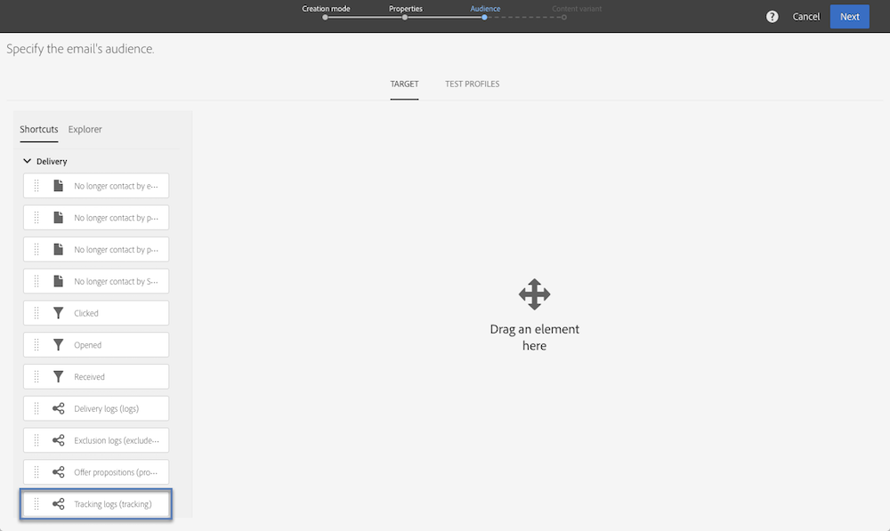

# 查詢{#query}

## 說明 {#description}

此活 **[!UICONTROL Query]** 動可讓您從Adobe Campaign資料庫中篩選及擷取元素總量。 您可以透過 **[!UICONTROL Additional data]** 專用標籤來定義目標人口。 此資料會儲存在其他欄中，且僅能用於進行中的工作流程。

活動使用查詢編輯器工具。 此工具在專屬章節中 [有詳細說明](../../automating/using/editing-queries.md#about-query-editor)。

## 使用內容 {#context-of-use}

此活 **[!UICONTROL Query]** 動可用於各種類型的使用：

* 將個人分段以定義訊息、對象等的目標。
* 豐富整個Adobe Campaign資料庫表格的資料。
* 匯出資料.

## 配置 {#configuration}

1. 將活動拖放 **[!UICONTROL Query]** 到工作流程中。
1. 選擇活動，然後使用顯示的快  速操作中的按鈕將其開啟。 依預設，活動會預先設定為搜尋描述檔。
1. 如果要對配置檔案資源以外的資源運行查詢，請轉至活動的頁籤， **[!UICONTROL Properties]** 然後選擇 **[!UICONTROL Resource]** 和 **[!UICONTROL Targeting dimension]**。

   您 **[!UICONTROL Resource]** 可以調整浮動視窗中顯示的篩選條件，而與所選資源相關的 **[!UICONTROL Targeting dimension]**，則與您要取得的人口類型（識別的設定檔、傳送、連結至所選資源的資料等）相對應。

   如需詳細資訊，請參閱「定 [位維度和資源」](#targeting-dimensions-and-resources)。

1. 在標籤 **[!UICONTROL Target]** 中，定義並結合規則以執行查詢。
1. 您可以透過 **[!UICONTROL Additional data]** 專用標籤來定義目標人口。 此資料會儲存在其他欄中，且僅能用於進行中的工作流程。 尤其是，您可以從連結至查詢定位維度的Adobe Campaign資料庫表格新增資料。 請參閱「 [豐富資料](#enriching-data) 」一節。

   >[!NOTE]
   >
   >預設情況下， **[!UICONTROL Remove duplicate rows (DISTINCT)]** 選項會在查 **[!UICONTROL Advanced options]** 詢的選 **[!UICONTROL Additional data]** 項卡中選中。 如果活 **[!UICONTROL Query]** 動包含許多（來自100個）已定義的其他資料，則建議基於效能原因取消選中此選項。 請注意，取消勾選此選項會導致重複，視查詢的資料而定。

1. 在標籤 **[!UICONTROL Transition]** 中，選 **[!UICONTROL Enable an outbound transition]** 項可讓您在查詢活動後新增傳出轉場，即使它未擷取任何資料亦然。

   使用標準運算式和事件變數可個人化傳出轉場的區段代碼(請參閱使用事 [件變數自訂活動](../../automating/using/calling-a-workflow-with-external-parameters.md#customizing-activities-with-events-variables))。

1. 確認活動的設定並儲存工作流程。

## 定位維度與資源 {#targeting-dimensions-and-resources}

定位維度和資源可讓您定義查詢要依據哪些元素來判斷傳送的目標。

定位維度是在定位映射中定義。 如需詳細資訊，請參閱[本小節](../../administration/using/target-mappings-in-campaign.md)。

### 定義查詢的定位維和資源 {#defining-the-targeting-dimension-and-resource-of-a-query}

定位維度和資源是在建立工作流程時，在「查詢」活動 **[!UICONTROL Properties]** 的標籤中定義。

>[!NOTE]
>
>建立對象時，也可定義定位維度(請參 [閱本節](../../audiences/using/creating-audiences.md))。

定位維度和資源會連結。 因此，可用的定位維度取決於選取的資源。

例如，對於「資源」, **[!UICONTROL Profiles (profile)]**&#x200B;將可使用下列定位維度：

對於， **[!UICONTROL Deliveries (delivery)]**&#x200B;清單將包含下列定位維度：

在指定定位維度和資源後，查詢中就可使用不同的篩選。

資源的可用篩選器示 **[!UICONTROL Profiles (profile)]** 例：

資源的可用篩選器示 **[!UICONTROL Deliveries (delivery)]** 例：

### 使用與定位維度不同的資源 {#using-resources-different-from-targeting-dimensions}

預設會設定定位維度和資源，以定位描述檔。

不過，如果您想在遠端表格中尋找特定記錄，則使用與定位維度不同的資源可能會很有用。

**範例1:使用標籤「歡迎回來！」識別傳送所定位的描述檔**。

* 在此案例中，我們要定位描述檔。 我們會將定位維度設為 **[!UICONTROL Profiles (profile)]**。
* 我們想要根據傳送標籤來篩選選取的描述檔。 因此，我們將資源設定為 **[!UICONTROL Delivery logs]**。 這樣，我們就直接在傳送記錄表中進行篩選，提供更佳的效能。

**範例2:識別傳送時未鎖定的描述檔，並標示為「歡迎返回！」**

在上個範例中，我們使用與定位維度不同的資源。 只有在您想要查找位於遠程表中 **的記錄** （在我們的示例中是交付日誌）時，才能執行此操作。

如果我們想要尋找不在遠端表格中的記錄 **** （例如，未由特定傳送定位的設定檔），您必須使用相同的資源和定位維度，因為該記錄不會出現在遠端表格中（傳送記錄）。

* 在此案例中，我們要定位描述檔。 我們會將定位維度設為 **[!UICONTROL Profiles (profile)]**。
* 我們想要根據傳送標籤來篩選選取的描述檔。 無法直接篩選傳送記錄，因為我們正在尋找不在傳送記錄表格中的記錄。 因此，我們將資源設定為 **[!UICONTROL Profile (profile)]** 並在配置檔案表上構建查詢。

## 豐富資料 {#enriching-data}

「和 **[!UICONTROL Additional data]** 」活 **[!UICONTROL Query]**&#x200B;動的標 **[!UICONTROL Incremental query]****[!UICONTROL Enrichment]** 簽可讓您豐富目標資料，並將此資料傳輸至下列工作流程活動，以便在其中使用。 您尤其可以新增：

* 簡單資料
* 聚合
* 系列

對於匯整和系列，會自動 **[!UICONTROL Alias]** 定義一個字元，為複雜運算式提供技術ID。 此別名必須是唯一的，可讓您在之後輕鬆找到匯總和系列。 您可以修改它，使其具有易於辨識的名稱。

>[!NOTE]
>
>別名必須遵守下列語法規則：僅授權英數字元和&quot;_&quot;字元。 別名區分大小寫。 別名必須以&quot;@&quot;字元開頭。 緊接在&quot;@&quot;後面的字元不得為數值。 例如：@myAlias_1和@_1Alias正確；而@myAlias#1和@1Alias則不正確。

新增任何其他資料後，您可以根據所定義的其他資料建立條件，將額外的篩選層級套用至最初定位的資料。

>[!NOTE]
>
>預設情況下， **[!UICONTROL Remove duplicate rows (DISTINCT)]** 選項會在查 **[!UICONTROL Advanced options]** 詢的選 **[!UICONTROL Additional data]** 項卡中選中。 如果活 **[!UICONTROL Query]** 動包含許多（來自100個）已定義的其他資料，則建議基於效能原因取消選中此選項。 請注意，取消勾選此選項會導致重複，視查詢的資料而定。

### 新增簡單欄位 {#adding-a-simple-field}

將簡單欄位新增為其他資料後，該欄位就會直接顯示在活動的對外轉場中。 這可讓使用者檢查，例如，查詢中的資料是否為所需資料。

1. 從標籤 **[!UICONTROL Additional data]** 中新增元素。
1. 在開啟的視窗中，在欄位中 **[!UICONTROL Expression]** ，選取目標維度中直接可用的其中一個欄位或其中一個連結的維度。 您可以編輯表達式，並使用維欄位中的函式或簡單計算（集合除外）。

   如果 **[!UICONTROL Alias]** 編輯的表達式不是簡單的XPATH路徑，則會自動建立一個表達式(例如：&quot;Year(&lt;@birthDate>)&quot;)。 如果您願意，可以修改它。 如果您只選取一個欄位(例如：&quot;@age&quot;)，您不需要定義 **[!UICONTROL Alias]**。

1. 選擇 **[!UICONTROL Add]** 以確認將欄位添加到其他資料。 執行查詢時，與添加的欄位對應的附加列將出現在活動的出站轉換中。

### 添加聚合 {#adding-an-aggregate}

匯總可讓您從定位維度的欄位或連結至定位維度的維度欄位計算值。 例如：描述檔購買的平均金額。
使用帶查詢的聚合時，其函式可返回零，然後視為NULL。 使用查 **[!UICONTROL Output filtering]** 詢的標籤來篩選匯總值：

* 如果您想要零值，您應加以篩選 **[!UICONTROL is null]**。
* 的雙曲餘切值 **[!UICONTROL is not null]**。

請注意，如果您需要對匯總應用排序，則應過濾掉零值，否則NULL值將顯示為最大數。

1. 從標籤 **[!UICONTROL Additional data]** 中新增元素。
1. 在開啟的視窗中，選取您要用來在欄位中建立匯總的系 **[!UICONTROL Expression]** 列。

   系統 **[!UICONTROL Alias]** 會自動建立。 如果您喜歡，可返回查詢的頁籤修改該 **[!UICONTROL Additional data]** 選項。

   將開啟聚合定義窗口。

1. 從標籤中定義匯 **[!UICONTROL Data]** 總。 根據所選聚合的類型，欄位中只有與其資料相容的元 **[!UICONTROL Expression]** 素。 例如，總和只能用數值資料計算。

   

   您可以為選取之系列的欄位新增數個匯總。 請務必定義明確標籤，以區分活動出站資料詳細資訊中的不同列。

   您也可以更改為每個聚合自動定義的別名。

   

1. 如有需要，您可以新增篩選器以限制已考慮的資料。

   請參閱篩選已 [新增的資料](#filtering-added-data) 區段。

1. 選擇 **[!UICONTROL Confirm]** 以添加聚合。

>[!NOTE]
>
>不能直接從窗口的欄位建立包含 **[!UICONTROL Expression]** 聚合的表達 **[!UICONTROL New additional data]** 式。

### 新增系列 {#adding-a-collection}

1. 從標籤 **[!UICONTROL Additional data]** 中新增元素。
1. 在開啟的視窗中，選取您要新增至欄位中的系列 **[!UICONTROL Expression]** 。 系統 **[!UICONTROL Alias]** 會自動建立。 如果您喜歡，可返回查詢的頁籤修改該 **[!UICONTROL Additional data]** 選項。
1. Select **[!UICONTROL Add]**. 隨即開啟新視窗，讓您調整想要顯示的收集資料。
1. 在標籤 **[!UICONTROL Parameters]** 中，選 **[!UICONTROL Collection]** 擇並定義要添加的系列行數。 例如，如果您想要取得每個描述檔執行的三個最近購買，請在欄位中輸入&quot;3&quot; **[!UICONTROL Number of lines to return]** 。

   >[!NOTE]
   >
   >您必須輸入大於或等於1的數字。

1. 在標籤 **[!UICONTROL Data]** 中，定義要針對每行顯示的系列欄位。

   

1. 如果您喜歡，您可以新增篩選來限制已考慮的系列行。

   請參閱篩選已 [新增的資料](#filtering-added-data) 區段。

1. 如果您喜歡，可以定義資料排序。

   例如，如果您在標籤中選擇了3行要返回，並且想要確定最近的3個採購，則可以在與事務處理對應的系列的「日期」欄位中定義降序排序。 **[!UICONTROL Parameters]**

1. 請參閱「排 [序其他資料](#sorting-additional-data) 」一節。
1. 選取 **[!UICONTROL Confirm]** 以新增系列。

### 篩選新增的資料 {#filtering-added-data}

當您新增匯總或系列時，可以指定其他篩選器來限制您要顯示的資料。

例如，如果您只想處理金額為50美元及以上的事務處理的收集行，則可以在標籤中與事務處理金額對應的欄位中添加條 **[!UICONTROL Filter]** 件。

### 排序其他資料 {#sorting-additional-data}

在向查詢的資料中添加聚合或集合時，可以根據欄位的值或定義的表達式指定是否要應用排序（無論排序是升序還是降序）。

例如，如果只想保存配置檔案最近執行的事務，請在標籤的欄位中輸入&quot;1&quot;，然後通過標籤對與事務日期對應的欄位應用降序 **[!UICONTROL Number of lines to return]****[!UICONTROL Parameters]****[!UICONTROL Sort]** 排序。

### 根據其他資料篩選目標資料 {#filtering-the-targeted-data-according-to-additional-data}

新增其他資料後，新標籤 **[!UICONTROL Output filtering]** 會出現在 **[!UICONTROL Query]**。 此標籤可讓您針對標籤中最初定位的資料套用額外的篩選， **[!UICONTROL Target]** 方法是考量新增的資料。

例如，如果您已將執行至少一個事務處理的所有配置檔案定位，並且每個配置檔案的平均事務處理金額的匯總計算都添加到中 **[!UICONTROL Additional data]**，則可以細化最初使用此平均值計算的人口。

若要這麼做，請在標 **[!UICONTROL Output filtering]** 簽中，在此額外資料上新增條件。

### 範例：使用其他資料個人化電子郵件 {#example--personalizing-an-email-with-additional-data}

下列範例說明如何新增不同類型的其他資料至查詢，以及其作為電子郵件中個人化欄位的用途。

在此範例中， [會使用自訂資](../../developing/using/data-model-concepts.md) 源：

* 擴充 **描述檔資源** ，以便新增欄位，以儲存每個描述檔的忠誠度點數。
* 已創 **建事務** 資源，並標識資料庫中配置檔案執行的所有採購。 系統會針對每筆交易儲存購買的日期、價格和產品。
* 已建 **立產品** 資源，並參考可供購買的產品。

目標是傳送電子郵件至至少已儲存一個交易的設定檔。 透過這封電子郵件，客戶將會收到上次交易的提醒，以及其所有交易的概述：購買的產品數、總花費、提醒已累計的忠誠度點數總數。

工作流程如下：

1. 新增活 **[!UICONTROL Query]** 動，可讓您定位已執行至少一項交易的設定檔。

   

   從查詢的標籤 **[!UICONTROL Additional data]** 中，定義要顯示在最終電子郵件中的不同資料：

   * 對應於忠誠點 **的** 「描述檔」維度的簡單欄位。 請參閱「 [Adding a simple field](#adding-a-simple-field) 」（添加簡單欄位）部分。
   * 根據事務處理收集進行兩個匯總：購買的產品數量和花費的總金額。 您可以使用「計數」和「 **[!UICONTROL Data]** 總和」聚合，從聚合配置窗口的選 **項卡中添****** 加它們。 請參閱「添 [加聚合](#adding-an-aggregate) 」部分。
   * 傳回已生效之上次交易之花費金額、日期和產品的系列。

      若要這麼做，您必須從系列設定視窗的標籤中新增您要顯示的 **[!UICONTROL Data]** 不同欄位。

      要僅返回最近的事務處理，您必須為輸入&quot;1&quot;, **[!UICONTROL Number of lines to return]** 並在標籤中的系列的「日期」欄位上應用降序 ******[!UICONTROL Sort]** 排序。

      請參閱「新 [增系列](#adding-a-collection) 」 [和「排序其他資料](#sorting-additional-data) 」區段。
   

   如果要檢查活動的出站轉移是否正確傳輸資料，請首次啟動工作流（沒有活動）並開啟查詢的出站轉移。 **[!UICONTROL Email delivery]**

   

1. 新增活 **[!UICONTROL Email delivery]** 動。 在電子郵件內容中，插入與查詢中計算的資料對應的個人化欄位。 您可以透過個人化欄位瀏 **[!UICONTROL Additional data (targetData)]** 覽器的連結找到它。

   

您的工作流程現在已可以執行。 查詢中定位的設定檔將會收到包含其交易所計算資料的個人化電子郵件。

## 查詢示例 {#query-samples}

### 以簡單描述檔屬性為目標 {#targeting-on-simple-profile-attributes}

下列範例顯示一個查詢活動，其設定是針對居住在倫敦的18至30歲男性。

### 針對電子郵件屬性進行定位 {#targeting-on-email-attributes}

下列範例顯示一個查詢活動，其設定是以電子郵件地址網域「orange.co.uk」定位描述檔。

下列範例顯示已設定為定位其電子郵件地址之描述檔的查詢活動。

### 定位生日為今天的個人檔案 {#targeting-profiles-whose-birthday-is-today}

下列範例顯示設定為定位生日為今天的描述檔的查詢活動。

1. 拖曳查 **[!UICONTROL Birthday]** 詢中的篩選器。

   

1. 將設定 **[!UICONTROL Filter type]** 為並 **[!UICONTROL Relative]** 選擇 **[!UICONTROL Today]**。

   

### 鎖定開啟特定傳送的設定檔 {#targeting-profiles-who-opened-a-specific-delivery}

下列範例顯示一個查詢活動，其設定為篩選開啟傳送且標籤為「夏季時間」的描述檔。

1. 拖曳查 **[!UICONTROL Opened]** 詢中的篩選器。

   

1. 選取傳送，然後按一下 **[!UICONTROL Confirm]**。

   

### 針對因特定原因而傳送失敗的設定檔 {#targeting-profiles-for-whom-deliveries-failed-for-a-specific-reason}

下列範例顯示一個查詢活動，其設定是篩選因其郵箱已滿而傳送失敗的描述檔。 此查詢僅適用於具有管理權限且屬於組織單位的用 **[!UICONTROL All (all)]** 戶(請參 [閱本節](../../administration/using/organizational-units.md))。

1. 選擇資 **[!UICONTROL Delivery logs]** 源，以便直接在傳送記錄表中篩選(請參 [閱使用與定位維度不同的資源](#using-resources-different-from-targeting-dimensions))。

   

1. 拖曳查 **[!UICONTROL Nature of failure]** 詢中的篩選器。

   

1. 選擇要定位的失敗類型。 就我們而言 **[!UICONTROL Mailbox full]**。

   

### 過去7天未連絡定位設定檔 {#targeting-profiles-not-contacted-during-the-last-7-days}

下列範例顯示一個查詢活動，其設定是用來篩選過去7天未連絡的設定檔。

1. 拖曳查 **[!UICONTROL Delivery logs (logs)]** 詢中的篩選器。

   

   在下 **[!UICONTROL Does not exist]** 拉式清單中選取，然後拖曳篩 **[!UICONTROL Delivery]** 選器。

   

1. 設定篩選如下。

   

### 定位按一下特定連結的個人檔案 {#targeting-profiles-who-clicked-a-specific-link-}

1. 拖曳查 **[!UICONTROL Tracking logs (tracking)]** 詢中的篩選器。

   

1. 拖曳篩 **[!UICONTROL Label (urlLabel)]** 選器。

   

1. 在欄位 **[!UICONTROL Value]** 中，輸入在傳送中插入連結時所定義的標籤，然後確認。

   

