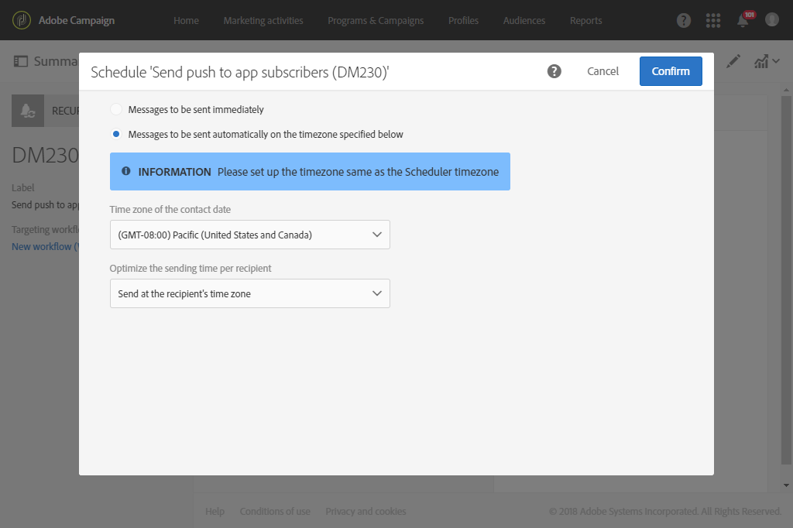

# 使用工作流程傳送循環推播通知 {#sending-a-recurring-push-notification-with-a-workflow}

在此範例中，個人化推播通知會根據您的行動應用程式訂閱者的時區，於每月第一天晚上8點傳送給訂閱者。

若要建立工作流程，請遵循下列步驟：

1. 此 [排程器](../../automating/using/scheduler.md) 活動可讓您在傳送開始前幾天啟動工作流程，以便能夠在任何指定時區的晚上8點將通知傳送給每個訂閱者：

   * 在 **[!UICONTROL Execution frequency]** 欄位中，選取每月。
   * 在中選取8點 **[!UICONTROL Time]** 欄位。
   * 選擇每月傳送傳遞的日期。
   * 請為您的工作流程選取開始日期，至少是在開始傳送的前一天。 否則，如果所選時間已在其時區中過，則某些收件者可能會在日後一天收到訊息。
   * 在 **[!UICONTROL Execution options]** 索引標籤中，選取工作流程將在哪個時區開始 **[!UICONTROL Time zone]** 欄位。 舉例來說，工作流程將從太平洋時間晚上8點（該月第一天的前一週）開始，以便為所有適用時區建立傳遞專案留出一些時間。

   >[!NOTE]
   >
   >依預設，選取的時區是工作流程屬性中定義的時區（請參閱[建立工作流程](../../automating/using/building-a-workflow.md)）。

   

1. 此 [查詢](../../automating/using/query.md) 活動可讓您鎖定年齡在20到30歲之間、已訂閱您的行動應用程式且未開啟您傳送之電子郵件的VIP客戶：

   * 選取對象(您的VIP客戶)並根據其年齡篩選。
   * 拖放 **應用程式的訂閱** 元素加入至工作區。 選取 **存在** 並選取您要使用的行動應用程式。
   * 選取您傳送給客戶的電子郵件。
   * 拖放 **傳遞記錄（記錄）** 元素並選取 **存在** 以定位所有收到電子郵件的客戶。
   * 拖放 **追蹤記錄（追蹤）** 元素並選取 **不存在** 以鎖定未開啟電子郵件的所有客戶。

      

1. 此 [推播通知傳遞](../../automating/using/push-notification-delivery.md) 活動可讓您輸入訊息內容，並選取您要使用的個人化欄位：

   * 選取 **[!UICONTROL Recurring notification]** 選項。
   * 定義推播通知內容。 如需推播通知內容的詳細資訊，請參閱此 [區段](../../channels/using/preparing-and-sending-a-push-notification.md).
   * 在 **[!UICONTROL Schedule]** 區塊，選取 **[!UICONTROL Messages to be sent automatically on the time zone specified below]**. 在此，我們選擇 **[!UICONTROL Time zone of the contact date]** 太平洋（如同工作流程） **[!UICONTROL Scheduler]**.
   * 在 **[!UICONTROL Optimize the sending time per recipient]** 欄位中，選取 **[!UICONTROL Send at the recipient's time zone]**。

      

1. 按一下 **[!UICONTROL Start]** 按鈕以開始您的循環工作流程。

   

您的工作流程目前正在執行中。 它將在的所選開始日期開始 **[!UICONTROL Scheduler]** 在太平洋時間晚上8點，週期性推送將會在每月的第一天晚上8點傳送（視客戶時區而定）。
