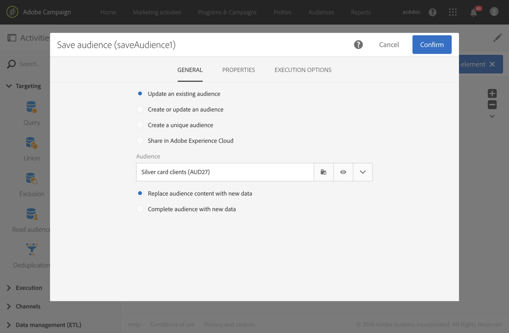

# Save audience{#save-audience}

## Description {#description}

**[!UICONTROL Save audience]** 此活動可讓您更新現有對象，或從工作流程上游計算的人口族群建立新觀眾。The audiences created or updated from this activity are **List** or **File** audiences. They are added to the list of application audiences, and are made available via the **[!UICONTROL Audiences]** menu.

>[!NOTE]
>
>If the audience created through the **[!UICONTROL Save audience]** activity has been enriched with additional data, you will not be able to use these data to personalize a standalone delivery. 它們只能用於工作流程中執行的傳送。

此活動也可讓您將描述檔匯出為Adobe Experience Cloud觀眾/區段。如此一來，您就可以在其他Adobe Experience Cloud解決方案中利用這些受眾。For more information about shared audiences, refer to [Working with Campaign and People Core Service](../../integrating/using/about-campaign-audience-manager-or-people-core-service-integration.md).

## Context of use {#context-of-use}

**[!UICONTROL Save audience]** 此活動基本上是用來讓在相同工作流程中計算的人口群組，轉換成可重復使用的對象。

## Configuration {#configuration}

1. Drop a **[!UICONTROL Save audience]** activity into your workflow.
1. 在其他定位活動(例如查詢、相交、聯合或排除)之後加以連接。
1. Select the activity, then open it using the  button from the quick actions that appear.
1. 選擇您要執行的動作：

   * **[!UICONTROL Update an existing audience]**：選取現有對象並選擇更新類型：

      * **[!UICONTROL Replace audience content with new data]**：會取代整個觀眾內容。舊資料會遺失。只會保留儲存觀眾活動之傳入轉換的資料。
      * **[!UICONTROL Complete audience with new data]**：保留舊對象資料，並將儲存觀眾活動的傳入轉場資料加入其中。
   * **[!UICONTROL Create then update an audience]**：輸入對象名稱，然後選取更新類型。如果對象不存在，則會建立此對象。如果它已經存在，則會根據選取的模式進行更新：

      * **[!UICONTROL Replace audience content with new data]**：會取代整個觀眾內容。舊資料會遺失。只會保留儲存觀眾活動之傳入轉換的資料。

         警告，此選項會擦除對象類型和更新對象的定位維度。

      * **[!UICONTROL Complete audience with new data]**：保留舊對象資料，並將儲存觀眾活動的傳入轉場資料加入其中。

         警告：如果對象類型或更新對象的定位維度與目前工作流程的設定不相容，則此選項會造成錯誤。例如，您無法使用來自查詢的描述檔來完成檔案類型對象。
   * **[!UICONTROL Create a new audience]**：輸入要建立的對象名稱。觀眾建立的時間和日期會自動新增至對象名稱。如此可讓觀眾每次執行工作流程時都不重復。
   * **[!UICONTROL Share in Adobe Experience Cloud]**：如果您有目標設定檔，而您想要將觀眾匯出至Adobe Experience Cloud，請選取此選項，然後選取現有的共用觀眾或建立新觀眾。

      Also select a **[!UICONTROL Shared Data source]** that corresponds to the resource of the data contained in the audience so that the data is correctly reconciled in Adobe Experience Cloud.

      Using this option, the shared audience is not added to the list of Adobe Campaign audiences available via the **[!UICONTROL Audiences]** menu.

      >[!NOTE]
      >
      >只有當管理員已設定Adobe Experience Cloud的共用觀眾功能時，才可使用此選項。For more information, refer to [Working with Campaign and People Core Service](../../integrating/using/about-campaign-audience-manager-or-people-core-service-integration.md).
   更新期間儲存或可用的觀眾類型取決於位於工作流程中的活動。

   If the targeting dimension of the audience is unknown when it is saved (for example if it is from an imported file), the audience is created or updated as a **[!UICONTROL File]** type audience.

   If the targeting dimension of the saved audience is already defined when it is saved (for example, if it comes from a targeting, after a query, etc.), then the audience is saved or updated as a **[!UICONTROL List]** type audience.

   The content of the saved audience is then available in the detail view of the audience, which can be accessed from the **[!UICONTROL Audiences]** menu. 此檢視中可用的欄對應工作流程儲存觀眾活動的傳入轉換欄。例如：匯入檔案的欄，以及從查詢中新增的其他資料。

1. 確認活動的設定並儲存工作流程。

## Example {#example}

此範例中定義的工作流程會顯示一般對象從定位的更新：

* It is automatically executed once a month using a **[!UICONTROL Scheduler]**.
* You can use a **[!UICONTROL Query]** to recover all the profiles subscribed to the different application services available.
* **[!UICONTROL Save audience]** 此活動會刪除自上次工作流程執行後取消訂閱的設定檔，並新增已訂閱的描述檔，以更新觀眾。

**[!UICONTROL Save audience]** 活動的設定如下：

