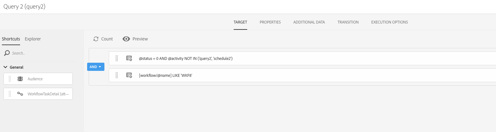

# 排程工作流程的重疊執行{#preventing-overlapping-execution-of-scheduled-workflows}

## 關於排程的工作流程執行

在Campaign Standard中，工作流引擎保證僅由一個進程執行工作流實例。 阻止導入、長時間運行查詢或寫入資料庫等活動會阻止在運行時執行任何其他任務。

另一方面，非阻塞活動不會阻止其他任務的執行(通常是等待事件（如&#x200B;**[!UICONTROL Scheduler]**&#x200B;活動）的活動。

這可能會導致以排程為基礎的工作流程即使先前執行的相同工作流程尚未完成，仍可能會開始執行，進而造成非預期的資料問題。

因此，在設計包含多個活動的計畫工作流時，您需要確保在工作流完成之前不會重新計畫該工作流。 若要這麼做，您必須設定您的工作流程，以便在先前執行的一或多個工作仍待定時，防止其執行。

## 設定工作流程

要檢查上一工作流執行中的一個或多個任務是否仍在暫掛，您需要使用&#x200B;**[!UICONTROL Query]**&#x200B;和&#x200B;**[!UICONTROL Test]**&#x200B;活動。

1. 在&#x200B;**[!UICONTROL Scheduler]**&#x200B;活動後添加&#x200B;**[!UICONTROL Query]**&#x200B;活動，然後按如下方式進行配置。

1. 將活動的資源更改為&#x200B;**[!UICONTROL WorkflowTaskDetail]** ，表示它將定位工作流的當前任務。

   

1. 使用以下規則配置查詢：

   

   * 第一個規則過濾掉當前任務(query2)以及屬於當前工作流的下一個調度任務(schedule2)。

      >[!NOTE]
      >
      >當&#x200B;**[!UICONTROL Scheduler]**&#x200B;活動啟動時，它會立即添加另一個計畫任務，以便在下一個計畫時間運行並啟動工作流。 因此，在從先前執行中查找待定任務時，請務必同時篩選查詢和調度任務。

   * 第二規則確定來自工作流先前運行的任何任務是否仍處於活動狀態（待定），該狀態對應於0執行狀態。

1. 新增&#x200B;**[!UICONTROL Test]**&#x200B;活動，以檢查&#x200B;**[!UICONTROL Query]**&#x200B;活動傳回的待處理任務數。 若要這麼做，請設定兩個傳出轉場。

   

   * 如果沒有待定任務，則第一次轉換會繼續工作流執行。
   * 如果存在任何待定任務，則第二個轉換將取消工作流執行。

   

您現在可以視需要設定其餘的工作流程。 如果由於待定任務而取消了工作流執行，則當工作流按照計畫再次運行時，它可以執行這些步驟。 這將確保只有在先前執行中沒有作用中（待定）任務時，工作流執行才會繼續。
