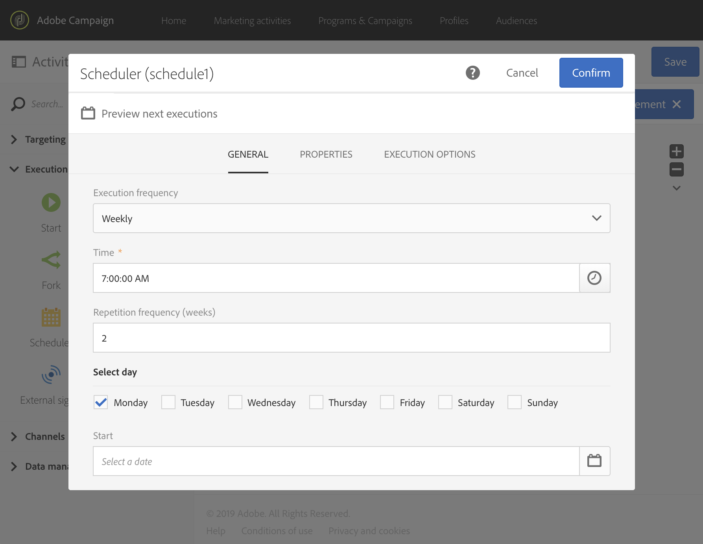

# 排程器{#scheduler}

## 說明 {#description}

**[!UICONTROL Scheduler]** 活動可讓您排程何時啟動工作流程或活動。

## 使用內容 {#context-of-use}

**[!UICONTROL Scheduler]** 活動應視為已排程的開始。圖表中的活動定位規則與活動 **[!UICONTROL Start]** 的定位規則相同。此活動不得具有入站轉變。

在建立工作流程時，每個分支只使用一個 **[!UICONTROL Scheduler]** 活動，並請記得設定時區。這可讓您在特定時區啟動工作流程，否則工作流程將在工作流程屬性中定義的時區中執行（請參閱[建立工作流程](../../automating/using/building-a-workflow.md)）。

>[!CAUTION]
>
>**[!UICONTROL Repetition frequency]** 活動的時間不能少於　10　分鐘。這表示工作流程無法每　10　分鐘自動執行多次。

設計包含多個活動的已排程工作流程時，您必須確保工作流程在完成前不會重新排程。 若要這麼做，您需要設定工作流程，以防止其在先前執行的一或多個任務仍擱置時執行。 如需詳細資訊，請參閱[此頁面](../../automating/using/scheduled-workflows-execution.md)。

**相關主題：**

* [使用案例：在設定檔建立日期中建立傳送](../../automating/using/workflow-creation-date-query.md)
* [使用案例：建立每個星期二的電子郵件傳送](../../automating/using/workflow-weekly-offer.md)

## 設定 {#configuration}

1. 將 **[!UICONTROL Scheduler]** 活動拖放至工作流程中。
1. 選取活動，然後使用所顯示快速動作中的  按鈕將其開啟。
1. 指定 **[!UICONTROL Execution frequency]**：

   * **[!UICONTROL Once]**：工作流程只需執行一次。
   * **[!UICONTROL Several times a day]**：工作流程會定期執行數次。
   * **[!UICONTROL Daily]**：工作流程會在指定的時間執行，一天一次。
   * **[!UICONTROL Weekly]**：工作流程會在指定的時間執行，每週執行一或數次。
   * **[!UICONTROL Monthly]**：工作流程會在指定的時間執行，每月執行一或數次。當您需要執行工作流程時，可以選取月份。您也可以在月份的指定工作日（例如，當月的第二個星期二）設定執行。
   * **[!UICONTROL Yearly]**：工作流程會在指定的時間執行，每年執行一次或數次。

1. 根據您的需求配置執行設定。 可用選項可能會因選取的執行頻率（執行時間或天數、重複頻率等）而有所不同。

   >[!NOTE]
   >
   >此 **[!UICONTROL Repetition frequency]** 可用於每日和每月執行頻率的欄位可讓您在觸發工作流程時省下時間。 例如，如果您選取每日執行期間，而重複頻率設定為 **2**（天），則每兩天就會觸發工作流程一次。時間不能少於　10　分鐘。如果重複頻率設為 **0** （也是預設值），不會考慮此選項，工作流程將根據指定的執行頻率執行。

   將執行頻率設定為 **[!UICONTROL Several times a day]**，您可靈活地選擇在一天中的特定時間執行工作流程，或在一天中定期執行工作流程。

+++ 瞭解如何設定 **[!UICONTROL "Several times a day"]** 執行頻率

   * 若要在一天中的特定時間多次執行工作流程，請開啟 **[!UICONTROL Specific times]** option ，然後按一下 **[!UICONTROL Add an element]** 以指定所需的執行時間。 視需要多次新增，以符合您的需求。

   * 若要在一天中定期執行工作流程，請開啟 **[!UICONTROL Periodic]** 選項，然後設定執行週期：

      1. 在 **[!UICONTROL Repeat processing according to the following frequency (e.g. 2h)]** 欄位中，指定工作流程應執行的間隔（例如每30分鐘、每2小時）。

         >[!NOTE]
         >
         >此選項也允許每日、每月或每年重複頻率。 請注意，在此情況下，工作流程將不會一天執行數次，而是根據您在此欄位中指定的頻率來執行。
         >
         > 如果您的工作流程不需要在一天內執行多次，而是需要每日、每月或每年執行，建議您使用 **[!UICONTROL Daily]**， **[!UICONTROL Monthly]** 或 **[!UICONTROL Yearly]** 中可用的選項 **[!UICONTROL Execution frequency]** 下拉式清單。

      1. 在 **[!UICONTROL Start]**/**[!UICONTROL End]** 時間欄位，定義工作流程執行的開始和結束時間。

         如果未指定結束時間，執行會在午夜00結束:00:00小時，而下一個執行會在隔天的指定開始時間開始。

      1. 在 **[!UICONTROL Start]** 日期欄位，選取第一次執行的開始日期。

   在以下範例中，活動設定為從3月1日上午8點至下午5點，每兩小時執行工作流程一次。

   

+++

1. 指定執行將於何時過期：

   * **[!UICONTROL Never]**：工作流程將根據指定的頻率執行，對時間範圍或迭代次數沒有任何限制。
   * **[!UICONTROL After a certain number of iterations]**：工作流程將根據指定的頻率執行，直到達到 **X**　限制為止。因此需要指定　**[!UICONTROL Number of iterations]**。
   * **[!UICONTROL On a specific date]**：工作流程將根據指定的頻率執行，直到特定日期為止。因此，必須指定執行期限。

1. 按一下　**[!UICONTROL Preview next executions]**，以檢查工作流程接下來十個執行的排程。

1. 在 **[!UICONTROL Execution options]** 索引標籤中，在　**[!UICONTROL Time zone]**　欄位中為排程器設定時區。

   如需根據收件者時區傳送傳送的詳細資訊，請參閱本[區段](../../sending/using/sending-messages-at-the-recipient-s-time-zone.md)或循環工作流程的[範例](../../automating/using/recurring-push-notifications.md)。

1. 確認活動的設定並儲存工作流程。

## 範例 {#example}

在在下列範例中，已將活動設定每週啟動工作流程，每隔一週的星期一上午　7:00 啟動工作流程，但持續時間不確定。

