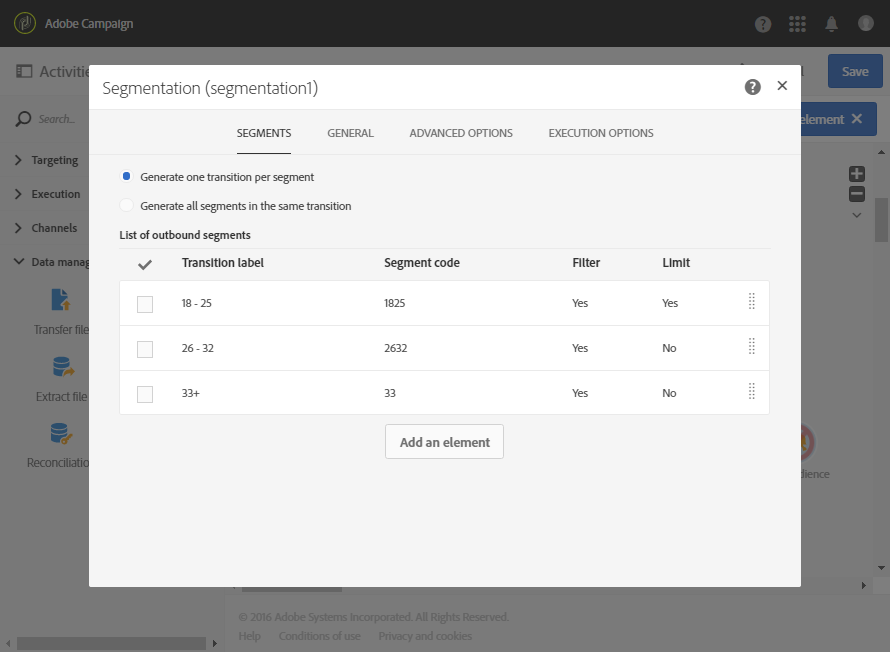

# 根據年齡群體細分 {#segmentation-age-groups}

下列範例會根據年齡群組區分資料庫設定檔。

工作流程的目的是為每個年齡群組傳送特定電子郵件。考慮到此工作流程屬於測式行銷活動的一部分，每個區段只能包含最多隨機選取的 100 個設定檔，以便同時使用受限制的對象和代表。

工作流程由下列元素組成：

* A [排程器活動](../../automating/using/segmentation.md) 以指定工作流程的執行日期。
* A [查詢](../../automating/using/query.md) 已輸入其生日及電子郵件地址之人們的目標設定檔的活動。
* A [細分](../../automating/using/segmentation.md) 建立分為不同出站轉變的3個區段的活動：18-25歲、26-32歲及超過32歲的設定檔。 區段會依據下列參數定義：

  

   * 年齡篩選器以定義區段的年齡群組

     

   * 已連接至 100 的 **[!UICONTROL Maximum size]** 限制的 **[!UICONTROL Random sampling]** 類型限制

     

* 一個 [電子郵件傳遞](../../automating/using/email-delivery.md) 每個區段的活動。
