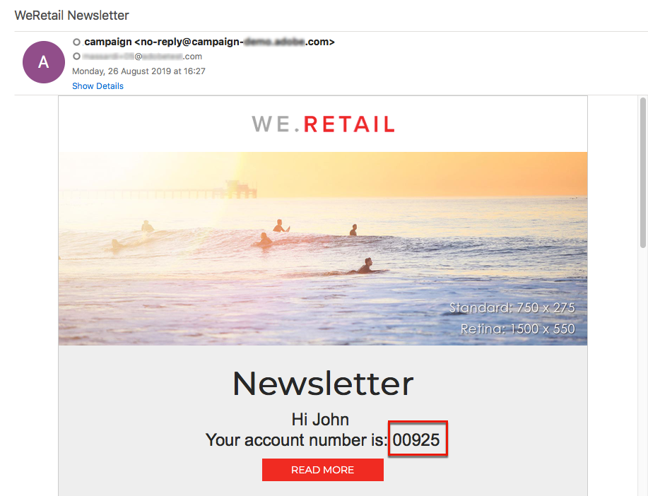

# 傳送包含擴充欄位的電子郵件 {#sending-email-enriched-fields}

<!--A new example showing how to send an email containing additional data retrieved from a load file activity has been added. [Read more](example-2-email-with-enriched-fields)-->

此外，載入檔案活動也可讓您在相同的工作流程中，從外部檔案傳送內含其他資料的電子郵件。

以下範例說明如何透過載入檔案活動，使用從外部檔案擷取的其他資料來傳送電子郵件。在此範例中，外部檔案包含設定檔清單及其關聯的帳號。您想要匯入此資料，以傳送電子郵件給每個設定檔及其帳號。

若要建立工作流程，請依照下列步驟進行：

1. Drag and drop a [Query](../../automating/using/query.md) activity into your workflow and open it to define the main target.

   <!--The Query activity is presented in the [Query](../../automating/using/query.md) section.-->

1. Drag and drop a [Load file](../../automating/using/load-file.md) activity to assign some data to a profile. 在此範例中，載入包含與資料庫之一些設定檔相對應帳號的檔案。

   

1. Drag and drop an [Enrichment](../../automating/using/enrichment.md) activity into your workflow and link the load file and query activities to it.

1. 在擴充活動的 **[!UICONTROL Advanced relations]** 索引標籤中，選取 **[!UICONTROL 0 or 1 cardinality simple link]** 並定義要用於調解的欄位。在此處，我們會使用姓氏來調整資料和資料庫設定檔。

   

1. 在 **[!UICONTROL Additional data]** 索引標籤中，選取您要在電子郵件中使用的元素。在此處選取帳號（從透過載入檔案活動擷取之檔案的欄）。

   

   <!---->

   如需詳細資訊，請參閱[擴充](../../automating/using/enrichment.md)區段。

1. Drag and drop a [Segmentation](../../automating/using/segmentation.md) activity into your workflow and open it to refine the main target.

   

   如需詳細資訊，請參閱[分段](../../automating/using/segmentation.md)區段。

1. Drag and drop an [Email delivery](../../automating/using/email-delivery.md) activity into your workflow and open it.

   <!--The Email delivery activity is presented in the [Email delivery](../../automating/using/email-delivery.md) section.-->

1. 新增個人化欄位，並從 **[!UICONTROL Additional data (targetData)]** 節點選取擴充活動（此處為帳號）中定義的其他資料。如此可動態擷取電子郵件內容中每個設定檔的帳號。

   

1. 儲存電子郵件並啟動工作流程。

會將電子郵件傳送至目標。每個設定檔都會收到含有其對應帳號的電子郵件。

