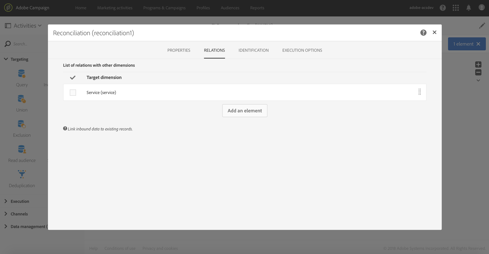

# Subscription Services{#subscription-services}

## Description {#description}


**[!UICONTROL Subscription Services]** 活動可讓您大量擷取個人檔案，並訂閱服務或取消訂閱服務。

>[!CAUTION]
>
>在工作流程中管理訂閱時，訂閱或未訂閱的描述檔不會接收服務屬性中定義的不同確認電子郵件。

## Context of use {#context-of-use}

**[!UICONTROL Subscription Services]** 活動是唯一的Adobe Campaign功能，可讓多個描述檔訂閱或取消訂閱單一動作中的服務。

您可以在執行定位或匯入已識別資料的檔案後使用此活動。

如果在檔案中透過專用欄指定，此活動也可讓您選擇動作(訂閱或取消訂閱)以及執行動作的服務。

## Configuration {#configuration}

1. Drag and drop a **[!UICONTROL Subscription Services]** activity into your workflow.
1. 在匯入後，在其他定位活動(例如查詢或協調)之後連接它。
1. Select the activity, then open it using the  button from the quick actions that appear.
1. Select the **[!UICONTROL Service]** for which you would like to manage the subscriptions using one of the following options:

   * **[!UICONTROL Select a specific service]**：手動選取服務。
   * **[!UICONTROL Select services from the inbound transition]**：服務是在傳入轉換中指定的。例如，您可以匯入指定每一行管理服務的檔案。If you choose this option, make sure a link has been created beforehand between the data and the **Service** resource, as shown in [this example](../../automating/using/subscription-services.md#example--updating-multiple-subscription-statuses-from-a-file).

      執行操作的服務接著會動態選取每個記錄。

1. Select the **[!UICONTROL Operation type]** to execute using one of the following options:

   * **[!UICONTROL Select a specific operation type]**：視需要手動 **[!UICONTROL Subscribe]****[!UICONTROL Unsubscribe]** 選取。
   * **[!UICONTROL Select an operation type from a path of inbound transition]**：選取傳入資料的欄，以指定每個記錄執行的動作。

      在此欄中，作業必須指定為布林或整數。Use **0** to unsubscribe a record and **1** to subscribe.

      In case the values contained in an imported file do not match the above requirements, you can still use the [Remapping of values](../../automating/using/load-file.md#column-format) option available in the **[!UICONTROL Load file]** activity

1. 如果傳入的資料包含與描述檔的訂閱日期對應的欄，請選取該欄。您可以保留空白，但在執行工作流程時不會設定訂閱日期。
1. 定義訂閱的來源。You can set it to one of the fields of the inbound data or to a constant value of your choice by checking the **[!UICONTROL Set a constant as origin]** option. 您可以保留空白，但在執行工作流程時不會設定原點。
1. 如有需要，您可以產生對外轉場。此轉換包含與傳入活動中完全相同的資料。
1. 確認活動的設定並儲存工作流程。

   現在已可執行。在執行後，您可以檢視服務中已訂閱或取消訂閱服務的描述檔。

## Example: Subscribing profiles to a specific service after importing a file {#example--subscribing-profiles-to-a-specific-service-after-importing-a-file}

此範例說明如何匯入包含描述檔的檔案並訂閱現有服務。匯入檔案後，需要執行協調，以便將匯入的資料識別為描述檔。為了確保檔案不包含任何重復項目，將會在資料上執行去重復化活動。

工作流程的呈現方式如下：


* **[!UICONTROL Load file]** 活動會載入描述檔檔案，並定義匯入欄的結構。

   在此範例中，載入的檔案為. csv格式，並包含下列資料：

   ```
   lastname;firstname;email;birthdate;subdate
   jackman;megan;megan.jackman@testmail.com;07/08/1975;10/08/2017
   phillips;edward;phillips@testmail.com;09/03/1986;10/08/2017
   weaver;justin;justin_w@testmail.com;11/15/1990;10/08/2017
   martin;babeth;babeth_martin@testmail.net;11/25/1964;10/08/2017
   reese;richard;rreese@testmail.com;02/08/1987;11/08/2017
   cage;nathalie;cage.nathalie227@testmail.com;07/03/1989;11/08/2017
   xiuxiu;andrea;andrea.xiuxiu@testmail.com;09/12/1992;11/08/2017
   grimes;daryl;daryl_890@testmail.com;12/06/1979;12/08/2017
   tycoon;tyreese;tyreese_t@testmail.net;10/08/1971;12/08/2017
   ```

   

* **[!UICONTROL Reconciliation]** 活動會將檔案中的資料識別為Adobe Campaign資料庫的描述檔維度。Only the **[!UICONTROL Identification]** tab is configured. 它會根據描述檔的電子郵件地址識別檔案資料。

   

* A **[!UICONTROL Deduplication]** based on the **email** field of the temporary resource (resulting from the reconciliation) identifies any duplicates. 如果從檔案匯入的資料包含任何重復項目，所有資料的訂閱訂閱將會失敗。

   

* **[!UICONTROL Subscription Services]** 活動可讓您選取必須訂閱描述檔的服務、對應訂閱日期的欄位，以及訂閱的來源。

   

## Example: Updating multiple subscription statuses from a file {#example--updating-multiple-subscription-statuses-from-a-file}

此範例說明如何匯入包含描述檔的檔案，並將其訂閱更新為檔案中指定的多個服務。匯入檔案後，需要進行協調，以便將匯入的資料識別為具有服務連結的描述檔。為了確保檔案不包含任何重復項目，將會在資料上執行去重復化活動。

工作流程的呈現方式如下：


* **[!UICONTROL Load file]** 活動會載入描述檔檔案，並定義匯入欄的結構。

   在此範例中，載入的檔案為. csv格式，並包含下列資料：

   ```
   lastname;firstname;email;birthdate;service;operation
   jackman;megan;megan.jackman@testmail.com;07/08/1975;SVC2;sub
   phillips;edward;phillips@testmail.com;09/03/1986;SVC3;unsub
   weaver;justin;justin_w@testmail.com;11/15/1990;SVC3;sub
   martin;babeth;babeth_martin@testmail.net;11/25/1964;SVC3;unsub
   reese;richard;rreese@testmail.com;02/08/1987;SVC3;sub
   cage;nathalie;cage.nathalie227@testmail.com;07/03/1989;SVC3;sub
   xiuxiu;andrea;andrea.xiuxiu@testmail.com;09/12/1992;SVC4;sub
   grimes;daryl;daryl_890@testmail.com;12/06/1979;SVC3;unsub
   tycoon;tyreese;tyreese_t@testmail.net;10/08/1971;SVC2;sub
   ```

   

   如您所注意到，該作業在檔案中指定為「子」或「unsub」。The system expects a **Boolean** or **Integer** value to recognize the operation to perform: "0" to unsubscribe and "1" to subscribe. 若要符合此需求，會在「操作」欄的詳細資料中執行值重新對應。

   

   如果您的檔案已使用「0」和「1」來識別作業，則不需要重新對應這些值。Only make sure that the column is processed as a **Boolean** or **Integer** in the **[!UICONTROL Column definition]** tab.

* **[!UICONTROL Reconciliation]** 活動會將檔案中的資料識別為Adobe Campaign資料庫的描述檔維度。Through the **[!UICONTROL Identification]** tab, the **email** field of the file is matched to the **email** field of the profile resource.

   

   **[!UICONTROL Relations]** 在標籤中，會使用服務資源建立連結，以允許識別檔案的 **服務** 欄位。In this example, the values match the **name** field of the service resource.

   

* A **[!UICONTROL Deduplication]** based on the **email** field of the temporary resource (resulting from the reconciliation) identifies duplicates. 請務必消除重復的事項，因為在發生重復的情況下，訂閱服務的訂閱將失敗。

   

* A **[!UICONTROL Subscription Services]** identifies the services to update as coming from the transition, through the link created in the **[!UICONTROL Reconciliation]** activity.

   **[!UICONTROL Operation type]** 這是來自檔案 **的作業** 欄位。此處只能選取布林或整數欄位。If the column of your file that contains the operation to perform does not appear in the list, make sure that you have correctly set your column format in the **[!UICONTROL Load file]** activity, as explained earlier in this example.

   

