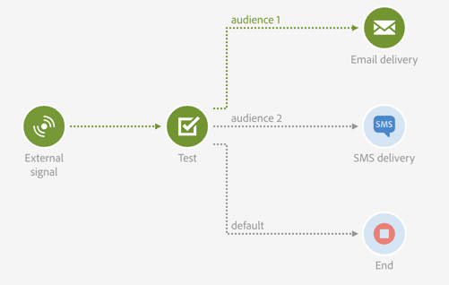

# 測試 {#test}

## 說明 {#description}

**[!UICONTROL Test]** 活動會根據測試結果啟用轉換。

## 使用內容 {#context-of-use}

「**測試**」活動會啟動滿足與其相關的條件的第一個轉變。

如果未滿足任何條件，並且啟動了「**使用預設過渡**」選項，則將啟動預設轉變。

條件能以&#x200B;**函式**&#x200B;為基礎，或以&#x200B;**變數**&#x200B;為基礎，例如已宣告至工作流程 **[!UICONTROL External signal]** 活動中的事件變數。

**相關主題：**

* [函式清單](../../automating/using/list-of-functions.md)
* [使用外部參數呼叫工作流程](../../automating/using/calling-a-workflow-with-external-parameters.md)

## 設定 {#configuration}

1. 將 **[!UICONTROL Test]** 活動拖放至工作流程中。
1. 選取活動，然後使用所顯示快速操作中的  按鈕將其開啟。
1. 定義每個條件的屬性：

   編輯 **[!UICONTROL Condition]** 欄位時，兩個按鈕可提供呼叫事件變數及編輯結合變數和函式的運算式的協助：

   * :在工作流程中可用的所有變數中選取事件變數(請參 [閱本頁](../../automating/using/customizing-workflow-external-parameters.md))。

      例如，您可以使用&#x200B;**[!UICONTROL filesCount]**&#x200B;變數檢查[檔案傳輸](../../automating/using/transfer-file.md)活動後下載的檔案數。

      

   * ：編輯結合變數和函式的運算式。如需運算式編輯器的詳細資訊，請參考[本區段](../../automating/using/advanced-expression-editing.md)。

      
