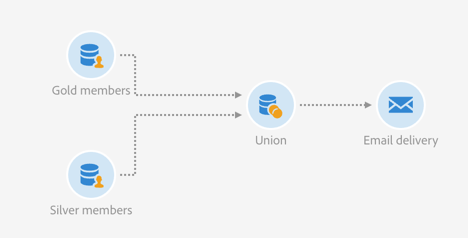

# 聯合兩個完善的對象 {#example--union-on-two-refined-audiences}

此範例中定義的工作流程會顯示兩個 **[!UICONTROL Read audience]** 活動的聯合。此工作流程的目標是傳送電子郵件給年齡介於 18 至 30 歲之間的金級或銀級會員。系統中已建立特定對象，以追蹤金級和銀級會員。

工作流設計如下：

* 第一個[讀取對象](../../automating/using/read-audience.md)活動，可擷取金級成員對象，並只選取18到30歲的設定檔來調整。
* 第二個 **[!UICONTROL Read audience]** 活動，只要選取介於 18 至 30 歲的設定檔，即可擷取和改良銀級會員對象。
* A [聯合](../../automating/using/union.md)活動，將兩個&#x200B;**[!UICONTROL Read audiences]**&#x200B;活動的人口聯合為一個最終人口。
* [電子郵件傳送](../../automating/using/email-delivery.md)活動，將電子郵件傳送給來自&#x200B;**[!UICONTROL Union]**&#x200B;活動的人口。
