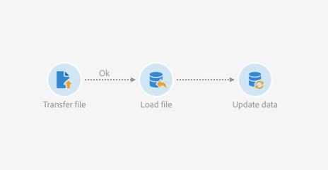

# 根據自動檔案下載更新資料 {#updating-data-automatic-file-download}

載入檔案活動主要從傳輸檔案活動中構造資料，以便將其整合到現有資料中。

以下示例顯示通過傳輸檔案活動自動下載的載入檔案活動的結果，其後是更新資料活動。 此工作流程旨在以新的描述檔豐富Adobe Campaign資料庫，或使用從匯入檔案中復原的資料更新現有的描述檔。

若要建立工作流程，請依照下列步驟進行：

1. 將「傳輸」檔案 [活動拖放](../../automating/using/transfer-file.md) 至您的工作流程中。
1. 選擇活動，然後使用顯示的快  速操作中的按鈕將其開啟。
1. 以某種方式配置活動，以便恢復您要的檔案。 在標籤 **[!UICONTROL Protocol]** 中，選擇 **SFTP**。
1. 選擇「使 **用在外部帳戶中定義的連接參數** 」選項。
1. 輸入外部帳戶的名稱。
1. 輸入遠程 **伺服器上的檔案路徑**。

   

1. 確認您的活動。
1. 將「載入檔 [案」活動拖放至](../../automating/using/load-file.md) 「工作流程」中，並將其置於活動 **[!UICONTROL Transfer file]** 後面。
1. 選擇活動，然後使用顯示的快  速操作中的按鈕將其開啟。
1. 在標籤 **[!UICONTROL File to load]** 的區段中 **[!UICONTROL Execution]** ，勾選選 **[!UICONTROL Use the file specified in the inbound transition]** 選項。

   

1. 依照先前的指定設定您的活動。
1. 將「更新」資 [料活動拖放至](../../automating/using/update-data.md) 「工作流程」中，並將其置於活動之 **[!UICONTROL Load file]** 後，再加以設定。

工作流程開始後，會擷取上傳檔案的資料，然後用來豐富Adobe Campaign資料庫。
