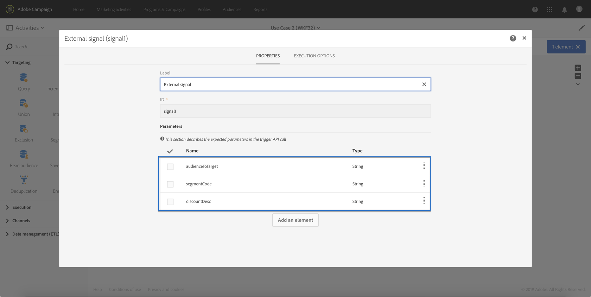
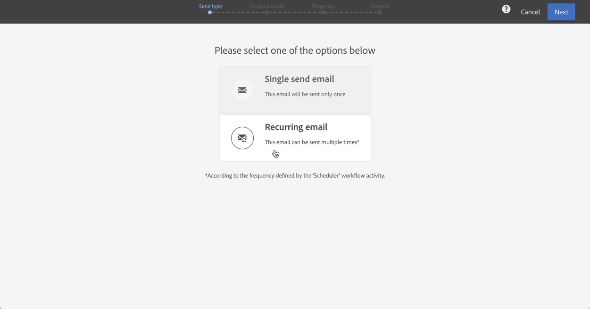

# 使用案例 {#use-case}

以下使用案例說明如何使用工作流程中的參數來呼叫工作流程。

其目的在於使用外部參數從API呼叫觸發工作流程。 此工作流程會從檔案將資料載入您的資料庫，並建立相關對象。 在建立對象後，會觸發第二個工作流程，以傳送個人化訊息，並使用API呼叫中定義的外部參數。

要執行此使用案例，您需要執行以下操作：

1. **進行API呼叫** 以使用外部參數觸發Workflow 1。請參閱[步驟1:設定API呼叫](../../automating/using/use-case-calling-workflow.md#step-1--configuring-the-api-call)。
1. **建立工作流程1**:工作流將傳輸檔案並將其載入到資料庫中。然後，它會測試資料是否空白，並最終將描述檔儲存至觀眾。 最後，它將觸發Workflow 2。 請參閱[步驟2:設定工作流程1](../../automating/using/use-case-calling-workflow.md#step-2--configuring-workflow-1)。
1. **建立工作流程2**:工作流程會讀取在Workflow 1中建立的觀眾，然後傳送個人化訊息至描述檔，並使用參數自訂區段代碼。請參閱[步驟3:設定工作流程2](../../automating/using/use-case-calling-workflow.md#step-3--configuring-workflow-2)。


## 必要條件 {#prerequisites}

在設定工作流程之前，您必須先建立Workflow 1和Workflow 2，其中每個工作流程都包含&#x200B;**[!UICONTROL External signal]**&#x200B;活動。 如此，您就可以在呼叫工作流程時鎖定這些訊號活動。

## 步驟1:設定API呼叫{#step-1--configuring-the-api-call}

進行API呼叫，以使用參數觸發Workflow 1。 如需API呼叫語法的詳細資訊，請參閱[ Campaign Standard REST APIs檔案](../../api/using/triggering-a-signal-activity.md)。

在本例中，我們要使用下列參數來呼叫工作流程：

* **fileToTarget**:要導入到資料庫的檔案的名稱。
* **折扣設計**:要在交貨中顯示的折扣說明。

```
-X POST https://mc.adobe.io/<ORGANIZATION>/campaign/<TRIGGER_URL>
-H 'Authorization: Bearer <ACCESS_TOKEN>' 
-H 'Cache-Control: no-cache' 
-H 'X-Api-Key: <API_KEY>' 
-H 'Content-Type: application/json;charset=utf-8' 
-H 'Content-Length:79' 
-i
-d {
-d "source:":"API",
-d "parameters":{
-d "fileToTarget":"profile.txt",
-d "discountDesc":"Running shoes"
-d } 
```

## 步驟2:配置工作流1 {#step-2--configuring-workflow-1}

工作流程1的建立方式如下：

* **[!UICONTROL External signal]** 活動：其中，必須聲明外部參數才能在工作流中使用。
* **[!UICONTROL Transfer file]** 活動：導入具有參數中定義的名稱的檔案。
* **[!UICONTROL Load file]** 活動：從導入的檔案將資料載入到資料庫中。
* **[!UICONTROL Update data]** 活動：使用導入檔案中的資料插入或更新資料庫。
* **[!UICONTROL Test]** 活動：檢查是否有匯入的資料。
* **[!UICONTROL Save audience]** 活動：如果檔案包含資料，請將描述檔儲存至觀眾。
* **[!UICONTROL End activity]** 活動：呼叫Workflow 2，其中包含您要使用的參數。


請依照下列步驟來設定工作流程：

1. 宣告已在API呼叫中定義的參數。 若要這麼做，請開啟&#x200B;**[!UICONTROL External signal]**&#x200B;活動，然後新增參數的名稱和類型。

   

1. 添加&#x200B;**[!UICONTROL Transfer file]**&#x200B;活動以將資料導入資料庫。要執行此操作，請拖放活動，將其開啟，然後選擇&#x200B;**[!UICONTROL Protocol]**&#x200B;頁籤。
1. 選擇&#x200B;**[!UICONTROL Use a dynamic file path]**&#x200B;選項，然後使用&#x200B;**fileToTarget**&#x200B;參數作為要傳輸的檔案：

   ```
   $(vars/@fileToTarget)
   ```

   

1. 將資料從檔案載入到資料庫中。

   若要這麼做，請將&#x200B;**[!UICONTROL Load file]**&#x200B;活動拖放至工作流程中，然後根據您的需求進行設定。

1. 使用導入檔案中的資料插入和更新資料庫。

   若要這麼做，請拖放&#x200B;**[!UICONTROL Update data]**&#x200B;活動，然後選取&#x200B;**[!UICONTROL Identification]**&#x200B;標籤以新增協調條件（在本例中為&#x200B;**email**&#x200B;欄位）。

   

1. 選擇&#x200B;**[!UICONTROL Fields to update]**&#x200B;標籤，然後指定要在資料庫中更新的欄位（在本例中為&#x200B;**firstname**&#x200B;和&#x200B;**email**&#x200B;欄位）。

   

1. 檢查是否從檔案檢索到資料。 若要這麼做，請將&#x200B;**[!UICONTROL Test]**&#x200B;活動拖放至工作流程中，然後按一下&#x200B;**[!UICONTROL Add an element]**&#x200B;按鈕以新增條件。
1. 命名並定義條件。 在本例中，我們要測試出站轉場是否包含下列語法的資料：

   ```
   $long(vars/@recCount)>0
   ```

   

1. 如果擷取資料，請將其儲存至觀眾。 若要這麼做，請新增&#x200B;**[!UICONTROL Save audience]**&#x200B;活動至&#x200B;**Target not empty**&#x200B;轉場，然後開啟它。
1. 選取&#x200B;**[!UICONTROL Use a dynamic label]**&#x200B;選項，然後使用&#x200B;**fileToTarget**&#x200B;參數作為對象的標籤：

   ```
   $(vars/@fileToTarget)
   ```

   

1. 拖放&#x200B;**[!UICONTROL End]**&#x200B;活動，該活動將使用參數呼叫Workflow 2，然後將其開啟。
1. 選擇&#x200B;**[!UICONTROL External signal]**&#x200B;標籤，然後指定要觸發的工作流程及其關聯的信號活動。
1. 定義您要在Workflow 2中使用的參數及其關聯值。

   在本例中，我們要傳遞API呼叫中最初定義的參數（**fileToTarget**&#x200B;和&#x200B;**discountDesc**），以及具有常數值（「20%折扣」）的額外&#x200B;**segmentCode**&#x200B;參數。

   

Workflow 1已設定，您現在可以建立Workflow 2。 如需詳細資訊，請參閱[本章節](../../automating/using/use-case-calling-workflow.md#step-3--configuring-workflow-2)。

## 步驟3:配置工作流2 {#step-3--configuring-workflow-2}

工作流程2的建立方式如下：

* **[!UICONTROL External signal]** 活動：其中，必須聲明參數才能在工作流中使用。
* **[!UICONTROL Read audience]** 活動：讀取在Workflow 1中儲存的對象。
* **[!UICONTROL Email delivery]** 活動：傳送循環訊息給目標對象，並使用參數個人化。


請依照下列步驟來設定工作流程：

1. 聲明已在Workflow 1中定義的參數。

   要執行此操作，請開啟&#x200B;**[!UICONTROL External signal]**&#x200B;活動，然後添加在Workflow 1的&#x200B;**[!UICONTROL End]**&#x200B;活動中定義的每個參數的名稱和類型。

   

1. 使用已儲存在Workflow 1中的對象。 若要這麼做，請將&#x200B;**[!UICONTROL Read audience]**&#x200B;活動拖放至工作流程中，然後開啟它。
1. 選取&#x200B;**[!UICONTROL Use a dynamic audience]**&#x200B;選項，然後使用&#x200B;**fileToTarget**&#x200B;參數作為要讀取的對象名稱：

   ```
   $(vars/@fileToTarget)
   ```

   

1. 根據&#x200B;**segmentCode**&#x200B;參數命名出站轉場。

   要執行此操作，請選擇&#x200B;**[!UICONTROL Transition]**&#x200B;頁籤，然後選擇&#x200B;**[!UICONTROL Use a dynamic segment code]**&#x200B;選項。

1. 使用&#x200B;**segmentCode**&#x200B;參數作為出站轉換的名稱：

   ```
   $(vars/@segmentCode)
   ```

   

1. 拖放&#x200B;**[!UICONTROL Email delivery]**&#x200B;活動以傳送訊息給觀眾。
1. 識別訊息中要使用的參數，以&#x200B;**discountDesc**&#x200B;參數將訊息個人化。 若要這麼做，請開啟活動的進階選項，然後新增參數名稱和值。

   

1. 您現在可以設定訊息。 開啟活動，然後選取&#x200B;**[!UICONTROL Recurring email]**。

   

1. 選取要使用的範本，然後根據您的需求定義電子郵件屬性。
1. 使用&#x200B;**discountDesc**&#x200B;參數做為個人化欄位。 若要這麼做，請從個人化欄位清單中選取它。

   

1. 您現在可以完成訊息的設定，然後照常傳送。

   

## 執行工作流程{#executing-the-workflows}

建立工作流程後，您就可以執行這些工作流程。 在執行API呼叫前，請確定已啟動兩個工作流程。
