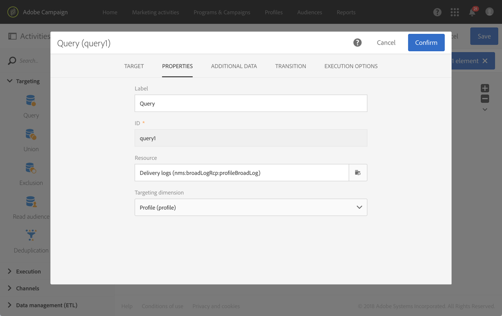

# 使用與目標維度　{#using-resources-different-from-targeting-dimensions}　不同的資源

此使用案例說明如何使用與定位維度不同的資源，例如，在遠端表格中尋找特定記錄。

如需定位維度和資源的詳細資訊，請參閱 [本節](../../automating/using/query.md#targeting-dimensions-and-resources)

**範例　1：使用標籤「歡迎回來！」識別傳送所定位的設定檔**。

* 在此案例中，我們要定位設定檔。我們會將目標維度設為　**[!UICONTROL Profiles (profile)]**。
* 我們想要根據傳送標籤來篩選所選取的設定檔。因此，我們將資源設定為　**[!UICONTROL Delivery logs]**。如此，我們會直接在傳送記錄表中進行篩選，以提供更理想的效能。

**範例　2：識別傳送時未鎖定的設定檔，並標示為「歡迎返回！」**

在上個範例中，我們使用與目標維度不同的資源。只有當您尋找已&#x200B;**出現**&#x200B;在遠距表格（在此範例中為傳送記錄檔）中的記錄，才能進行此作業。

如果我們想要尋找&#x200B;**不存在**&#x200B;遠距表格（例如，未由特定傳送定位的設定檔）中的記錄，您必須使用相同的資源及目標為度，因為記錄將不會存在於遠距表格（傳送記錄檔）中。

* 在此案例中，我們要定位設定檔。我們會將目標維度設為　**[!UICONTROL Profiles (profile)]**。
* 我們想要根據傳送標籤來篩選所選取的設定檔。無法直接篩選傳送記錄，因為我們正在尋找不在傳送記錄表格中的記錄。因此，我們將資源設定為 **[!UICONTROL Profile (profile)]** 並在設定檔案表上建構查詢。

