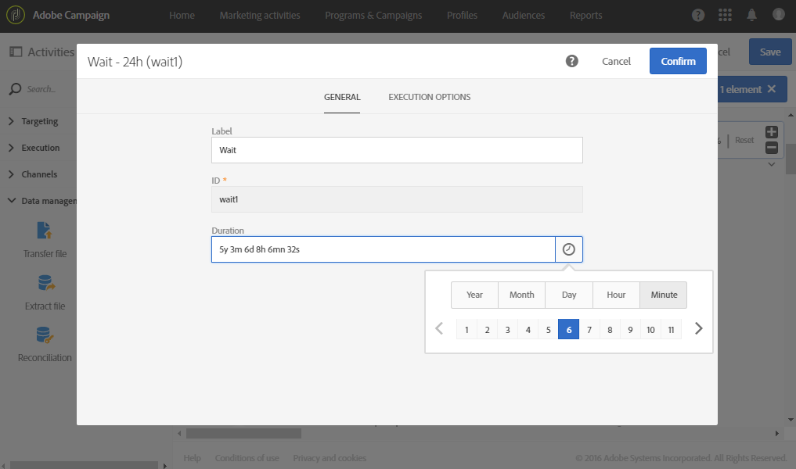

# 等待{#wait}

## 說明 {#description}

**[!UICONTROL Wait]** 活動會暫時暫停執行工作流程的一部分。它會在延遲後啟動其出站轉變，延遲範圍可能在幾秒到幾個月之間，然後執行之後放置的活動。

## 使用內容 {#context-of-use}

**[!UICONTROL Wait]** 活動可用於在兩個執行之活動之間傳遞的特定時間。例如，若要在電子郵件傳送活動後等候數天，請先分析此期間產生的開啟次數和點按次數，再執行任何後續操作（提醒電子郵件、建立閱聽眾等）。

## 設定 {#configuration}

1. 將 **[!UICONTROL Wait]** 活動拖放至工作流程中。
1. 選取活動，然後使用所顯示快速操作中的  按鈕將其開啟。
1. 指定在啟動活動之入站及出站變動之間等候的 **[!UICONTROL Duration]**。

   您可以手動輸入持續時間或使用欄位中可用的選取器。

   

1. 確認活動的設定並儲存工作流程。

## 範例 {#example}

以下範例說明典型使用案例中的 **[!UICONTROL Wait]** 活動。已傳送活動的電子郵件邀請。在傳送電子郵件後 24 小時，會分析電子郵件傳送記錄，並傳送提醒電子郵件給收到第一封電子郵件但未註冊的人。

工作流程如下：

* 第一個 **[!UICONTROL Query]** 目標是將會傳送電子郵件邀請的設定檔。
* **[!UICONTROL Email delivery]** 會第一次將邀請傳送給所選取的設定檔。
* 24 小時的 **[!UICONTROL Wait]** 活動會在傳送邀請與工作流程的其餘時間之間暫停。
* 第二個 **[!UICONTROL Query]** 目標是收到第一封電子郵件但未點按內部訂閱連結的設定檔。
* 第二個 **[!UICONTROL Email delivery]** 會將邀請的提醒傳送給選取的人員。

