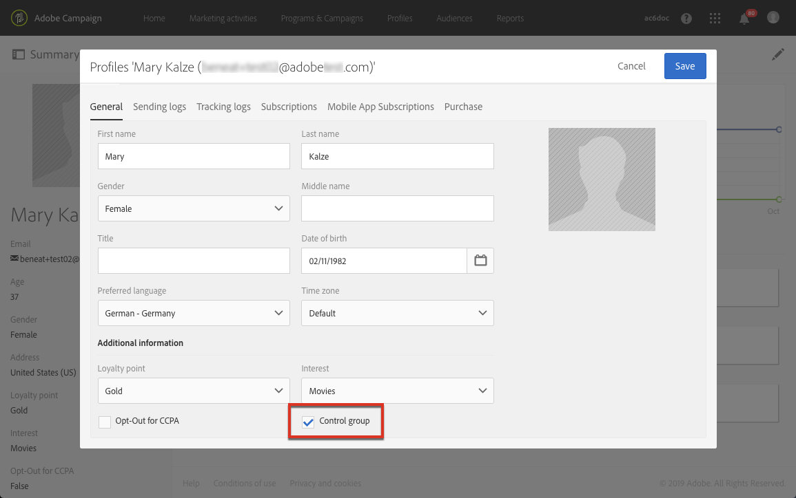

# 建立控制群組 {#building-control-group}

若要測量傳送的影響，您可能想從目標中排除某些描述檔，以免他們收到特定訊息。 該控制組可用於與接收消息的目標群體的行為進行比較。

若要在Adobe Campaign Standard中執行此動作，您可以建立包含下列活動的工作流程：
* 定位 [給定人口](../../automating/using/query.md) 的查詢活動。
* 區 [段活動](../../automating/using/segmentation.md) ，可將隨機控制群組與此群組隔離。
* 電子郵件 [傳送](../../automating/using/email-delivery.md) ，以傳送訊息至主要目標。
* 更新 [資料活動](../../automating/using/update-data.md) ，以更新從目標（隨機控制群組）排除的描述檔。

## 擴展配置檔案資源 {#extending-profile}

首先，您需要使用與控 **[!UICONTROL Profile]** 制組對應的新欄位擴展資源。 工作流運行後，將檢查此欄位中是否有從目標中排除的配置檔案。

1. 從 **[!UICONTROL Administration]** > **[!UICONTROL Development]** > **[!UICONTROL Custom Resources]**&#x200B;按一下 **[!UICONTROL Create]**。
1. 如果尚未擴展，請選擇並 **[!UICONTROL Extend an existing resource]** 選擇資 **[!UICONTROL Profile]** 源。
1. 在標 **[!UICONTROL Data structure]** 簽中，為控制組添加新欄位，然後為該 **[!UICONTROL Boolean]** 欄位選 **[!UICONTROL Type]** 擇。

   

1. 從標 **[!UICONTROL Screen definition]** 簽中展開該 **[!UICONTROL Detail screen configuration]** 部分並選擇剛建立的欄位，以便顯示每個配置檔案。

   

1. 儲存您的變更。
1. 更新資料庫結構以發佈擴 **[!UICONTROL Profile]** 展資源。 請參 [閱發佈自訂資源](../../developing/using/updating-the-database-structure.md#publishing-a-custom-resource)。

有關擴展自定義資源的詳細資訊，請 [參閱添加資源的關鍵步驟](../../developing/using/key-steps-to-add-a-resource.md)。

## 建立工作流程 {#creating-a-workflow}

1. 在中， **[!UICONTROL Marketing Activities]**&#x200B;按一下並 **[!UICONTROL Create]** 選擇 **[!UICONTROL Workflow]**。
1. 選擇 **[!UICONTROL New Workflow]** 為工作流類型，然後按一下 **[!UICONTROL Next]**。
1. 輸入工作流的屬性並按一下 **[!UICONTROL Create]**。

建立工作流的詳細步驟在「生成工作流」( [Building a workflow](../../automating/using/building-a-workflow.md) )部分中顯示。

## 建立查詢活動 {#create-a-query-activity}

1. 在 **[!UICONTROL Activities]** > **[!UICONTROL Targeting]**&#x200B;中，拖放  Query活動。
1. 連按兩下活動以定義您的目標。
1. 例如，在拖 **[!UICONTROL Shortcuts]**&#x200B;放中，選 **[!UICONTROL Profile]**&#x200B;取 **[!UICONTROL Age]** 運算子，並在欄 **[!UICONTROL Greater than]** 位中輸入25 **[!UICONTROL Value]** 。
1. 按一下「**[!UICONTROL Confirm]**」。

## 建立區段活動 {#creating-a-segmentation-activity}

1. 拖放區段 [活動](../../automating/using/segmentation.md) ，然後按兩下它。
1. 在標籤 **[!UICONTROL Segments]** 中，選取要編輯的區段。
1. 在該區 **[!UICONTROL Configuration]** 段的標籤中，選取選 **[!UICONTROL Limit the population of this segment]** 項。

   

1. 在標籤 **[!UICONTROL Limitation]** 中，請確定選 **[!UICONTROL Random sampling]** 取了選項。

   

1. 定義初始人口的百分比，例如10%，然後按一下 **[!UICONTROL Confirm]**。 控制群組由10%的目標群組成，隨機選取。
1. 在標籤 **[!UICONTROL Advanced options]** 中，選取 **[!UICONTROL Generate complement]** 選項並填寫 **[!UICONTROL Transition label]** 和欄 **[!UICONTROL Segment code]** 位。

   

1. 按一下「**[!UICONTROL Confirm]**」。

## 建立電子郵件活動 {#creating-an-email-activity}

1. 在 **[!UICONTROL Activities]** > **[!UICONTROL Channels]**&#x200B;中，拖放主要目標區段之 [後的](../../automating/using/email-delivery.md) 「電子郵件傳送」活動。
1. 按一下活動並選  取以編輯它。
1. 選擇 **[!UICONTROL Single send email]** 並按一下 **[!UICONTROL Next]**。
1. 選取電子郵件範本，然後按一下 **[!UICONTROL Next]**。
1. 輸入電子郵件屬性，然後按一下 **[!UICONTROL Next]**。
1. 若要建立電子郵件的版面，請按一下 **[!UICONTROL Use the Email Designer]**。
1. 編輯並儲存您的內容。
1. 在消息 **[!UICONTROL Schedule]** 儀表板的部分中，在發送消息} **之前取消選擇[!UICONTROL請求確認** 。

## 建立更新資料活動 {#creating-update-data-activity}

1. 在控制群組區段 [之後拖放](../../automating/using/update-data.md) 「更新」資料活動。
1. 選擇活動，然後使用顯示的快  速操作中的按鈕將其開啟。
1. 在標籤 **[!UICONTROL General]** 中，從下 **[!UICONTROL Update]** 拉式清 **[!UICONTROL Operation type]** 單中選取。
1. 在標籤 **[!UICONTROL Identification]** 中，選擇選 **[!UICONTROL Directly using the targeting dimension]** 項。
1. 選擇 **[!UICONTROL Profile]** 先前擴展的資源作為要更新的維。

   

1. 在選 **[!UICONTROL Fields to update]** 項卡中，選擇添加到資源中的控制組字 **[!UICONTROL Profile]** 段作為 **[!UICONTROL Destination]** ，然後輸入true作為條件。

   

1. 按一下「**[!UICONTROL Confirm]**」。

## 執行工作流程 {#running-the-workflow}

按一 **[!UICONTROL Start]** 下以執行工作流程。

工作流運行後，將排除控制組的人口，並將消息發送到其餘的主目標。

資 **[!UICONTROL Profile]** 源更新如下： 如果配置檔案在控制組中，則會檢查相應的欄位。

您現在可以比較訊息的收件者與被排除在訊息之外而未收到訊息的小群組有何反應。

## 重複使用相同的控制組 {#reusing-same-control-group}

上述範例可建立全域控制群組，因為這會儲存為與傳送無關的描述檔屬性。 事實上，作為資源擴展部分建立的新「控制組」欄位在運行上述工作流 **[!UICONTROL Profile]** 後會更新。

因此，下次您想使用相同的控制群組時，可以在新的「控制群組」欄位上分段，而不是進行隨機分段。

操作步驟：
1. 建立活動 **[!UICONTROL Segmentation]** 時，請在標籤中選取要編輯的 **[!UICONTROL Segments]** 區段。
1. 在該區 **[!UICONTROL Configuration]** 段的標籤中，請確定您未選取該選 **[!UICONTROL Limit the population of this segment]** 項。
1. 在標籤 **[!UICONTROL Filtering]** 中，拖放到 **[!UICONTROL Profiles (attributes)]** 主工作區。

   

1. 在窗 **[!UICONTROL Add a rule - Profiles (attributes)]** 口中，選擇「控制組」(添加到資源的字 **[!UICONTROL Profile]** 段)，然後選擇 **[!UICONTROL Yes]** 作為篩選條件。

   
