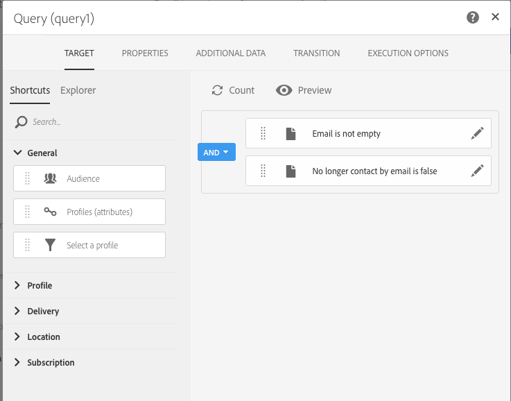
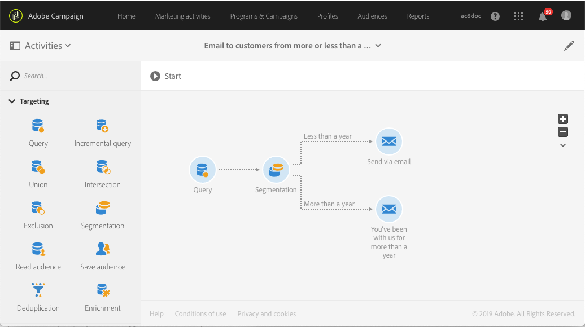

# 使用補集來建立傳送 {#deliveries-with-complement}

您可以傳送電子郵件給客戶：一個適用於不到一年前建立的客戶，另一個適用於超過一年前建立的客戶。

1. 在 **[!UICONTROL Marketing Activities]** 中，按一下 **[!UICONTROL Create]** 並選取 **[!UICONTROL Workflow]**。
1. 選取 **[!UICONTROL New Workflow]** 作為工作流程類型，並按一下 **[!UICONTROL Next]**。
1. 輸入工作流程的屬性並按一下 **[!UICONTROL Create]**。

## 建立「查詢」活動 {#create-a-query-activity}

1. 在 **[!UICONTROL Activities]** > **[!UICONTROL Targeting]** 中，拖放[查詢](../../automating/using/query.md)活動。
1. 連按兩下此活動。
1. 在&#x200B;**[!UICONTROL Shortcuts]**&#x200B;中，拖放&#x200B;**[!UICONTROL Profiles]**&#x200B;並使用運運算元&#x200B;**[!UICONTROL is not empty]**&#x200B;選取&#x200B;**[!UICONTROL email]**。
1. 在&#x200B;**[!UICONTROL Shortcuts]**&#x200B;中，拖放&#x200B;**[!UICONTROL Profiles]**&#x200B;並選取值為&#x200B;**[!UICONTROL no]**&#x200B;的&#x200B;**[!UICONTROL no longer contact by email]**。
1. 按一下 **[!UICONTROL Confirm]**。

## 建立細分活動 {#create-a-segmentation-activity}

1. 在&#x200B;**[!UICONTROL Activities]** > **[!UICONTROL Targeting]**&#x200B;中，拖放[Segmentation](../../automating/using/segmentation.md)活動並連按兩下。
1. 將游標暫留在區段上，然後按一下「」以定位今年新增到資料庫中的客戶。
1. 拖放&#x200B;**[!UICONTROL Profiles]**&#x200B;並選取篩選器型別為&#x200B;**[!UICONTROL Relative]**&#x200B;的&#x200B;**[!UICONTROL Created]**。
1. 將&#x200B;**[!UICONTROL Level of precision]**&#x200B;變更為&#x200B;**[!UICONTROL Year]**&#x200B;並選取&#x200B;**[!UICONTROL This year]**。
1. 按兩下 **[!UICONTROL Confirm]**。
1. 在&#x200B;**[!UICONTROL Advanced Options]**&#x200B;中，核取&#x200B;**[!UICONTROL Generate complement]**&#x200B;以建立以其他收件者為目標的區段。
1. 按一下 **[!UICONTROL Confirm]**。
1. 按一下 **[!UICONTROL Save]**。

>[!NOTE]
>
>若要觀察規則的結構，請按一下&#x200B;**[!UICONTROL Advanced Mode]**。

## 建立電子郵件傳遞 {#create-an-email-delivery}

1. 在&#x200B;**[!UICONTROL Activities]** > **[!UICONTROL Channels]**&#x200B;中，將[電子郵件傳遞](../../automating/using/email-delivery.md)活動拖放到每個區段之後。
1. 按一下活動並選取  以編輯。
1. 選取 **[!UICONTROL Single send email]** 並按一下 **[!UICONTROL Next]**。
1. 選取電子郵件範本，然後按一下 **[!UICONTROL Next]**。
1. 輸入電子郵件屬性，然後按一下 **[!UICONTROL Next]**。
1. 若要建立電子郵件的版面，請按一下 **[!UICONTROL Email Designer]**。
1. 插入元素或選取現有範本。
1. 使用每個傳遞專屬的優惠，個人化您的電子郵件。
1. 按一下 **[!UICONTROL Preview]** 以檢查版面。
1. 按一下 **[!UICONTROL Save]**。

如需詳細資訊，請參閱[設計電子郵件](../../designing/using/designing-from-scratch.md#designing-an-email-content-from-scratch)。

