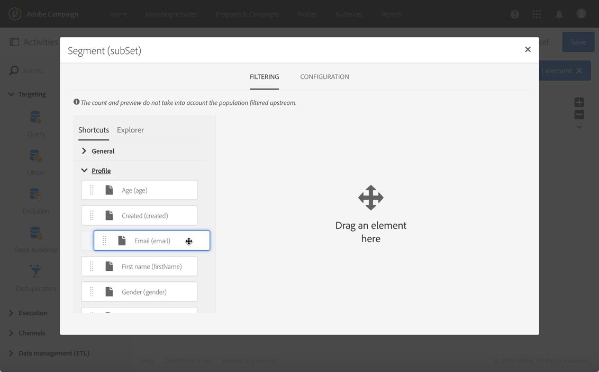
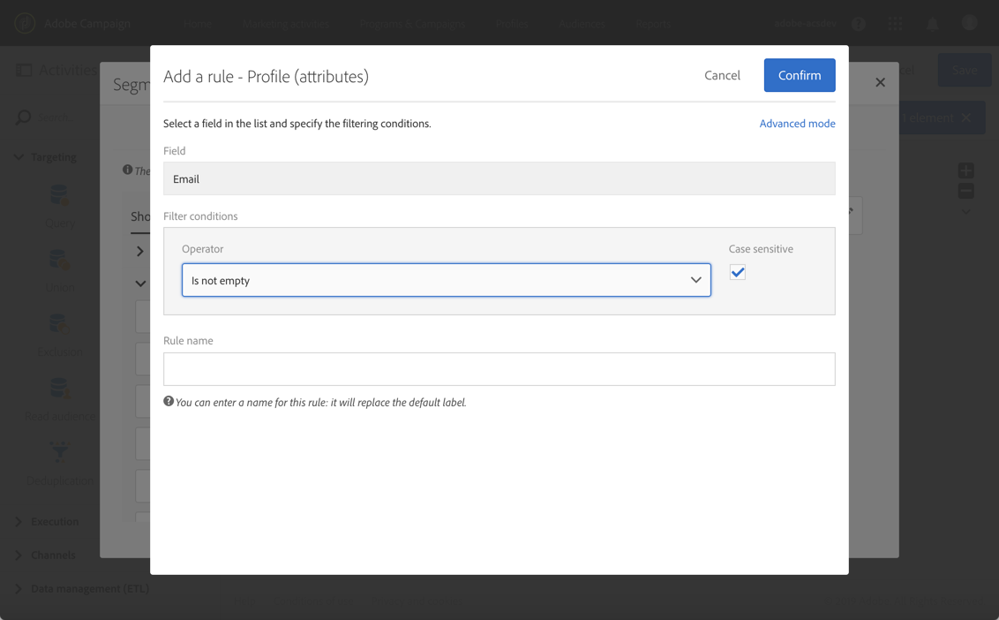
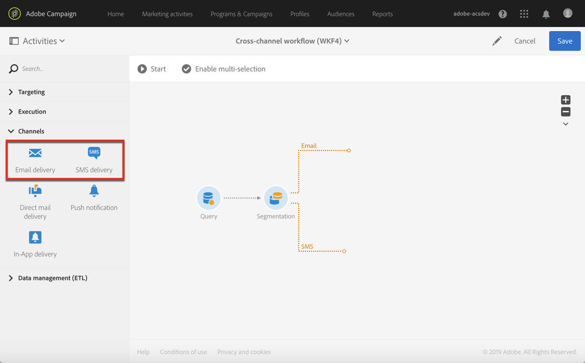

# 建立跨通道傳送{#cross-channel-delivery}

本檔案可讓您透過標準使用案例來探索下列Adobe Campaign功能： 建立跨通道傳送工作流程。

這裡的目標是從資料庫的接收者中選擇一個對象，並將其分成兩個不同的組，以便向第一組發送電子郵件和向第二組發送SMS消息。

如需Adobe Campaign工作流程和不同通道的詳細資訊，請查看下列檔案：

* [探索工作流程](../../automating/using/get-started-workflows.md)
* [探索通訊通道](../../channels/using/get-started-communication-channels.md)

## 建立工作流程 {#creating-workflow}

若要傳送兩個不同的傳送至指定群組，您必須先定義您的目標。

若要這麼做，您將需要建立查詢來識別收件者，因此您必須建立工作流程。

在方案或您選擇的促銷活動中建立新的工作流程：

1. 在中， **[!UICONTROL Marketing Activities]**&#x200B;按一下並 **[!UICONTROL Create]** 選擇 **[!UICONTROL Workflow]**。
1. 選擇 **[!UICONTROL New Workflow]** 為工作流類型，然後按一下 **[!UICONTROL Next]**。
1. 輸入工作流的屬性並按一下 **[!UICONTROL Create]**。

建立工作流的詳細步驟在「生成工作流」( [Building a workflow](../../automating/using/building-a-workflow.md) )部分中顯示。

## 建立查詢活動 {#creating-query-activity}

建立工作流程後，您就可以存取其介面。

將「查詢」活動插入您的工作流程，以定位將接收您傳送的描述檔。

1. 在 **[!UICONTROL Activities]** > **[!UICONTROL Targeting]**&#x200B;中，拖放  Query活動。
1. 連按兩下活動。
1. 在索引標 **[!UICONTROL Target]** 簽中，瀏覽快速鍵並選取其中一個 [對象](../../audiences/using/about-audiences.md)。
1. 將快速鍵拖放至編輯區域。 根據所選快捷方式的類型，將出現一個窗口。
1. 設定定位元素，然後確認查詢。

您可以對一或多個元素建立查詢。

使用按 **[!UICONTROL Count]** 鈕可查看查詢所定位的描述檔數目估計。

## 建立區段活動 {#creating-segmentation-activity}

在「查詢」活動識別目標後，您必須選擇一個標準，將目標分成兩個不同的人口族群： 一個會收到電子郵件，另一個會收到簡訊。

您必須使用「分 [段](../../automating/using/segmentation.md) 」活動，才能從查詢上游計算的人口中建立一或多個區段。

「電 **子郵件** 」群組將鎖定已定義電子郵件地址但沒有行動電話號碼的收件者。 SMS **群組將包含** 其行動電話號碼儲存在其設定檔中的收件者。

若要設定第一個轉場（電子郵件）:

1. 在標籤 **[!UICONTROL Segments]** 中，預設會顯示第一個區段。 編輯其屬性以設定該區段。

   

1. 選取描述檔作為 **[!UICONTROL Email]** 篩選准則。

   

1. 在螢幕上顯示的新窗口中，選擇運算 **[!UICONTROL Is not empty]** 符。

   

1. 新增第二個篩選准則， **[!UICONTROL Mobile]**&#x200B;並選取運算子 **[!UICONTROL Is empty]**。

   

   所有來自查詢的設定檔都會在此轉換中，這些設定檔包含電子郵件，但未定義行動電話號碼。

1. 若要讓工作流程更清楚，您可以編輯轉場標籤。 確認您的變更。

   

已設定您的第一個轉場。 若要設定第二個轉場(SMS):

1. 按一下 **[!UICONTROL Add an element]** 按鈕以新增轉場。
1. 定義條件，可讓您擷取已提供行動電話號碼的所有描述檔。 若要這麼做，請使用邏輯運算子在 **[!UICONTROL Mobile]** 欄位上建立 **[!UICONTROL Is not empty]** 規則。

   

   所有來自定義行動電話號碼之查詢的描述檔都將在此轉換中。

1. 您可以編輯轉場的標籤。 確認您的變更。

您的第二個轉場現在也已設定好。

## 建立傳送 {#creating-deliveries}

由於已建立兩個轉場，您現在必須將兩種類型的傳送新增至「區段」活動的對外轉場： 電子郵件 [傳送活動](../../automating/using/email-delivery.md) ，以及簡 [訊傳送活動](../../automating/using/sms-delivery.md) 。

Adobe Campaign可讓您將傳送新增至工作流程。 若要這麼做，請從工作流程的活 **[!UICONTROL Channels]** 動浮動視窗類別中選取傳送。

若要建立電子郵件傳送：

1. 在第一個區段後 [拖放「電子郵件](../../automating/using/email-delivery.md) 」傳送活動。
1. 連按兩下活動以進行編輯。
1. Select **[!UICONTROL Simple email]**.
1. 選擇 **[!UICONTROL Add an outbound transition with the population]** 並按一下 **[!UICONTROL Next]**。

   

   對外轉移可讓您復原人口和追蹤記錄檔。 例如，您可以使用此功能，傳送第二封郵件給未點按第一封郵件的使用者。

1. 選取電子郵件範本，然後按一下 **[!UICONTROL Next]**。
1. 輸入電子郵件屬性，然後按一下 **[!UICONTROL Next]**。
1. 若要建立電子郵件的版面，請選取 **[!UICONTROL Use the Email Designer]**。
1. 編輯並儲存您的內容。
1. 在消息 **[!UICONTROL Schedule]** 儀表板的部分中，在發送消息} **之前取消選擇[!UICONTROL請求確認** 。

若要建立SMS傳送：

1. 將SMS傳送活 [動拖放至](../../automating/using/sms-delivery.md) 其他區段之後。
1. 連按兩下活動以進行編輯。
1. 選擇 **[!UICONTROL SMS]** 並按一下 **[!UICONTROL Next]**。
1. 選取SMS範本，然後按一下 **[!UICONTROL Next]**。
1. 輸入SMS屬性，然後按一下 **[!UICONTROL Next]**。
1. 編輯並儲存您的內容。

在建立和編輯您的傳送後，您的工作流程就可開始。

## 執行工作流程 {#running-the-workflow}

工作流程啟動後，活動所定位的人口 **[!UICONTROL Query]** 將會分段，以接收電子郵件或簡訊傳送。

要執行工作流，請按一下 **[!UICONTROL Start]** 操作欄中的按鈕。

您可從>進階功能表 **[!UICONTROL Marketing plans]** ，透 **[!UICONTROL Marketing activities]** 過Adobe Campaign標誌存取傳送內容。 按一下傳送，然 **[!UICONTROL Reports]** 後按鈕即可存取傳送報 [表](../../reporting/using/about-dynamic-reports.md#accessing-dynamic-reports)，例如傳送摘要、開放率或根據收件者的訊息收件匣而轉換的電子郵件。
