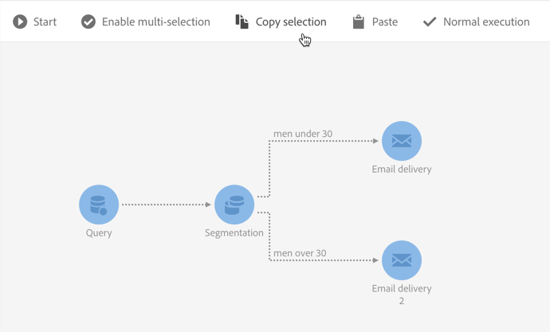

# 工作流程介面{#workflow-interface}

您可以建立工作流程來管理促銷活動和方案中的整個程式。

工作流程編輯畫面由下列元素組成：

* 「浮 [動視窗](#palette)」，它參照可用活動。
* 活動 [在其中配置和組織的「工作區](#workspace)」中。
* 動作 [列](#action-bar)，由按鈕組成，可讓您與工作流程及／或其元件互動。
* 快速 [動作](#quick-actions)（顯示在選取的活動周圍）可讓您與它互動。

## 浮動視窗 {#palette}

浮動視窗位於畫面的左側。 所有可用活動都分為幾類：

* [定位](../../automating/using/about-targeting-activities.md):特定於定位、控制人口資料及篩選活動的活動
* [執行](../../automating/using/about-execution-activities.md):組織和執行工作流的特定活動
* [渠道](../../automating/using/about-channel-activities.md):代表不同可用通訊頻道的活動
* [資料管理(ETL)](../../automating/using/about-data-management-activities.md):操作資料的特定活動

若要在工作流程中使用浮動視窗中的活動，請將它拖放至工作區。

您必須先設定從浮動視窗新增的每個活動，才能啟動工作流程。

## 工作區 {#workspace}

工作區是工作流程編輯器中的中心區域。 您可以在此區域中放置活動、使用轉場將活動連結在一起，並進行設定。

若要連結兩個活動，請將箭頭的結尾從第一個活動移至下列活動，直到它們連結為止。 您也可以將活動移至其後方的箭頭點，以將其連結至前一個活動。 如果您移動任何活動，它們將保持連結。

處理資料後續活動的轉變包含中介人口族群。 如果您勾選工作流程屬性區 **[!UICONTROL Keep interim results]** 段中的選 **[!UICONTROL Execution]** 項，即可存取這些選項。

>[!CAUTION]
>
>此選項佔用了大量磁碟空間，設計旨在幫助您建構工作流程並確保正確的設定和行為。在生產執行個體中保留未核取的狀態。

選取活動時，活動周圍會出現快速動作，讓您與其互動。 例如，若要設定活動，請選取活動，然後使用快速動作  中的按鈕將其開啟。

某些功能僅在工作區中啟用：

* 通過在活動周圍繪製區域來選取多個活動和轉變。
* 按 **Ctrl** +左鍵，以選取數個活動和／或轉場。
* 按 **Enter** 鍵可查看當前選定活動或轉變的詳細資訊。
* 按 **Delete** （刪除）可刪除當前選定的活動。
* 按 **Ctrl + C** ，複製所選活動， **按Ctrl + V** ，將它們貼上到工作區。

## 動作列 {#action-bar}

根據工作區中選取的元素或工作流程的執行狀態，動作列中可用的按鈕可能會有所不同。

 **[!UICONTROL Open activity]** 允許您編輯工作流的屬性。

 **[!UICONTROL Start]** 啟動工作流。

 **[!UICONTROL Pause]** 暫停工作流。

 **[!UICONTROL Stop]** 中斷工作流執行。 無法從停止位置恢復。

 **[!UICONTROL Restart]** 重新啟動工作流程。

 **[!UICONTROL Log and tasks]** 開啟工作流的執行日誌。

 **[!UICONTROL Enable multi-selection]** 啟用多選模式。 工作流至少必須由兩個活動組成。

 **[!UICONTROL Disable multi-selection]** 禁用多選模式。 

 **[!UICONTROL Open transition]** 開啟選取的轉場。 

  **[!UICONTROL Normal execution]** 如果選取項目先前已停用或標示為暫停，請重新啟用選取項目。 

 **[!UICONTROL Execution suspended]** 在所選活動暫停工作流。 

 **[!UICONTROL No execution]** 停用活動。 

 **[!UICONTROL Delete selection]** 刪除選定的活動。 

 **[!UICONTROL Copy selection]** 複製選定的活動。

 **[!UICONTROL Paste]** 貼上已複製的活動。

## 快速動作 {#quick-actions}

選取活動時，活動周圍會出現快速動作按鈕，讓您與活動互動。

 **[!UICONTROL Open activity]** 開啟選取的活動。

 **[!UICONTROL Copy selection]** 複製所選活動。

 **[!UICONTROL Open the activity's advanced options]** 開啟選取之「電子郵件」或「簡訊」傳送活動的進階選項。

 **[!UICONTROL Normal execution]** 如果選取項目先前已停用或標示為暫停，請重新啟用選取項目。

 **[!UICONTROL Execution suspended]** 在所選活動暫停工作流。

 **[!UICONTROL No execution]** 停用活動。

 **[!UICONTROL Immediate execution]** 強制立即處理選擇。 此按鈕僅適用於「排程器」和「等待」活動。

 **[!UICONTROL Delete selection]** 刪除選定的活動。

## 複製工作流程活動 {#duplicating-workflow-activities}

工作區可讓您將工作流程活動複製貼至相同的工作流程，或從相同的促銷活動例項複製至其他工作流程。

複製活動後，將保留其整個配置。 對於傳送活動（電子郵件、簡訊、推播通知……），會複製附加至該活動的傳送物件。

>[!NOTE]
>
>工作流活動不能從實例複製到另一個實例。 無法複製來自技術工作流程的活動。

若要複製活動，請遵循下列步驟：

1. 選擇活動，然後從快速動 **[!UICONTROL Copy selection]** 作中按一下按鈕。

   您也可以使用 **Ctrl + C** （鍵盤）快捷鍵。

   

1. 在目標工作流程工作區中按一下滑鼠右鍵，然後按一下 **[!UICONTROL Paste]** 按鈕。

   您也可以使用 **CTRL + V** （V鍵盤）快捷鍵。

   

1. 此活動會複製，並包含所有已初始設定的設定。

您也可以複製並貼上多個活動，以複製整個工作流程。

要執行此操作，請通過在活動周圍繪製一個區域來選擇活動。 然後按一 **[!UICONTROL Copy selection]** 下動作列中的按鈕(或按 **Ctrl + C**)。 然後，您可以將它們貼到所要的位置。

