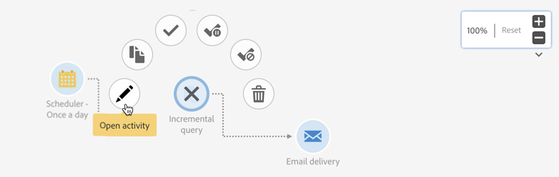

# 工作流程介面{#workflow-interface}

您可以建立工作流來管理市場活動和計畫中的整個流程。

工作流編輯螢幕由以下元素組成：

* 的 [調色板](#palette)，它引用可用活動。
* 的 [工作區](#workspace)，在其中配置和組織活動。
* 的 [操作欄](#action-bar)，它由允許您與工作流和/或其元件交互的按鈕組成。
* 的 [快速操作](#quick-actions)，允許您與所選活動交互。

## 浮動視窗 {#palette}

調色板位於螢幕的左側。 所有可用活動都分為幾類：

* [目標](../../automating/using/about-targeting-activities.md):針對、操縱人口資料和篩選活動的特定活動
* [執行](../../automating/using/about-execution-activities.md):特定於組織和執行工作流的活動
* [頻道](../../automating/using/about-channel-activities.md):代表不同可用通信通道的活動
* [資料管理(ETL)](../../automating/using/about-data-management-activities.md):操作資料的特定活動

要使用工作流中調色板中的活動，請將其拖放到工作區中。

在啟動工作流之前，必須配置從元件面板添加的每個活動。

## 工作區 {#workspace}

工作區是工作流編輯器中的中心區域。 您可以在此區域中刪除活動，使用轉換將它們連結在一起並配置它們。

要連結兩個活動，請將箭頭的末端從第一個活動移到下一個活動，直到它們連接。 您還可以將活動移動到其後箭頭的點，以便將其連結到上一個活動。 如果移動任何活動，它們將保持連結。

處理資料的活動後面的過渡包含中間群體。 如果您檢查 **[!UICONTROL Keep interim results]** 的上界 **[!UICONTROL Execution]** 的子菜單。

>[!CAUTION]
>
>此選項佔用了大量磁碟空間，設計旨在幫助您建構工作流程並確保正確的設定和行為。在生產執行個體中保留未核取的狀態。

選中某個活動後，該活動周圍會出現快速操作，允許您與其進行交互。 例如，要配置活動，請選擇該活動，然後使用  按鈕。

某些功能僅在工作區中啟用：

* 通過在活動周圍繪製區域來選取多個活動和過渡。
* 按 **Ctrl鍵** +左鍵按一下以選擇幾個活動和/或過渡。
* 按 **輸入** 查看當前選定活動或過渡的詳細資訊。
* 按 **刪除** 刪除當前選定的活動。
* 按 **Ctrl + C** 複製所選活動， **Ctrl + V** 將其貼上到工作區。

## 動作列 {#action-bar}

根據在工作區中選擇的元素或工作流的執行狀態，操作欄中可用的按鈕可能會有所不同。

 **[!UICONTROL Open activity]** 允許您編輯工作流的屬性。

 **[!UICONTROL Start]** 啟動工作流。

 **[!UICONTROL Pause]** 暫停工作流。

 **[!UICONTROL Stop]** 中斷工作流執行。 無法從停止的位置恢復。

 **[!UICONTROL Restart]** 重新啟動工作流。

 **[!UICONTROL Log and tasks]** 開啟工作流的執行日誌。

 **[!UICONTROL Enable multi-selection]** 啟用多選模式。 工作流必須至少由兩個活動組成。

 **[!UICONTROL Disable multi-selection]** 禁用多選模式。 

 **[!UICONTROL Open transition]** 開啟選定的過渡。 

  **[!UICONTROL Normal execution]** 如果以前禁用或標籤為暫停，則重新啟用選擇。 

 **[!UICONTROL Execution suspended]** 暫停所選活動的工作流。 

 **[!UICONTROL No execution]** 禁用活動。 

 **[!UICONTROL Delete selection]** 刪除選定的活動。 

 **[!UICONTROL Copy selection]** 複製選定的活動。

 **[!UICONTROL Paste]** 貼上已複製的活動。

## 快速動作 {#quick-actions}

選中某個活動後，該活動周圍會出現快速操作按鈕，允許您與其進行交互。

 **[!UICONTROL Open activity]** 開啟選定的活動。

 **[!UICONTROL Copy selection]** 複製所選活動。

 **[!UICONTROL Open the activity's advanced options]** 開啟所選電子郵件或SMS傳遞活動的高級選項。

 **[!UICONTROL Normal execution]** 如果以前禁用或標籤為暫停，則重新啟用選擇。

 **[!UICONTROL Execution suspended]** 暫停所選活動的工作流。

 **[!UICONTROL No execution]** 禁用活動。

 **[!UICONTROL Immediate execution]** 強制立即處理所選內容。 此按鈕僅適用於 調度程式 和 等待 活動。

 **[!UICONTROL Delete selection]** 刪除選定的活動。

## 複製工作流活動 {#duplicating-workflow-activities}

工作區允許您通過將工作流活動複製到同一工作流或從同一市場活動實例複製到另一個工作流來複製工作流活動。

複製活動後，將保留其整個配置。 對於傳遞活動（電子郵件、SMS、推送通知……），附加到該活動的傳遞對象是重複的。

>[!NOTE]
>
>無法將工作流活動從實例複製到另一個實例。 無法複製技術工作流中的活動。

要複製活動，請執行以下步驟：

1. 選擇活動，然後按一下 **[!UICONTROL Copy selection]** 按鈕。

   您還可以使用 **Ctrl + C** 鍵盤快捷鍵。

   

1. 在目標工作流工作區中按一下右鍵，然後按一下 **[!UICONTROL Paste]** 按鈕

   您還可以使用 **CTRL + V** 鍵盤快捷鍵。

   

1. 活動與最初配置的所有設定重複。

還可以複製 — 貼上多個活動，從而複製整個工作流。

為此，請通過在活動周圍繪製區域來選取活動。 然後按一下 **[!UICONTROL Copy selection]** 按鈕(或 **Ctrl + C**)。 然後，可將它們貼上到所需位置。

