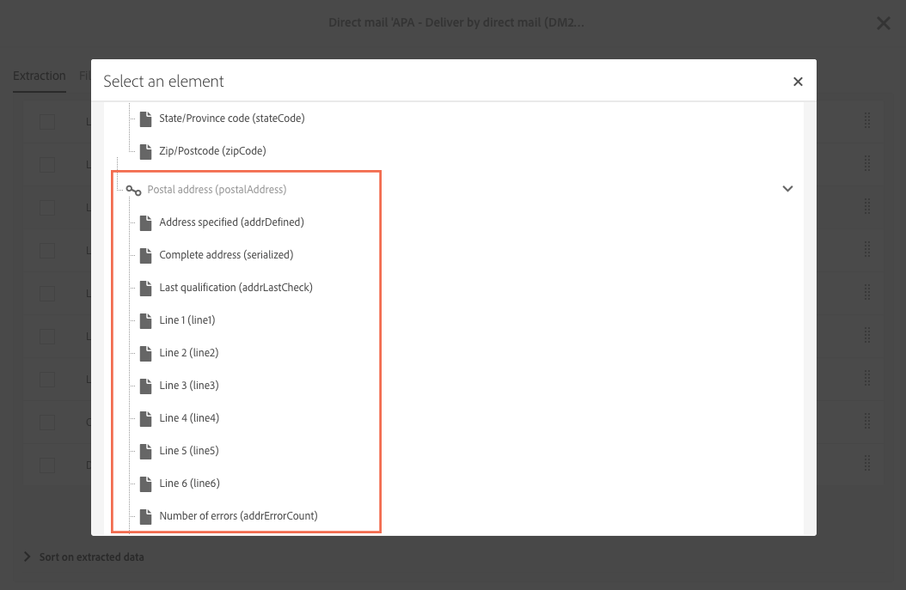

# 關於直接郵件{#about-direct-mail}

直接郵件是一種離線通道，可讓您個人化並產生直接郵件供應商所需的檔案。 它可讓您在客戶歷程中混合使用線上和離線通道。

>[!NOTE]
>
>此功能是選取性的。 請檢查您的授權合約。 使用直接郵件時需要 **[!UICONTROL Export]** 角色。 請聯絡您的管理員。

線上通道可讓您建立訊息（電子郵件、簡訊、行動應用程式傳送等） 並直接從Adobe Campaign傳送給您的對象。 離線通道則不同。 當您準備直接郵件傳送時，Adobe Campaign 會產生一個檔案，其中包含所有目標輪廓和選取的聯絡資訊（例如，郵遞區號）。 然後，您就可以將此檔案傳送給直接郵件提供者，由他們負責實際傳送。

下節將說明如何建立並產生單次直接郵件傳送。 您也可以將直接郵件活動納入工作流程，以協調結合線上和離線通道的宣傳活動。 如需詳細資訊，請參閱[工作流程](../../automating/using/get-started-workflows.md)指南。

Adobe Campaign 中的使用者程序如下：

1. 建立傳送
1. 選取客群
1. 定義內容
1. 設定聯絡日期
1. 產生檔案

**相關主題：**

* [使用案例：將電子郵件與直接郵件傳送連線](../../automating/using/coupling-email-direct-mail.md)

## 建議 {#recommendations}

### 直接郵件提供者 {#direct-mail-providers}

首先，您需要聯絡直接郵件供應商並收集其建議。 識別需納入解壓縮檔案的輪廓資訊，以便個人化通訊並傳送給客群。 例如，名字和姓氏、郵遞區號、促銷代碼等。這些欄位是您要在直接郵件內容的[定義解壓縮](../../channels/using/defining-the-direct-mail-content.md#defining-the-extraction)索引標籤中新增的欄位。

請確保您已核取輪廓資訊中的 **[!UICONTROL Address specified]**&#x200B;方塊。 如果已啟動此選項，則會將輪廓新增至目標。 若非如此，則會在準備階段期間被排除於類型規則（請參閱[建立直接郵件](../../channels/using/creating-the-direct-mail.md)）。 在匯入輪廓時，請別忘記更新此欄位。

### 郵寄地址 {#postal-addresses}

新增要納入解壓縮檔案的欄位時，可於 **[!UICONTROL Location]** 節點取得郵寄地址欄位。

Adobe Campaign　提供一組預先定義的計算欄位，這些欄位會遵循最常見的郵遞區號慣例。 這些欄位在　**[!UICONTROL Postal address]**　節點中可供使用。

依預設，地址最多可包含　6　行：第一個計算欄位（**[!UICONTROL Line 1]** 包含名字和姓氏)、下一行包含郵遞區號（道路等），而最後一行則包含郵遞區號和城鎮。

