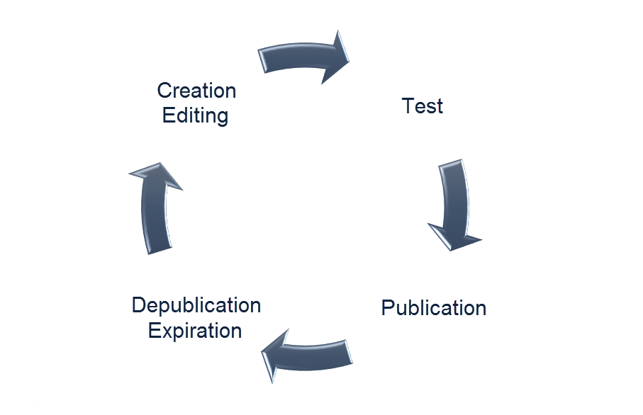

# 關於登錄頁面{#about-landing-pages}

Campaign隨附著著陸頁面，這些網頁表單可用來擷取您受眾的資訊、提供服務訂閱、顯示資料以及擴充您的資料庫。 著陸頁面也可用於取得或更新現有的描述檔。

如需設定著陸頁面所需步驟的詳細資訊，請參閱 [本節](../../channels/using/main-steps-to-set-up-a-landing-page.md)

**相關主題：**

* [建立著陸頁面教學課程影片](https://helpx.adobe.com/campaign/kt/acs/using/acs-create-edit-landing-page-feature-video-use.html) （影片）
* [使用登陸頁面訂閱服務](../../audiences/using/creating-a-service.md)

## 著陸頁面生命週期 {#landing-pages-life-cycle}

著陸頁面的完整生命週期如下：

1. 建立：設計並設定著陸頁面的內容。
1. 測試：模擬測試描述檔上的著陸頁面執行。
1. 出版物：發佈登陸頁面，即時推播。
1. 到期或取消發佈：手動取消發佈或等待著陸頁面過期，則不再提供。

建立並發佈後，您就可以透過網站或將登陸頁面的 [直接連結插入電子郵件中，讓登陸頁面可以存取](../../designing/using/links.md#inserting-a-link)。

## 著陸頁面限制{#landing-page-limitations}

下節列出您在開始設定登陸頁面之前應注意的限制。

**寫入和更新資料**

* 著陸頁面僅限於 **[!UICONTROL Profile]** 和 **[!UICONTROL Subscription]** 資源。 您可以儲存記錄，並從 **[!UICONTROL Profile]** 訂閱／取消訂閱中更新記錄 **[!UICONTROL Service]**。
有關資源配置的詳細資訊，請 [參閱配置資源的資料結構](../../developing/using/configuring-the-resource-s-data-structure.md)。

>[!CAUTION]
>
>著陸頁面無法顯示或更新來自和以外任何其他資源的 **[!UICONTROL Profile]** 資料 **[!UICONTROL Subscription]**。

**預載**

* 著陸頁面無法自動顯示記錄清單，也無法列出已訂閱描述檔的服務。 有關服務的詳細資訊，請參閱本 [頁](../../audiences/using/creating-a-service.md)。

* 具有預先填入表單的登陸頁面（資料已預先載入頁面）只能從Adobe Campaign電子郵件存取。 無法從網站頁面存取此類表格。

**調解**

* 協調行為如下：一找到匹配，協調進程就會停止。 這表示協調只能在一個配置檔案記錄上進行，在存在重複項時，不能在多個記錄上進行。

例如，您想要傳送下列贏取登陸頁面至您的描述檔，以使用描述檔的行動號碼更新您的Campaign資料庫。

如果您的其中一個描述檔填入著陸頁面，但已有重複的描述檔，則會更新具有最早建立日期的相符描述檔，因為描述檔會根據其建立日期來排定優先順序。

這裡只更新了第一個描述檔，因為它是最舊的項目。

**測試著陸頁面**

* 著陸頁面僅適用於描述檔，而非測試描述檔，這表示著陸頁面無法作為電子郵件證明的一部分進行測試。
