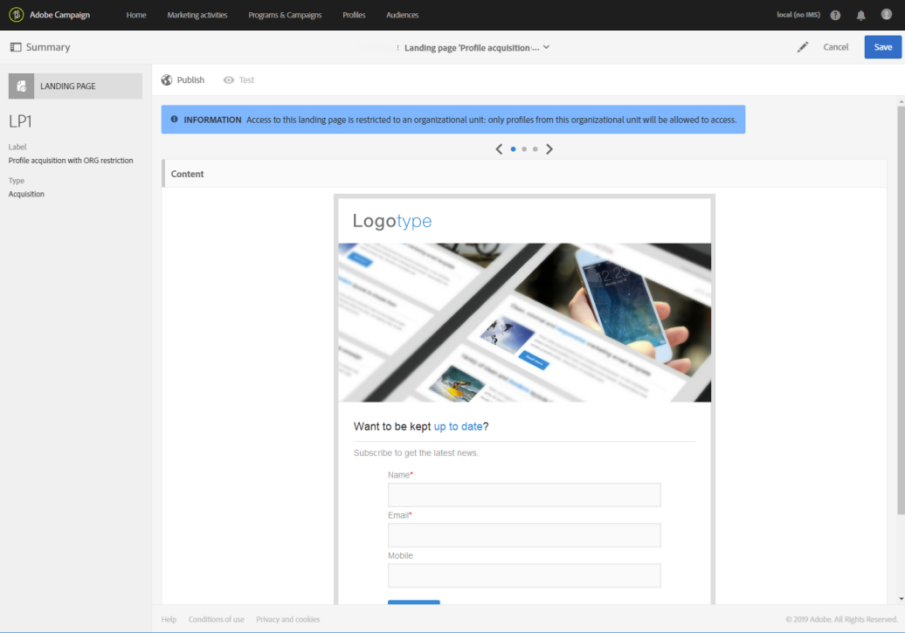

# 設定登錄頁面 {#configuring-landing-page}

## 確認登錄頁面提交 {#confirm-a-landing-page-submission}

當訪客提交登錄頁面時，您可以設定觸發的動作。操作步驟：

1. 編輯透過登錄頁面控制面板中  圖示存取的登錄頁面屬性，並顯示 **[!UICONTROL Job]** 參數。

   

1. 在 **[!UICONTROL Specific actions]** 區段下方，選取 **[!UICONTROL Start sending message]** 以判定自動訊息的傳送，例如確認服務的訂閱。之後，您需要選取電子郵件傳遞範本。

   請注意，如果服務層級已設定確認訊息，則不應在此畫面中選取一個訊息，以避免傳送多個確認訊息。請參閱[設定服務](../../audiences/using/creating-a-service.md)。

1. 建立 **[!UICONTROL Additional data]** 以便在提交登錄頁面時儲存其他資料。造訪頁面的使用者不會看見此資料。只會考慮常數值。

   

## 將登錄頁面連結至服務 {#linking-a-landing-page-to-a-service}

您可以將表單連結至服務，如此在驗證登錄頁面時，設定檔就可以訂閱特定服務。

連結登錄頁面的參數可讓您指定執行的動作類型，以及登錄頁面是否特別連結至單一服務或是否為一般服務。

若要選取要連結的服務，您需要：

1. 編輯透過登錄頁面控制面板中  圖示存取的登錄頁面屬性，並顯示 **[!UICONTROL Job]** 參數。

   

1. 選取下拉式清單 **[!UICONTROL Subscription]** 中的 **[!UICONTROL Specific actions]**。

   

1. 選取 **[!UICONTROL Specific service]** 將登錄頁面連結至單一服務。如果您想要在登錄頁面上使用數個服務，請勿選取此選項。

   使用 **[!UICONTROL Specified service in the URL]** 選項可允許將登錄頁面用於數個服務。因此，在設定服務時，您必須參考登錄頁面。

## 設定權限和預先載入資料 {#setting-permissions-and-pre-loading-data}

登錄頁面的存取權可限制給已識別的訪客，這些訪客來自（舉例來說）Campaign 所傳送之訊息中的連結，或是特定組織單位。
若是已識別的訪客，您可以在登錄頁面中預先載入其資料。操作步驟：

1. 編輯透過登錄頁面控制面板中  圖示存取的登錄頁面屬性，並顯示 **[!UICONTROL Access & loading]** 參數。

   

1. 選取 **[!UICONTROL Preload visitor data]**。

   如果頁面的訪客與資料庫中的設定檔相對應，則其資料會顯示在與資料庫資料對應的表單欄位中，而登錄頁面的個人化元素也會納入考量。

   

您也可以：

* 使用 URL 參數來識別訪客，使用下列 **[!UICONTROL Authorize visitor identification via URL parameters]** 選項：之後，您必須選取載入索引鍵，並將篩選參數對應至相對應 URL 的參數。
* 使用選項 **[!UICONTROL Authorize unidentified visitors]** 授權任何訪客存取登錄頁面。

也可以將登錄頁面連結至組織單位。這將定義使用者對於不同登錄頁面的存取權限。若要分配組織單位：

1. 透過 **[!UICONTROL Edit properties]** 圖示存取您的登錄頁面屬性。

   

1. 展開 **[!UICONTROL Access authorization]**。

1. 按一下下拉式功能表，然後選取您的組織單位。有關如何建立組織單位的詳細資訊，請參閱本[頁面](../../administration/using/organizational-units.md)。

   

1. 會自動完成 **[!UICONTROL Created by]**、**[!UICONTROL Created]**、**[!UICONTROL Access authorization]** 及 **[!UICONTROL Last modified]** 欄位。

1. 按一下 **[!UICONTROL Confirm]**，之後 **[!UICONTROL Save]**。

您的登錄頁面現在只能由所選組織單位內的使用者存取和管理。

## 設定 Google reCAPTCHA {#setting-google-recaptcha}

您可以使用登錄頁面設定 Google reCAPTCHA V3，以保護其免受機器人造成的垃圾訊息和濫用。您必須先建立外部帳戶，才能將之與登錄頁面搭配使用。有關如何設定的詳細資訊，請參閱本[區段](../../administration/using/external-accounts.md#google-recaptcha-external-account)。

一旦 Google reCAPTCHA V3 外部帳戶設定完成後，您就可以將它新增至您的登錄頁面：

1. 發佈登錄頁面之前，請先存取透過您登錄頁面控制面板  圖示存取的頁面屬性。

   

1. 展開 **[!UICONTROL Access & loading]** 功能表。
1. 核取 **[!UICONTROL Use reCAPTCHA to protect your site from spam and abuse]** 選項。
1. 選取您先前建立的 Google reCAPTCHA 外部帳戶。

   

1. 按一下 **[!UICONTROL Confirm]**。

您的登錄頁面現在已使用 Google reCAPTCHA 設定完畢，可在頁面底部看到。

之後，Google reCAPTCHA 會根據使用者與您頁面的互動，傳回分數。若要檢查您的分數，請連線至您的 [Google管理主控台](https://g.co/recaptcha/admin)。
