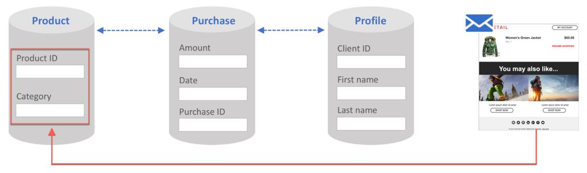

# 設定異動事件 {#configuring-transactional-event}

若要使用Adobe Campaign傳送交易式訊息，您必須先建立並設定事件，以說明事件資料的結構。

>[!IMPORTANT]
>
>只有[功能管理員](../../administration/using/users-management.md#functional-administrators) <!--being part of the **[!UICONTROL All]** [organizational unit](../../administration/using/organizational-units.md) -->具有建立和編輯事件配置的適當權限。

設定會根據您要傳送的交易式訊息](../../channels/using/getting-started-with-transactional-msg.md#transactional-message-types)的類型，以及將使用的通道而有所不同。 [有關詳細資訊，請參閱[特定配置](#transactional-event-specific-configurations)。

完成設定後，必須發佈事件。 請參閱[發佈交易式事件](../../channels/using/publishing-transactional-event.md)。

## 建立事件 {#creating-an-event}

若要開始，請建立符合您需求的事件。

1. 按一下左上角的&#x200B;**Adobe**&#x200B;標誌，然後選擇&#x200B;**[!UICONTROL Marketing plans]** > **[!UICONTROL Transactional messages]** > **[!UICONTROL Event configuration]**。
1. 按一下 **[!UICONTROL Create]** 按鈕。
1. 輸入事件的&#x200B;**[!UICONTROL Label]**&#x200B;和&#x200B;**[!UICONTROL ID]**。 **[!UICONTROL ID]**&#x200B;欄位是必填欄位，應以首碼&quot;EVT&quot;開頭。 如果不使用此首碼，則在您按一下&#x200B;**[!UICONTROL Create]**&#x200B;後，就會自動添加該首碼。

   

   >[!IMPORTANT]
   >
   >ID不得超過64個字元，包括EVT首碼。

1. 選取將用於傳送交易式訊息&#x200B;**[!UICONTROL Email]**、**[!UICONTROL Mobile (SMS)]**&#x200B;或&#x200B;**[!UICONTROL Push notification]**&#x200B;的通道。 每個事件只能使用一個管道，之後無法變更。

1. 選取與所需事件設定對應的目標維度，然後按一下&#x200B;**[!UICONTROL Create]**。

   事件交易式訊息以事件本身包含的資料為目標，而設定檔交易式訊息以Adobe Campaign資料庫包含的資料為目標。 有關詳細資訊，請參閱[特定配置](#transactional-event-specific-configurations)。

>[!NOTE]
>
>交易事件的數量可能會對您的平台造成影響。 若要確保最佳效能，請務必刪除未使用的事件。 請參閱[刪除事件](../../channels/using/publishing-transactional-event.md#deleting-an-event)。

## 定義事件屬性 {#defining-the-event-attributes}

在&#x200B;**[!UICONTROL Fields]**&#x200B;區段中，定義將整合至事件內容的屬性，然後將可用來個人化交易式訊息。

新增和修改欄位的步驟與[自訂資源](../../developing/using/configuring-the-resource-s-data-structure.md#adding-fields-to-a-resource)的步驟相同。

>[!NOTE]
>
>如果要建立多語言交易式訊息，請以&#x200B;**[!UICONTROL AC_language]** ID定義其他事件屬性。 這僅適用於事件交易式訊息。 發佈事件後，編輯多語言交易式訊息內容的步驟與多語言標準電子郵件的步驟相同。 請參閱[建立多語言電子郵件](../../channels/using/creating-a-multilingual-email.md)。

## 定義資料集合 {#defining-data-collections}

您可以將元素的集合新增至事件內容，每個元素本身都包含數個屬性。

此集合可用於交易式電子郵件，以將[產品清單](../../designing/using/using-product-listings.md)新增至訊息內容，例如產品清單 — 價格、參考編號、數量等。 針對清單的每個產品。

1. 在&#x200B;**[!UICONTROL Collections]**&#x200B;區段中，按一下&#x200B;**[!UICONTROL Create element]**&#x200B;按鈕。

   

1. 為集合新增標籤和ID。
1. 針對清單的每個產品，新增您要顯示在交易式訊息中的所有欄位。

   在此範例中，我們新增了下列欄位：

   

1. **[!UICONTROL Enrichment]**&#x200B;標籤可讓您擴充集合的每個項目。 這可讓您使用Adobe Campaign資料庫或您建立之其他資源的資訊，個人化對應產品清單的元素。

>[!NOTE]
>
>擴充集合元素的步驟與[擴充事件](#enriching-the-transactional-message-content)區段中所述的相同。 請注意，豐富化事件不會允許您擴充集合：您需要在&#x200B;**[!UICONTROL Collections]**&#x200B;區段中將擴充新增至集合本身。

發佈事件和訊息後，您就能在交易式訊息中使用此集合。

以下是此範例的API預覽：

**相關主題：**

* [預覽和發佈事件](../../channels/using/publishing-transactional-event.md#previewing-and-publishing-the-event)
* [在交易式訊息中使用產品清單](../../designing/using/using-product-listings.md)
* [發佈交易式訊息](../../channels/using/publishing-transactional-message.md#publishing-a-transactional-message)

## 豐富化活動 {#enriching-the-transactional-message-content}

您可以使用Adobe Campaign資料庫的資訊來擴充交易式訊息內容，以便個人化您的訊息。 例如，您可以從每個收件者的姓氏或CRM ID中，復原資料，例如其位址、出生日期或「設定檔」表格中新增的任何其他自訂欄位，以便個人化傳送給收件者的資訊。

可以使用擴展&#x200B;**[!UICONTROL Profile and services Ext API]**&#x200B;中的資訊來豐富交易式消息內容。 如需詳細資訊，請參閱[擴充API:發佈擴充功能](../../developing/using/step-2--publish-the-extension.md)

此資訊也可儲存在新資源中。 在這種情況下，資源必須直接連結到&#x200B;**[!UICONTROL Profile]**&#x200B;或&#x200B;**[!UICONTROL Service]**&#x200B;資源，或通過其他表連結。 例如，在以下配置中，如果&#x200B;**[!UICONTROL Product]**&#x200B;資源連結到&#x200B;**[!UICONTROL Profile]**&#x200B;資源，則可以使用&#x200B;**[!UICONTROL Product]**&#x200B;資源（如產品類別或ID）的資訊來豐富交易式消息內容。

如需建立和發佈資源的詳細資訊，請參閱[此區段](../../developing/using/key-steps-to-add-a-resource.md)。

1. 在&#x200B;**[!UICONTROL Enrichment]**&#x200B;區段中，按一下&#x200B;**[!UICONTROL Create element]**&#x200B;按鈕。

   

1. 選取您要連結訊息的資源。 在此情況下，選擇&#x200B;**[!UICONTROL Profile]**&#x200B;資源。

   

1. 使用&#x200B;**[!UICONTROL Create element]**&#x200B;按鈕將選定資源中的欄位連結到以前添加到事件的其中一個欄位（請參閱[定義事件屬性](#defining-the-event-attributes)）。

   

1. 在此示例中，我們將&#x200B;**[!UICONTROL Last name]**&#x200B;和&#x200B;**[!UICONTROL First name]**&#x200B;欄位與&#x200B;**[!UICONTROL Profile]**&#x200B;資源中的相應欄位進行調節。

   

   您也可以使用&#x200B;**[!UICONTROL Service]**&#x200B;資源來擴充交易式訊息內容。 有關服務的詳細資訊，請參閱[此部分](../../audiences/using/creating-a-service.md)。

1. 如果您要建立或編輯[設定檔事件](#profile-based-transactional-messages)，請在&#x200B;**[!UICONTROL Targeting enrichment]**&#x200B;區段中，選取將在傳送執行期間用作訊息目標的擴充。

   

   >[!NOTE]
   >
   >對於設定檔事件，必鬚根據&#x200B;**[!UICONTROL Profile]**&#x200B;資源建立擴充及選取目標擴充。

發佈事件和訊息後，此連結可讓您擴充交易式訊息的內容。

**相關主題：**

* [預覽和發佈事件](../../channels/using/publishing-transactional-event.md#previewing-and-publishing-the-event)
* [個人化交易式訊息](../../channels/using/editing-transactional-message.md#personalizing-a-transactional-message)
* [發佈交易式訊息](../../channels/using/publishing-transactional-message.md#publishing-a-transactional-message)

## 搜尋交易式事件 {#searching-transactional-events}

若要存取並搜尋已建立的交易式事件，請遵循下列步驟。

1. 按一下左上角的&#x200B;**Adobe**&#x200B;標誌，然後選擇&#x200B;**[!UICONTROL Marketing plans]** > **[!UICONTROL Transactional messages]** > **[!UICONTROL Event configuration]**。
1. 按一下 **[!UICONTROL Show search]** 按鈕。

   

1. 您可以篩選&#x200B;**[!UICONTROL Publication status]**。 舉例來說，這可讓您只顯示已發佈的事件。
1. 您也可以使用&#x200B;**[!UICONTROL Last event received]**&#x200B;篩選事件。 例如，如果您輸入10，則只會顯示具有上次在10天前或更久之前收到的事件設定。 這可讓您顯示指定期間內哪些事件已停用。

   

   >[!NOTE]
   >
   >預設值為0。 接著會顯示所有事件。

## 特定配置 {#transactional-event-specific-configurations}

交易式事件設定可能會因您要傳送的交易式訊息](../../channels/using/getting-started-with-transactional-msg.md#transactional-message-types)類型（事件或設定檔），以及將使用的通道而有所不同。[

以下章節詳細說明應根據所需交易式訊息設定的特定設定。 有關配置事件的一般步驟的詳細資訊，請參閱[建立事件](#creating-an-event)。

### 事件型交易式訊息 {#event-based-transactional-messages}

您可以傳送目標定位事件的事件交易式訊息。此類交易式訊息不包含設定檔資訊：傳遞目標是由事件本身包含的資料所定義。

若要傳送事件型交易式訊息，您必須先建立並設定以事件本身&#x200B;**中包含的**&#x200B;資料為目標的事件。

1. 建立事件設定時，請選取&#x200B;**[!UICONTROL Real-time event]**&#x200B;目標維度（請參閱[建立事件](#creating-an-event)）。
1. 將欄位新增至事件，以便能夠個人化交易式訊息（請參閱[定義事件屬性](#defining-the-event-attributes)）。
1. 事件型交易式訊息應僅使用傳送事件中的資料來定義收件者和訊息內容個人化。

   不過，如果您想使用Adobe Campaign資料庫的其他資訊，則可以擴充交易式訊息內容（請參閱[擴充交易式訊息內容](#enriching-the-transactional-message-content)）。

1. 預覽並發佈事件（請參閱[預覽和發佈事件](../../channels/using/publishing-transactional-event.md#previewing-and-publishing-the-event)）。

   預覽事件時，REST API包含屬性，根據選取的通道指定電子郵件地址、行動電話或推播通知特定屬性。

   發佈事件後，會自動建立連結至新事件的交易式訊息。 為了讓事件觸發傳送交易式訊息，您必須[modify](../../channels/using/editing-transactional-message.md)和[publish](../../channels/using/publishing-transactional-message.md)剛建立的訊息。

1. 將事件整合至您的網站（請參閱[整合觸發](../../channels/using/getting-started-with-transactional-msg.md#integrate-event-trigger)的事件）。

### 設定檔交易式訊息 {#profile-based-transactional-messages}

您可以根據客戶設定檔傳送交易式訊息，這可讓您套用行銷類型規則、包括取消訂閱連結、將訊息新增至全域傳送報表，以及在客戶歷程中運用該訊息。

若要傳送設定檔交易式訊息，您必須先從Adobe Campaign資料庫&#x200B;**建立並設定以**&#x200B;資料為目標的事件。

1. 建立事件設定時，請選取&#x200B;**[!UICONTROL Profile event]**&#x200B;目標維度（請參閱[建立事件](#creating-an-event)）。
1. 將欄位新增至事件，以便能夠個人化交易式訊息（請參閱[定義事件屬性](#defining-the-event-attributes)）。 您必須至少新增一個欄位，才能建立擴充。 您不需要建立其他欄位，例如&#x200B;**名字**&#x200B;和&#x200B;**姓氏**，因為您將能使用Adobe Campaign資料庫中的個人化欄位。
1. 建立擴充以將事件連結至&#x200B;**[!UICONTROL Profile]**&#x200B;資源（請參閱[擴充事件](#enriching-the-transactional-message-content)），並選取此擴充作為&#x200B;**[!UICONTROL Targeting enrichment]**。

   >[!IMPORTANT]
   >
   >此步驟對於設定檔事件為必要。

1. 預覽並發佈事件（請參閱[預覽和發佈事件](../../channels/using/publishing-transactional-event.md#previewing-and-publishing-the-event)）。

   預覽事件時，REST API不包含指定電子郵件地址、行動電話或推播通知特定屬性的屬性，因為它將從&#x200B;**[!UICONTROL Profile]**&#x200B;資源中擷取。

   發佈事件後，會自動建立連結至新事件的交易式訊息。 為了讓事件觸發傳送交易式訊息，您必須[modify](../../channels/using/editing-transactional-message.md)和[publish](../../channels/using/publishing-transactional-message.md)剛建立的訊息。

1. 將事件整合至您的網站（請參閱[整合觸發](../../channels/using/getting-started-with-transactional-msg.md#integrate-event-trigger)的事件）。

<!--### Transactional SMS messages {#transactional-sms}

The steps to configure an  event to send an SMS transactional message are the same as for the email channel. The only differences are as follows:

* When creating the corresponding event, you need to select the **[!UICONTROL Mobile (SMS)]** channel.

* When previewing the event corresponding to an event-based transactional SMS, the REST API contains an attribute specifying the mobile phone instead of the email address.

* The specificities to edit the content of an SMS transactional message are the same as for a [standard SMS](../../channels/using/about-sms-and-push-content-design.md).-->

### 異動推送通知 {#transactional-push-notifications}

您可以傳送兩種類型的交易推播通知：
* 匿名交易式推播通知，傳送給選擇從行動應用程式接收通知的所有使用者。 請參閱[設定事件型交易式推播通知](../../channels/using/transactional-push-notifications.md#event-based-transactional-push-notifications)。
* 已訂閱您行動應用程式之Adobe Campaign設定檔的交易式推播通知。 請參閱[設定以設定檔為基礎的交易式推播通知](../../channels/using/transactional-push-notifications.md#profile-based-transactional-push-notifications)。

>[!IMPORTANT]
>
>若要傳送交易式推播通知，您必須據此設定Adobe Campaign。 請參閱[設定行動應用程式](../../administration/using/configuring-a-mobile-application.md)。

### 後續追蹤訊息 {#follow-up-messages}

您可以傳送後續訊息給收到特定交易式訊息的客戶。

在[本節](../../channels/using/follow-up-messages.md#configuring-an-event-to-send-a-follow-up-message)中詳細說明設定允許發送後續消息的事件的步驟。
