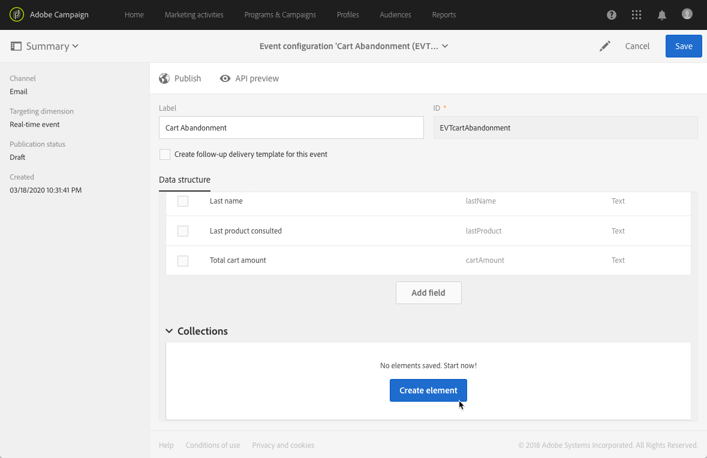
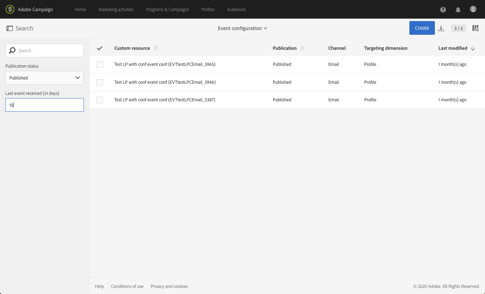

# 配置事務事件{#configuring-transactional-event}

若要使用Adobe Campaign傳送交易訊息，您首先需要建立並設定事件，以說明事件資料的結構。

>[!IMPORTANT]
>
>只有[職能管理員](../../administration/using/users-management.md#functional-administrators) <!--being part of the **[!UICONTROL All]** [organizational unit](../../administration/using/organizational-units.md) -->具有建立和編輯事件配置的適當權限。

配置會根據要發送的[事務性消息](../../channels/using/getting-started-with-transactional-msg.md#transactional-message-types)類型以及將使用的通道而有所不同。 有關詳細資訊，請參閱[特定配置](#transactional-event-specific-configurations)。

設定完成後，必須發佈事件。 請參閱[發佈事務性事件](../../channels/using/publishing-transactional-event.md)。

## 建立事件{#creating-an-event}

若要開始，請建立符合您需求的事件。

1. 按一下左上方的 **[!UICONTROL Adobe Campaign]** 標誌，然後選取「**[!UICONTROL Marketing plans]** > **[!UICONTROL Transactional messages]** > **[!UICONTROL Event configuration]**」。
1. 按一下 **[!UICONTROL Create]** 按鈕。
1. 輸入事件的&#x200B;**[!UICONTROL Label]**&#x200B;和&#x200B;**[!UICONTROL ID]**。 **[!UICONTROL ID]**&#x200B;欄位是必填欄位，開頭應為&quot;EVT&quot;。 如果您不使用此首碼，則會在您按一下&#x200B;**[!UICONTROL Create]**&#x200B;後自動新增該首碼。

   

   >[!IMPORTANT]
   >
   >ID不得超過64個字元，包括EVT首碼。

1. 選擇將用於發送事務性消息&#x200B;**[!UICONTROL Email]**、**[!UICONTROL Mobile (SMS)]**&#x200B;或&#x200B;**[!UICONTROL Push notification]**&#x200B;的渠道。 每個事件只能使用一個渠道，之後無法加以變更。

1. 選取與所需事件設定對應的定位維度，然後按一下&#x200B;**[!UICONTROL Create]**。

   事件型交易訊息會鎖定事件本身包含的資料，而以描述檔為基礎的交易訊息則會鎖定Adobe Campaign資料庫中包含的資料。 有關詳細資訊，請參閱[特定配置](#transactional-event-specific-configurations)。

>[!NOTE]
>
>即時事件的數量可能會對您的平台造成影響。 為確保最佳效能，請務必刪除未使用的即時事件。 請參閱[刪除事件](../../channels/using/publishing-transactional-event.md#deleting-an-event)。

## 定義事件屬性{#defining-the-event-attributes}

在&#x200B;**[!UICONTROL Fields]**&#x200B;部分中，定義將整合到事件內容中的屬性，然後可用於個性化事務性消息。

添加和修改欄位的步驟與[自定義資源](../../developing/using/configuring-the-resource-s-data-structure.md#adding-fields-to-a-resource)的步驟相同。

>[!NOTE]
>
>如果要建立多語言事務性消息，請使用&#x200B;**[!UICONTROL AC_language]** ID定義其他事件屬性。 這僅適用於事件事務性消息。 發佈事件後，編輯多語言交易訊息內容的步驟與編輯多語言標準電子郵件的步驟相同。 請參閱[建立多語言電子郵件](../../channels/using/creating-a-multilingual-email.md)。

## 定義資料集{#defining-data-collections}

您可以新增元素的集合至事件內容，每個元素本身包含數個屬性。

此系列可用於交易電子郵件中，以新增[產品清單](../../channels/using/editing-transactional-message.md#using-product-listings-in-a-transactional-message)至訊息內容，例如產品清單——價格、參考編號、數量等。 清單的每個產品。

1. 在&#x200B;**[!UICONTROL Collections]**&#x200B;區段中，按一下&#x200B;**[!UICONTROL Create element]**&#x200B;按鈕。

   

1. 新增系列的標籤和ID。
1. 為清單的每個產品新增您要在交易訊息中顯示的所有欄位。

   在此範例中，我們新增了下列欄位：

   

1. **[!UICONTROL Enrichment]**&#x200B;標籤可讓您豐富系列的每個項目。 這可讓您使用Adobe Campaign資料庫或您建立之其他資源的資訊，個人化對應產品清單的元素。

>[!NOTE]
>
>豐富集合元素的步驟與[豐富事件](#enriching-the-transactional-message-content)一節中所述的步驟相同。 請注意，豐富活動不允許您豐富系列：您需要在&#x200B;**[!UICONTROL Collections]**&#x200B;區段中，將擴充功能新增至系列本身。

發佈事件和訊息後，您就可以在交易訊息中使用此系列。

以下是此範例的API預覽：

**相關主題：**

* [預覽和發佈事件](../../channels/using/publishing-transactional-event.md#previewing-and-publishing-the-event)
* [在交易式訊息中使用產品清單](../../channels/using/editing-transactional-message.md#using-product-listings-in-a-transactional-message)
* [發佈交易式訊息](../../channels/using/publishing-transactional-message.md#publishing-a-transactional-message)

## 豐富事件{#enriching-the-transactional-message-content}

您可以利用Adobe Campaign資料庫的資訊豐富交易式訊息內容，以個人化您的訊息。 例如，您可以從每個收件者的姓氏或CRM ID中，復原資料，例如其地址、出生日期或「描述檔」表格中新增的任何其他自訂欄位，以個人化傳送給他們的資訊。

可以利用擴展的&#x200B;**[!UICONTROL Profile and services Ext API]**&#x200B;資訊豐富事務性消息內容。 如需詳細資訊，請參閱[擴充API:發佈擴充功能](../../developing/using/step-2--publish-the-extension.md)

此資訊也可以儲存在新資源中。 在這種情況下，資源必須直接連結到&#x200B;**[!UICONTROL Profile]**&#x200B;或&#x200B;**[!UICONTROL Service]**&#x200B;資源，或通過其他表連結。 例如，在以下配置中，如果&#x200B;**[!UICONTROL Product]**&#x200B;資源連結到&#x200B;**[!UICONTROL Profile]**&#x200B;資源，則可以使用&#x200B;**[!UICONTROL Product]**&#x200B;資源（如產品類別或ID）的資訊豐富事務性消息內容。

如需建立和發佈資源的詳細資訊，請參閱[本節](../../developing/using/key-steps-to-add-a-resource.md)。

1. 在&#x200B;**[!UICONTROL Enrichment]**&#x200B;區段中，按一下&#x200B;**[!UICONTROL Create element]**&#x200B;按鈕。

   

1. 選擇要將消息連結到的資源。 在這種情況下，請選擇&#x200B;**[!UICONTROL Profile]**&#x200B;資源。

   

1. 使用&#x200B;**[!UICONTROL Create element]**&#x200B;按鈕將選定資源中的欄位連結到先前添加到事件中的其中一個欄位（請參閱[定義事件屬性](#defining-the-event-attributes)）。

   

1. 在此示例中，我們協調&#x200B;**[!UICONTROL Last name]**&#x200B;和&#x200B;**[!UICONTROL First name]**&#x200B;欄位與&#x200B;**[!UICONTROL Profile]**&#x200B;資源中的相應欄位。

   

   您也可以使用&#x200B;**[!UICONTROL Service]**&#x200B;資源豐富事務性消息內容。 有關服務的詳細資訊，請參閱[本節](../../audiences/using/creating-a-service.md)。

1. 如果您要建立或編輯[描述檔型事件](#profile-based-transactional-messages)，請在&#x200B;**[!UICONTROL Targeting enrichment]**&#x200B;區段中，選取在傳送執行期間將用作訊息目標的擴充。

   

   >[!NOTE]
   >
   >對於基於配置檔案的事件，必須建立基於&#x200B;**[!UICONTROL Profile]**&#x200B;資源的擴充和選擇目標擴充。

發佈事件和訊息後，此連結可讓您豐富交易訊息的內容。

**相關主題：**

* [預覽和發佈事件](../../channels/using/publishing-transactional-event.md#previewing-and-publishing-the-event)
* [個人化交易式訊息](../../channels/using/editing-transactional-message.md#personalizing-a-transactional-message)
* [發佈交易式訊息](../../channels/using/publishing-transactional-message.md#publishing-a-transactional-message)

## 搜索事務事件{#searching-transactional-events}

要訪問和搜索已建立的事務事件，請執行以下步驟。

1. 按一下左上方的 **[!UICONTROL Adobe Campaign]** 標誌，然後選取「**[!UICONTROL Marketing plans]** > **[!UICONTROL Transactional messages]** > **[!UICONTROL Event configuration]**」。
1. 按一下 **[!UICONTROL Show search]** 按鈕。

   

1. 您可以篩選&#x200B;**[!UICONTROL Publication status]**。 這可讓您僅顯示已發佈的事件，例如。
1. 您也可以使用&#x200B;**[!UICONTROL Last event received]**&#x200B;篩選事件。 例如，如果輸入10，則只會顯示上次10天前或更久收到的事件配置。 這可讓您顯示在指定期間內哪些事件處於非活動狀態。

   

   >[!NOTE]
   >
   >預設值為0。 然後會顯示所有事件。

## 特定配置{#transactional-event-specific-configurations}

事務性事件配置可能因您要發送的[事務性消息類型](../../channels/using/getting-started-with-transactional-msg.md#transactional-message-types)（事件或配置檔案）以及將使用的渠道而異。

以下各節詳細介紹了根據所需事務性消息應設定哪些特定配置。 有關配置事件的一般步驟的詳細資訊，請參閱[建立事件](#creating-an-event)。

### 基於事件的事務性消息{#event-based-transactional-messages}

您可以傳送目標定位事件的事件交易式訊息。此類交易式訊息不包含設定檔資訊：傳遞目標是由事件本身包含的資料所定義。

要發送基於事件的事務性消息，您首先需要建立並配置針對事件本身包含的&#x200B;**資料的事件。**

1. 建立事件配置時，選擇&#x200B;**[!UICONTROL Real-time event]**&#x200B;目標維（請參閱[建立事件](#creating-an-event)）。
1. 將欄位添加到事件中，以便能夠個性化事務性消息（請參閱[定義事件屬性](#defining-the-event-attributes)）。
1. 事件型交易式訊息應僅使用傳送事件中的資料來定義收件者和訊息內容個人化。

   不過，如果您想要使用Adobe Campaign資料庫的其他資訊，則可以豐富交易訊息內容（請參閱[豐富交易訊息內容](#enriching-the-transactional-message-content)）。

1. 預覽並發佈事件（請參閱[預覽並發佈事件](../../channels/using/publishing-transactional-event.md#previewing-and-publishing-the-event)）。

   在預覽事件時，REST API會根據選取的頻道，包含指定電子郵件地址、行動電話或推播通知特定屬性的屬性。

   發佈事件後，會自動建立連結至新事件的交易訊息。 要觸發事件發送事務性消息，必須[modify](../../channels/using/editing-transactional-message.md)和[publish](../../channels/using/publishing-transactional-message.md)剛建立的消息。

1. 將事件整合至您的網站（請參閱[整合事件觸發](../../channels/using/getting-started-with-transactional-msg.md#integrate-event-trigger)）。

### 基於配置檔案的事務性消息{#profile-based-transactional-messages}

您可以根據客戶個人檔案傳送交易訊息，這可讓您套用行銷類型學規則、包含取消訂閱連結、將訊息新增至全域傳送報表，並在客戶歷程中運用此訊息。

若要傳送以描述檔為基礎的交易訊息，您首先需要從Adobe Campaign資料庫&#x200B;**建立並設定以**&#x200B;資料為目標的事件。

1. 建立事件配置時，選擇&#x200B;**[!UICONTROL Profile event]**&#x200B;目標維（請參閱[建立事件](#creating-an-event)）。
1. 將欄位添加到事件中，以便能夠個性化事務性消息（請參閱[定義事件屬性](#defining-the-event-attributes)）。 您必須至少添加一個欄位才能建立富集。 您不需要建立其他欄位，例如&#x200B;**名字**&#x200B;和&#x200B;**姓氏**，因為您可以使用Adobe Campaign資料庫中的個人化欄位。
1. 建立擴充功能，以將事件連結至&#x200B;**[!UICONTROL Profile]**&#x200B;資源（請參閱[豐富事件](#enriching-the-transactional-message-content)），並選取此擴充功能為&#x200B;**[!UICONTROL Targeting enrichment]**。

   >[!IMPORTANT]
   >
   >此步驟是描述檔事件的必要步驟。

1. 預覽並發佈事件（請參閱[預覽並發佈事件](../../channels/using/publishing-transactional-event.md#previewing-and-publishing-the-event)）。

   在預覽事件時，REST API不包含指定電子郵件地址、行動電話或推播通知特定屬性的屬性，因為該屬性將從&#x200B;**[!UICONTROL Profile]**&#x200B;資源中擷取。

   發佈事件後，會自動建立連結至新事件的交易訊息。 要觸發事件發送事務性消息，您必須[modify](../../channels/using/editing-transactional-message.md)和[publish](../../channels/using/publishing-transactional-message.md)剛建立的消息。

1. 將事件整合至您的網站（請參閱[整合事件觸發](../../channels/using/getting-started-with-transactional-msg.md#integrate-event-trigger)）。

<!--### Transactional SMS messages {#transactional-sms}

The steps to configure an  event to send an SMS transactional message are the same as for the email channel. The only differences are as follows:

* When creating the corresponding event, you need to select the **[!UICONTROL Mobile (SMS)]** channel.

* When previewing the event corresponding to an event-based transactional SMS, the REST API contains an attribute specifying the mobile phone instead of the email address.

* The specificities to edit the content of an SMS transactional message are the same as for a [standard SMS](../../channels/using/about-sms-and-push-content-design.md).-->

### 交易式推播通知 {#transactional-push-notifications}

您可以傳送兩種類型的交易推播通知：
* 匿名交易式推播通知，適用於已選擇從行動應用程式接收通知的所有使用者。 請參閱[設定事件型交易推播通知](../../channels/using/transactional-push-notifications.md#event-based-transactional-push-notifications)。
* 已訂閱您行動應用程式之Adobe Campaign設定檔的交易式推播通知。 請參閱[設定以描述檔為基礎的交易推播通知](../../channels/using/transactional-push-notifications.md#profile-based-transactional-push-notifications)。

>[!IMPORTANT]
>
>若要傳送交易推播通知，您必須據以設定Adobe Campaign。 請參閱[設定行動應用程式](../../administration/using/configuring-a-mobile-application.md)。

### 後續訊息 {#follow-up-messages}

您可以傳送後續訊息給收到特定交易訊息的客戶。

[本節](../../channels/using/follow-up-messages.md#configuring-an-event-to-send-a-follow-up-message)中詳細說明了配置允許發送後續消息的事件的步驟。
